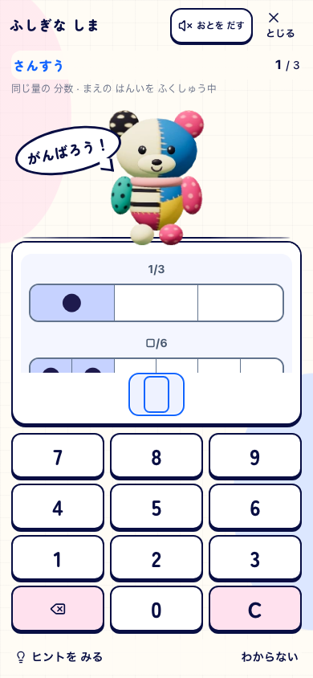
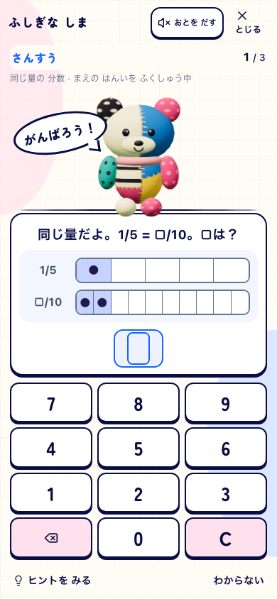

# 学習教材監査の修正

2026-10-01。[元監査](../2026-10-01-learning-content/README.md) C01〜C12への対応。基点はmain `008e0c8bfb1f784c86e8f1b6083c823a9b5189e3`、修正はローカル作業内容。コミット・本番公開は今回実行していない。

正本は[教材の意味・種類・導入](../../product/learning-content-integrity.md)、仕様02/03/04/29/31/32/33。既存118スキル・29算数レベル・1,184英語項目の所属、取得済み進度、保存済みの問題と記録を保持する。

| 指摘 | 対応 |
|---|---|
| C01 語義と例文 | 採用語義を維持して20例文を校訂。全1,184項目の英文形式・重複文脈も検査 |
| C02 同義の選択肢 | way/methodなどの禁止ペア・意味の重なり・かな/漢字の許容訳を除外。全項目、通常/全クールダウン、かな/漢字を検査 |
| C03 足し算の範囲 | 導入後のLv8をa=1〜9、b=1〜3へ。和≤5への縮小を解消 |
| C04 平均 | 非対称な3〜5個の数と整数/小数の平均。順番・分配も変え、対称導入だけを代表証拠にしない。小数点入力にも対応 |
| C05 除算 | 2桁÷2桁の通常生成と出題計画の一巡は商1約20%、商2〜9約80%。両方の型を確認 |
| C06 分数比較 | 同分母・同分子・等値・分子分母とも異なる不等値の4型 |
| C07 基礎9単元 | 位取り、集まり、割り算の意味、小数、分数、等値、帯分数、1あたりの量を短い導入として実装 |
| C08 前後関係 | 小数・分数の計算前にも量と比較を扱う。保存上のレベル番号は保持 |
| C09 型の被覆 | 実際の式・答えから型を検証。練習で循環させ、仕上げ20問にも必要な型を含める。v1/defaultをv2の特定型へ格上げしない |
| C10 表示名 | 数の次/最小値/10をまたぐ引き算/10倍等を実問題に合わせる |
| C11 レベル・重複 | 既存進度と教育的な難度校正を区別。綴り1,173、properlyの同義再登場を除く語義ID1,183、保存項目1,184を別集計 |
| C12 教材範囲 | 計算中心の対象と数量・形・空間・割合等の限定した範囲を明記 |

区間内で導入段階を循環し、凍結予約による同じ段階の重複と比較段階の飛びを防ぐ。基礎導入の独力正解は別IDへ保存し、レベル資格20問や計算coverageを増やさない。すでに関連計算に独力正解3回がある子は一律に戻さず、直近の誤答・支援後には戻れる。Due、親の無効設定、当日停止、クールダウン、区間上限を保持。時間制限Battleへ導入は混ぜない。追加の3回は導入の設計値であり、基礎全般の習得認定ではない。

## 検証

- 機械的検査: 算数88,900生成、うち独立した答えの照合47,600、英語23,680生成。[inventory.json](inventory.json)、実行時の各入力hashは[source.json](source.json)。全乱数・全語義の校閲を証明するものではない。
- 10,000 seed: 商1は2,000件、平均の最小/最大の中点だけで当たる問題0件。分数比較は2,499 / 2,502 / 2,500 / 2,499件。追加計算70,000件の照合不一致0。[probes.json](probes.json)。hard/difficult、way/methodの禁止ペア再現は各10,000 seedで0件。
- `npm run verify:core`: 509ファイル/4,544テスト、docs、lint（既存warning1件）、typecheck、build/assets PASS。[core.log](core.log)。
- phone/tablet 20ケースPASS（9教材×両幅と、通常出題の小数導入×両幅）、app入力hash開始/終了一致。[ui-report.json](ui-report.json)、[全画面](screens.html)。revision、flags、実候補IDをcaptureごとに記録。
- classic smoke: 最終候補で31/31 PASS。[smoke.log](smoke.log)。初回30/31では1024px portraitの次問題待ちが1,500msで停止した。初回ログを保持し、同じ制限を変えずに他のブラウザ検証終了後の再検証を通した。原因を製品修正で解消したとは認定しない。

## 実画面の検査範囲

Island flag-onの実予約を390×844/通常motion、768×1024/reduced motionで検査。使い捨てのnativeプロフィール・memory fixtureを使い、9教材の実DOM、同じ全体の幅、44px以上の入力、実タッチ回答、writerの全問ログ、再読込後の凍結済み次問を確認する。通常出題の小数導入では量→比較の2問を実回答し、専用IDの独力数が2へ増え、現在レベルの資格windowが0のままであることも照合する。生成問題の上書きやアプリの回答hookは使わない。DEV Chromiumであり、本番配布・実機・実SW更新・子どもの学習効果の証拠ではない。

初回は既存ハーネスの古い候補ID/手動submit前提で停止。検証側だけを現行v8へ合わせた。実画面の目視では、図の下に置いた問いが入力欄に隠れる製品上の問題を発見し、問いを上へ、図をコンパクトに修正した。初回のDOM内テキスト検査だけを視覚PASSにはしない。

| 修正前のphone | 修正後のphone |
|---|---|
|  |  |

視覚: 問いと図が同時に読め、全体の幅が揃う。無文字理解/子どもの自発的継続: 未評価。runtime: 指定ケースの入力・保存・再開を検査。教育的な難度・翌日/一週間後の保持、全語義の専門校閲、数直線・対応表を含む拡張教材は後続評価として残す。
