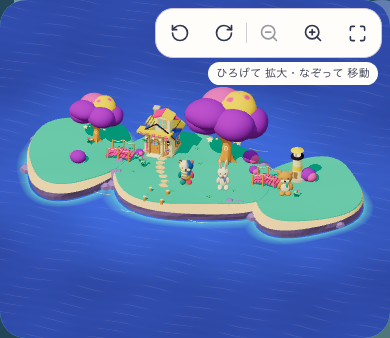
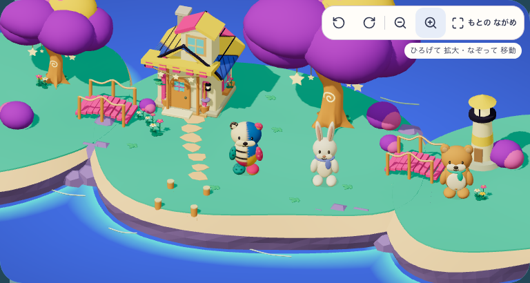
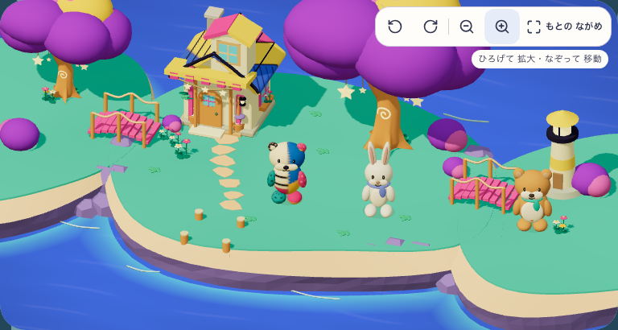
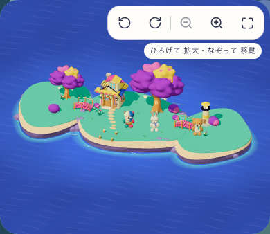
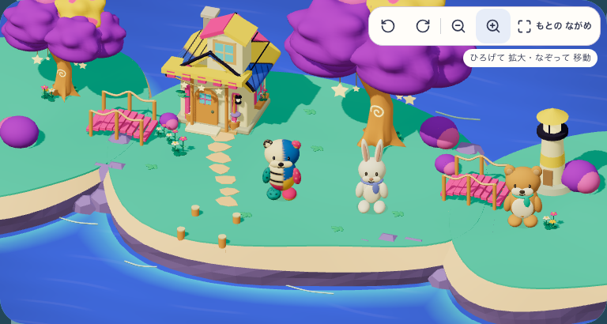

# 島と操作面を一体で整える

2026-09-09、ユーザーはゲーム全体のUI/UX・島の形・全体改善の判断を委任した。ローカル実装の方向選定と公開判定を分ける。

## 比較と維持する性質

| 対象 | TRANSFER | DO NOT TRANSFER |
| --- | --- | --- |
| 現行moon-garden | 青い海、ミントの庭、紫の樹冠、ピンク/黄の局所色、大きな単純形 | 均一な円盤、輪郭に沿う同心円、全色の等面積配置 |
| 住民 | パッチワークのカワウソとクリーム色のウサギ、見える顔/手/接地、家具を実際に使う | 顔の漂流、巨大な頭への置換、浮いた家具、装飾だけの新キャラ |
| UI | 生成り/藍/青、大きい静止水玉、文字付き操作、学ぶ/再開の主導線 | 同格の8ボタン、景色を覆う大きなカメラバー、意味のないバッジ |
| 空間 | 前景の岸、住民の広場、奥の家/木という奥行き | 保存された床を水にする、架空の行き先、地形と衝突の不一致 |
| 因果 | 庭を育てる→同じ場所に花が増える→住民が眺める | 雑多な粒子、光で変化を隠す、説明文だけで意味を作る |

候補は A: 砂浜と入り組む外岸、B: 岩の段を持つ玩具の庭、C: 広い母島と小島の連なり。phone 390×844、上部の世界は約340pxを起点に同じready/payoffの比較を作る。生成は造形方向を選ぶためのsource/mockで、runtime証拠ではない。

入力/採点/通常連問/問題生成/TenKeyは変更しない。現行20のP95/ゼロ追加操作は比較基準として保持。旧配置域は全て内包、歩行面y=0、橋と保存x/zを維持する。実際に上れる段丘や陸地切断は必要なdomain同期なしに見た目だけで行わない。

候補IDは既存mystic-island-living-v5とは区別する。採用後に親仕様/28/07/MASTERへ最終契約を同期し、phone/tablet実画面で見た目・理解/学習阻害・runtimeを別判定する。子どもの観察 N=0。

## 造形方向の選定

source比較はAを採用。島へ入りたい9、住民への愛着8、素材9、構図/奥行き9、色9、予兆/結果8、計52/60（実装者評価・sourceのみ・信頼度中）。Cは51/60で海の連なりが魅力だが、島中心の余白と色の焦点はAを優先。Bは岩の量が多く、実画面の土地を大きくするには重い。採用するのはAの外岸/砂浜/段状の低い岩と焦点整理で、生成された住民/家を既存identityへ置換しない。

生成画像は指定より世界部分が縦に長く、UI文字/ロゴも採用ブランドと一致しないため、そのまま画面実装や承認済みbenchmarkには使わない。新地形を実rendererに入れ、実phone/tablet cropのready/payoffで比較する。影/素材も生成結果とruntimeを同一と主張しない。現在は方向選定・ローカルprototype、公開判定HOLD。独立した子どもの理解/再遊び N=0。

runtime candidate: `mystic-island-shore-garden-v6`。既存表示物、解放済み床、自由配置、撮影済みPNG、保存された家具と成長を保持し、新地形rendererで過去と現在を同じ倍率で比べる。保存時点の画像そのものを再生成しない。

次の限定改善 `island-water-surface-v1` は、海と既存の sea/shelf/wet 面に同じ世界座標の静かな濃淡を加え、浅瀬の連続した明るいシアンを抑える。所有テーマの頂点色・不透明度・地形・歩行床・配置は維持し、時間変化、発光、反射、追加textureは使わない。固定23の実画面を前比較にし、同じphone/tablet構図で実WebGLのコンパイルと描画を確認してから評価する。source Aとの造形・素材の一致や公開判定は、この実装だけでPASSにしない。

## 水面の局所改善・固定24

runtime candidateは `mystic-island-shore-garden-v7`、固定24は `workshop-20260909-a285ab860033`（1070 inputs）。海と既存浅瀬の素材だけへ静止した濃淡・微弱で途切れた水紋を加え、明るいcyanの連続縁を弱めた。geometry、歩ける床、保存位置、本人のpalette/所有、住民/家/家具は保持。追加texture・時間uniformは使わない。

[実比較と集計](water-v7/verification.json)は固定23/5407と固定24/5409、両flag有効の同じ明示3土地fixtureを用いる。全4行PASS、同じcamera、描画回数152のまま、全store不変、console/page error 0。これは実獲得・通常planner・子どもの観察を示すfixtureではない。型/lint/build/assetsと293 suites/3234 testsが合格。正式80runとPWA回帰の既存合格は固定23へ帰属し、24へ転用しない。

| phone・前 | phone・後 | tablet近景・前 | tablet近景・後 |
| --- | --- | --- | --- |
|  |  |  |  |

水としての読みやすさが増し、岸の強い縁が弱まった局所改善として採用。source Aとの造形/素材全体の差は残り、art parity HOLD・Human N=0・Full Goal Activeを維持する。

## 樹冠の輪郭を変える試作

固定24の既定moon-gardenは、大きな滑らかな6塊が風船のように見え、source Aの柔らかい葉のかたまりと陰影を移せていない。次は表面装飾を足すのではなく、この6塊の輪郭そのものを、丸い起伏が連なる閉じたgeometryへ変える。各塊の中心・外形の範囲・所有palette・黄の模様を維持し、既定moon-gardenに限定する。共通の有機球、他テーマ、幹と枝、成長倍率、木と樹冠のidentity、光アンカー、歩ける床・保存位置は維持する。

比較は固定24を前としてphone/tablet同じcameraで行い、初回と4区間目の実回答後の帰島を採取する。実際のgrove成長値を記録し、4区間目を最大成長と見なさない。輪郭の起伏・陰影が小画面でも読め、枝の露出や操作対象の遮蔽が悪化しないことを確かめる。局所prototypeの採否とsource A全体とのparityは別判定とし、子どもの観察 N=0 を維持する。

## 樹冠の局所改善・固定26

`mystic-island-shore-garden-v8`、固定26 `workshop-20260909-88c3f5357ac2` を採用。各塊の輪郭に12方向の丸い起伏を作り、枝が入る下側の厚みを保持した。6塊・所有palette・黄の模様・位置・成長倍率・木と樹冠のidentityは維持する。1塊1,472 triangles以内、追加材質/texture/毎frame処理なし。三角形数は増えるが同じ比較構図の描画回数は152のまま。

最初の微弱な変形は実phone画面で弱く、採用を保留した。次の固定25ではgrowth1で幹先と葉の接触が失われたため、26で下側volumeを修正した。中心点だけが葉の中にあることと、実capが接触することを分け、旧版で接触する枝を全4成長段階で保持する検査へ直した。過去のFAILと固定25は残す。葉の変化で住民の共有動作を遮る範囲も変わるため、選択される画角の固定期待を更新し、各poseの可視率・身体の分離・見えない場面の拒否条件を保持した。

[実画面と検証の集計](canopy-v8/verification.json)に、294 suites / 3,244 tests、型/lint/build/assets、同画角の成熟fixture比較、両幅各18実回答の0〜4区間・同予約復帰・全store保持、別のgrove1診断fixtureを記録した。実回答経路のgroveは常に0であり、4区間目を木の成熟とは呼ばない。固定26の[正式80run](canopy-v8/throughput-verification.json)もPASS。入力再開P95はphone 200.2ms / tablet 199.6ms、通常連問の追加操作0。明示した固定問題・自動keyboardの計測であり、通常plannerや子どもの速度を示さない。既存PWAの固定23合格と、この26の証拠は分ける。

| phone・固定24 | phone・固定26 | tablet近景・固定24 | tablet近景・固定26 |
| --- | --- | --- | --- |
|  |  |  |  |

葉の輪郭と谷の陰影が読める局所改善として採用する。source Aの素材感・構図全体との差、初期phone画面で上部操作が樹冠に重なる点は残る。視覚全体parity HOLD・独立した理解/動機の観察 N=0・Full Goal Activeを維持する。
