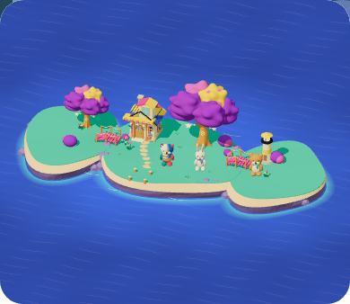
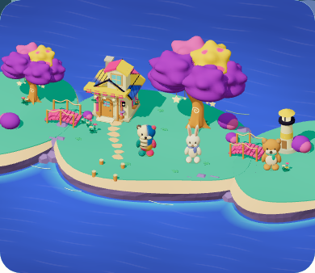
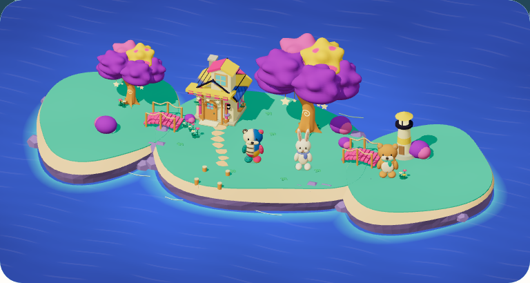
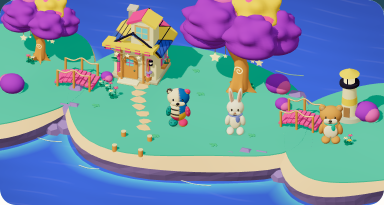

# 芝面の局所改善 — 固定28→33

2026-09-09。既定moon-gardenの芝に小葉の丸い起伏が読め、住民の足元と石道の読みやすさを保つ局所改善として、材質 `island-grass-surface-v5` / 全体 `mystic-island-shore-garden-v13` を採用する。rootがphone全景・近景、tablet近景と[source A](../shore-garden-a.png)を実画像で比較した判断である。屋根の黒い継ぎ目、一様な砂帯/崖、全体の素材・形・構図の差は残り、source A全面parityはHOLD。子どもの理解/動機の観察 N=0、Full Goalは未完了。

## 検証の範囲

前は固定28 `workshop-20260909-cef819587f14`（1072 inputs）、後は固定33 `workshop-20260909-37fdc4e0b49b`（1074 inputs）。前後とも `VITE_ISLAND_ENABLED=true` / `VITE_BUILD_PLAY_ENABLED=true`。固定manifest・保存済みversionと、各captureの実runtime revision/version/candidateを[verification.json](verification.json)に収録した。元reportは `output/playwright/island-renewal/grass-review-33-01/report.json`。新規撮影や画像加工はせず、8 PNGを同じSHAのままコピーした。

phone 390×844 / tablet 768×1024、両幅ともreduced motion、service worker制御下のhomeを撮影した。**明示した成熟3土地の保存fixture**であり、実回答・家具の実獲得・最大成長の獲得過程を示さない。元fixtureは `output/island-experience/camera-23-03/phone-mature-fixture-declared-fixture.json`。profileを作り、同じfixtureのprofileIdだけを変更して使う。通常planner、再遊びの自発性、学習予約の維持をこの比較では測らない。

| 項目 | reportから確認した結果 |
| --- | --- |
| 実行行 | 両幅×前後、4行PASS |
| 保存画像 | 各行の全景/近景、計8枚 |
| camera | 対応する前後の32値が一致 |
| 描画回数 | 全captureで152 |
| 保存 | 各contextの全objectStoreを撮影前後で比較し、不変 |
| console/page error | 0 |
| source / QA | 開始・終了照合で保持 |
| cleanup | browserClosed=true |

ここでの実ブラウザ合格は静止比較の範囲に限る。親担当の固定33検査は295 files / 3264 tests（61.03秒）と型/build/assetsがPASS。元ログは `output/playwright/island-renewal/integration-tests-33.log` / `integration-build-33.log`、SHAは集計へ保存した。lintもerror 0（既存Fast Refresh警告1）でPASS。docsもtracked 4710 filesだけをリポジトリ外へ写した検査でPASS（既存期限警告7）。これで型・lint・全unit・build/assets・docsのcore構成検査は合格。この文書作業では新しいテスト・build・ブラウザを実行していない。正式throughput、PWA/移行、normal motion、他の所持部位全組合せの既存証拠を固定33へ読み替えない。

**ローカル素材の採用と、image-led統合候補の検査完了は別。** 固定33の[正式80run](throughput-verification.json)もPASS。正答後の入力再開P95はphone199.9ms / tablet199.8ms、通常連問の追加操作0。固定問題の自動keyboard・音off/reduced motionの計測で、通常plannerや子どもの実速度ではない。同じ固定33 sourceの[classic smoke](smoke-summary.json)も31/31 PASS。専用DEVでIsland/build-play両flagsを無効にした保護経路の確認であり、Island PWAの合格とは呼ばない。旧固定26の合格を33へ転用しない。

既存のmaterialSignatureはmapのみを含み、bumpMap/scale/repeatの保持を証明しない。GPU診断は固定32へ帰属し、固定33の4行・実画像・source保持とは分ける。

[実8画像のコンタクトシート](contact-sheet.html)にも、同じ画像・実metadata・fixture注記を並べた。家・実獲得・学習復帰は[固定23の別監査](../../audits/2026-09-09-island-home-checkpoint.md)、家の撮影/操作配置は[固定28の別監査](../../audits/2026-09-09-island-panel-layout/README.md)へ帰属する。今回の芝比較をこれらの再検証とは呼ばない。

## 同じ画角の実画像

| 構図 | 固定28・前 | 固定33・後 |
| --- | --- | --- |
| phone 全景 |  |  |
| phone 近景 |  |  |
| tablet 全景 |  |  |
| tablet 近景 |  |  |

## 材質と保持する境界

対象は `legacy-v1:moon-garden:ground` の上面だけ。128² R8の短葉height textureを専用poolが一度生成し、3土地のcapが共有する。repeat0.25・既存UV・height bytes・base color・粗さ・geometryを保ち、bumpScaleを1.2にした。Threeの隣接画素の高さ差に対する法線応答であり、worldの高さや歩行面の変形ではない。map付き所持部位、`parts-v1`、他テーマ、岸、道、家は対象外。時間uniformや毎frameの更新を加えない。

## 保持する不採用と診断履歴

| 固定版 / 原記録 | 判断と原因 |
| --- | --- |
| 29 / `output/playwright/island-renewal/grass-review-29-01` | v1はHOLD。細模様が縮小除去され、地面近似色域の平均差は約1/255。描画/保存が通っても素材の改善とはしなかった。 |
| 30 / `output/playwright/island-renewal/grass-review-30-01` | v2もHOLD。横長の色斑が水面に見えたため、albedoの色noise調整を終了した。 |
| 31 / `output/playwright/island-renewal/grass-review-31-01` | v3もHOLD。bumpへ変更してもほぼ平滑で、phoneの葉の投影が小さかった。 |
| 32 / `output/playwright/island-renewal/grass-review-32-01` | v4もHOLD。repeatを下げた後も全画像の最大差は1/255。葉の投影寸法を実陰影の可読性と同一視できなかった。 |
| 32 GPU01 / `output/playwright/island-renewal/grass-gpu-32-01` | QA FAILを保持。上限到達後のzoomクリックによる停止であり、後の成功に置き換えない。 |
| 32 GPU02 / `output/playwright/island-renewal/grass-gpu-32-02` | 材質経路の限定PASS。実drawArrays 960頂点でUSE_BUMPMAP、bumpScale約0.035、transform対角0.25/0.25/1、128² R8・16384bytes・最小31/最大197/平均50.0047のtexture bindingを観測。材質が届くことと視覚採用を分けた。 |

原report/PNGは不変で保持し、[制作経緯](../direction.md)に詳細を残す。固定33の採用は芝材質の局所判断であり、これらのHOLDやsource A全体との差を消さない。

main保存地点は `7e533d3`。[Verify Core](https://github.com/yutogasaki/sansu/actions/runs/34301924112)（295 files / 3264 tests）と[Docs Check](https://github.com/yutogasaki/sansu/actions/runs/34301924111)も同じcommitでPASS。これは芝v13の保存地点で、後続の屋根試作は含まない。
