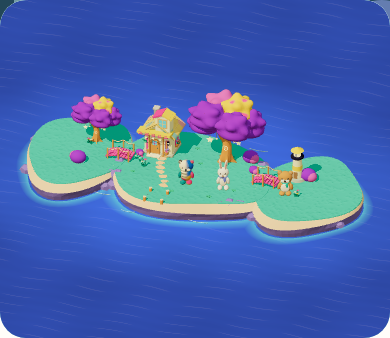
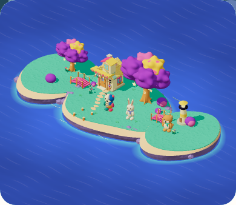
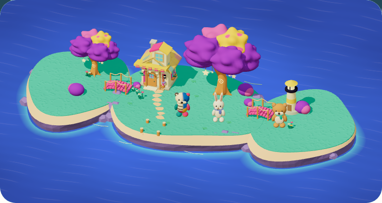
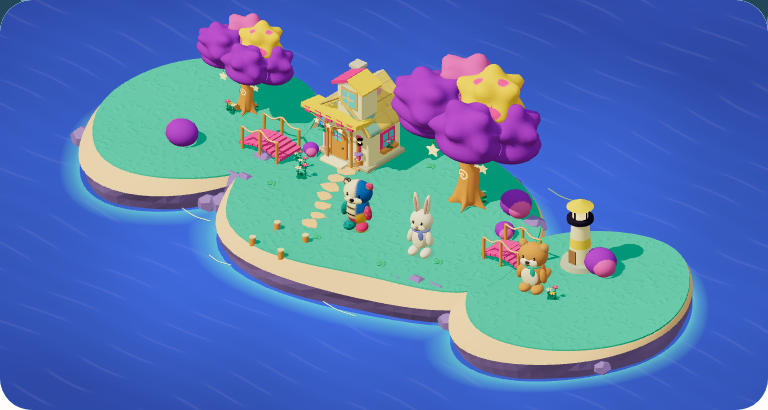

# 成長する島の輪郭と画角 — 固定34→35

2026-09-09。rootがphone/tabletの全景と既定の庭を実見し、対角に続く奥行きと、東西の余分な膨らみの縮小を局所改善と判断した。`mystic-island-shore-garden-v15` の限定確認であり、横に並ぶ三つの保存楕円の骨格は残る。[source A](../shore-garden-a.png)全面parityはHOLD、独立した理解・動機の観察は **Human N=0**、Full Goalは継続する。

**限定実描画は8行PASS、固定35の統合unitは4件FAIL。** この版を公開完成・全経路の合格とは扱わない。原結果を保持し、原因修正と再確認は次版へ帰属させる。

## 実画像と対象

[26枚のcontact sheet](contact-sheet.html)で、phone/tablet × 前後 × default/all × 拡張0/1/2の24枚と、固定35の既定画角・拡張2の実アプリ文脈2枚を比較できる。すべて原PNGの無加工コピーで、[verification.json](verification.json)に各SHA・実cameraのSHA・frame時刻・draw回数・版と出典を保存した。完全な32camera値はcontact sheetと原reportに残す。

| 端末・明示「しまぜんぶ」・拡張2 | 固定34 | 固定35 |
| --- | --- | --- |
| phone 390×844 |  |  |
| tablet 768×1024 |  |  |

前は `http://127.0.0.1:5420`、固定34 `workshop-20260909-193b42164378` / v14。後は `http://127.0.0.1:5421`、固定35 `workshop-20260909-94e5462d1f11` / v15。両方1076 inputs、Island/BuildPlay両flag=true。後のsource SHA256は `94e5462d1f11b3f0ee30c0727fcb4b77c873b1986577ee644966ad90fbeb0be7`。固定35は34をbaseに11の明示差分を重ね、並行中のnavigationのapp UI変更を除外したもの。未実行のPWA runnerに含まれた並行変更とコミットの分離は[後続36の注記](../growth-v16/README.md)を参照。現在の作業tree全体や後続版と混同しない。

## 何を確認したか

8つの独立contextで、同一document/canvasのまま拡張0→1→2を連続表示した。defaultと、本人が「しまぜんぶ」を選ぶallは別contextとし、明示選択が未選択の経路へ混ざらない。各幅ともreduced motion、home、Three renderer、Service Worker制御下での撮影である。

既存の明示成熟fixture（completedSets=24、全居場所progress=6、2品収納）を使い、native保存のexpansionLevelを0/1/2へ設定した。初期設定に1回の明示reloadを使い、その後はnative書込みとDexieへの変更通知から実描画を待つ。拡張時に変えるのは当該島のexpansionLevel/revision/updatedAtだけ。各閲覧区間はこの宣言した変更後の全objectStoreと一致し、Blobも内容SHAで比較した。通常初期化後に取ったbaseline以降の検査であり、初期化自体の全書込みを監査したものではない。

| 経路（両幅） | 固定34の0→1→2 | 固定35の0→1→2 |
| --- | --- | --- |
| 未選択のdefault | all→home→home。0→1でcameraが変化 | home→home→home。3段階の32camera値が完全一致 |
| 明示all | allを維持。収まりに応じて倍率が変化 | allを維持。新しい対角の画角と収まりを使用 |

全24captureで同document/canvasと、宣言したfixture更新以外の全store保持を確認。console/page errorは0、sourceStable/qaStable/browserClosedはすべてtrue、8 contextも終了した。警告20件（Threeの影設定非推奨とReadPixelsのGPU stall）は原reportに保持する。draw回数は89〜262で、行ごとの実値をJSONに保存した。一定の152回や正式性能の合格とは主張しない。

原reportは `output/playwright/island-renewal/growth-review-35-01/report.json`、QAは `output/playwright/island-renewal/growth-review-35-01.mjs`。元の24stage＋24page PNGを保持し、この文書には26枚だけ複製した。保存fixtureの直接更新を使った視覚診断なので、3段階を実回答で獲得した過程・最大成長の達成・子どもの自発行動・通常planner・学習の速度の証拠にはしない。

## 輪郭と統合検査

[形と構図の意図](../island-growth-shape-direction.md)は、既定の庭を同じ距離に保つこと、明示全景の視線を約19度から約41度へ変えること、東西の正の膨らみを縮めることを分けている。64頂点の輪郭計算では東cap面積を約9.93%、西を約9.82%減らし、母島を維持した。床y=0、旧配置楕円、橋と保存propの位置は変えていない。これは輪郭の計算・専用回帰の根拠であり、cameraも変わる前後PNGだけから求めた数値ではない。

固定35の型/build/assetsはPASS。lintは0 errors・既存warning 1件。全unitは **294 files PASS / 2 files FAIL、3270 tests PASS / 4 FAIL（計3274）**。`appearanceRendering` のstarry/candy/crystalの空の投影3件と、`cosmeticScenery` の旧geometry hash比較1件が失敗した。root/camera担当が新全景角度と屋根材質によるbatch分割を切り分けて修正中で、この35のFAILを期待値の更新や次版の結果で消さない。出典は `output/playwright/island-renewal/integration-build-35.log`、`integration-lint-35.log`、`integration-tests-35.log`。

固定35の正式80run・通常smoke・CIは未実施。[固定33の芝と検査](../grass-v13/README.md)、[固定34の屋根](../roof-v14/README.md)、[固定28の操作配置と家の写真](../../audits/2026-09-09-island-panel-layout/README.md)は別版の証拠であり、この比較へ合格を移さない。

## 残る判断

rootの作者視覚確認は両幅のbefore-all2 / after-all2 / after-default2、計6枚に基づく。全景は左右だけでなく手前と奥へ続いて見え、東西の余分な丸い張り出しも減った。一方で、三つの土地が横に連なる骨格、一様な砂帯・崖、source Aとの全体の差は残る。全外見・全重要経路の見た目、normal motion、独立した理解・安全性・動機は今回未検証。限定視覚の改善、描画の整合性、子どもの体験を別判定として維持する。
