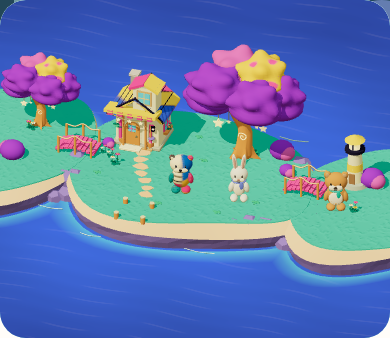
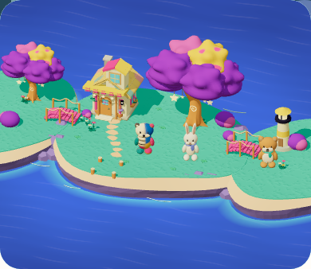
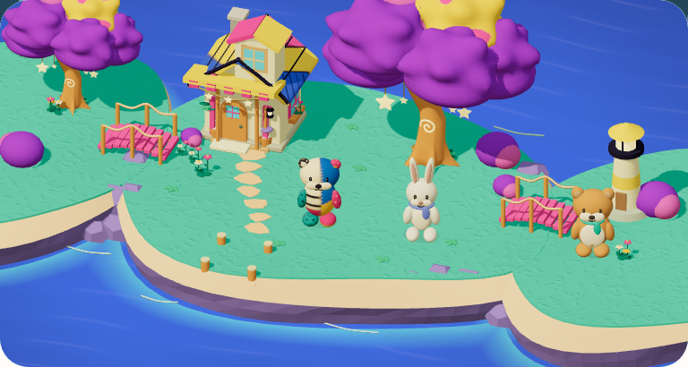
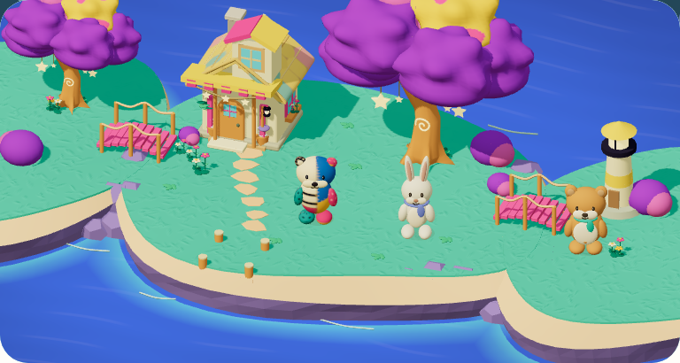

# 屋根の面がまとまる局所改善 — 固定33→34

2026-09-09。rootがphone/tabletの実近景を比較し、二重の黒線が消えて家の色面がまとまる局所改善として `island-roof-surface-v1` / `mystic-island-shore-garden-v14` を確認した。[source A](../shore-garden-a.png)全体とのparityはHOLD。個々の丸端瓦を実立体化したものではなく、既存shell/UVへの静止した色mapと暖色の継ぎ目である。

前は固定33 `workshop-20260909-37fdc4e0b49b` / v13、後は固定34 `workshop-20260909-193b42164378` / v14（1076 inputs）。後のsource SHA256は `193b42164378cf84c3841ef3b0c1849be420cfad2e5e84b3a88114a4c2c270db`、実対象は `http://127.0.0.1:5420`。前後ともIsland/BuildPlay両flag有効。[verification.json](verification.json)へ版・flags・source/QA/PNG SHA・実cameraを保存した。

## 実画像と検証範囲

| 端末 | 固定33・前 | 固定34・後 |
| --- | --- | --- |
| phone 390×844 |  |  |
| tablet 768×1024 |  |  |

4枚は元stage PNGと同じbytesの無加工コピー。原 `output/playwright/island-renewal/roof-review-34-01/report.json` は両幅×前後の4行PASS、全景/近景の8captureで152 draw、対応camera一致、各contextの全objectStore不変、console/page error 0、sourceStable/qaStable/browserClosed=true。明示した成熟3土地・2品収納の保存fixtureを使い、home/reduced motion/SW制御下で撮影した。実獲得・通常planner・最大成長を学習で得た過程・子どもの行動・正式性能は示さない。

固定34は関連4 files / 28 testsと型/build/assetsがPASS。元ログは `output/playwright/island-renewal/roof-focused-34.log` と `integration-build-34.log`。**34の全unit・lint・正式80run・通常smoke・CIは未実施**。正式80run/smokeは固定33、CIはcommit `7e533d3` の別証拠であり、この34へ合格を移さない。[芝v13の監査](../grass-v13/README.md)とも版を区別する。

## 保持する境界

対象は `legacy-v1:moon-garden:houseRoof` の面 `#c24f3e` と継ぎ目4色だけ。既存shell・UV・door・flag・世界palette・他theme・明示 `parts-v1` を維持する。guard、実builderへの材質到達、texture連続性、clone復元とpool退役は上記の関連回帰へ含むが、画面の魅力は実画像の局所判断として扱う。詳しい意図は[屋根素材の制作方針](../roof-material-direction.md)に残す。

砂帯/崖の一様さ、source Aとの素材・構図全体の差、島が横長に増えることへの最新の違和感は今回の屋根修正では扱っていない。source A全面parity HOLD、独立した理解/動機の観察 **Human N=0**、**Full Goal Active**。この文書作業でapp・テスト・ブラウザは変更/実行していない。
