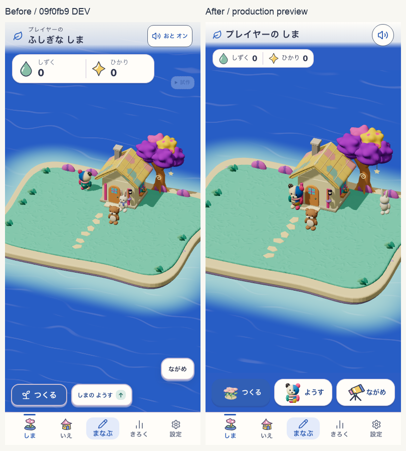
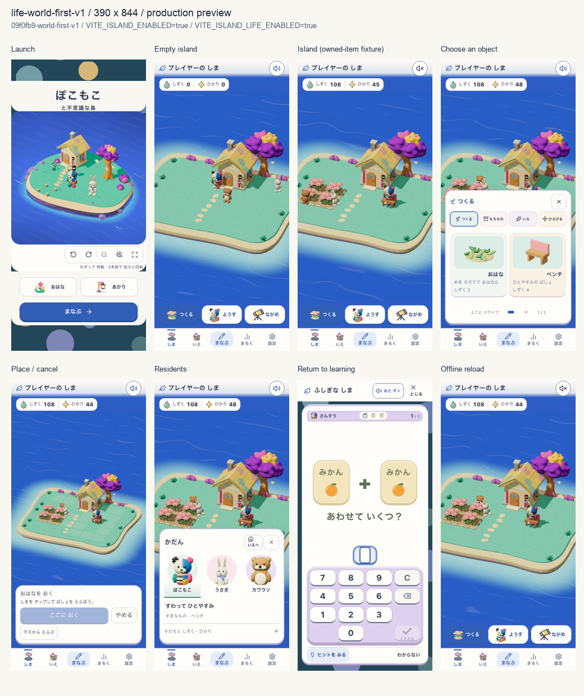

# 島を主役にする小さな操作面

2026-09-13。見出し・残高を各1行にし、「つくる／ようす／ながめ」を絵付きの1列へまとめた。通常の完了文は7秒で消え、同時の成長・発見・獲得は代表1件だけを案内する。保存失敗は消さず、再試行へ進める。[仕様48](../../product/48_island_life_spec.md#島を主役にした小さな操作面2026-09-13)が正本。

## 美術と表示範囲

| 継承するもの | 引き継がないもの |
| --- | --- |
| ミントの草地、紫の木、黄色い屋根、青い海、実3Dの花とぽこもこ | 大きい説明カード、常設の完了文、用途不明のアイコンだけの操作 |

花の3D見本とぽこもこの上半身は既存の描画・キャッシュを再利用。望遠鏡は既存の色付き玩具アイコンと同じ配色・輪郭の小さな絵とした。カタログは引き続き購入時の芽を見せる。新規の生成美術やキャラクター、保存writerは追加していない。

390×844で上の情報と下の操作に隠れない実canvasは604px高（画面の71.6%）。通常近景は従来の約1.15倍。全景・配置用の倍率を保持し、家の前へ少し中心を寄せた。320幅・横画面では44px操作と情報の可読性を優先し、70%を一律に要求しない。

## 対象と証拠

- 対象: `http://127.0.0.1:5323` の本番用ローカルpreview。この記録はローカルpreviewの検証であり、本番稼働の確認とは区別する。
- 親revision: `09f0fb9`。未commit変更のbuild名: `09f0fb9-world-first-v1`。
- App version: `09f0fb9-world-first-v1:e1473058-d24c-4ace-be84-23c4e1fb027e`。
- Flags: `VITE_ISLAND_ENABLED=true`、`VITE_ISLAND_LIFE_ENABLED=true`。
- Runtime HUD: `data-life-hud="life-world-first-v1"`。既存世界: `island-life-moon-garden-v9`。
- [source manifest](source-manifest.json)に変更した全アプリ入力のSHA-256を記録。
- 比較前は清潔な`09f0fb9`のDEV・空の島。比較後は同じ390×844の本番用preview。確認用の花4個・ベンチ・残高は使い捨てのnative fixtureであり、本人の保存データや実学習による取得ではない。
- 起動は新しいブラウザcontext。Chromiumでは実SW制御、offline再読込、同じ学習への復帰を確認。WebKitのoffline境界と実機iOSは未検証。

## 検証

| 検査 | 結果 |
| --- | --- |
| `verify:core` | PASS。docs/lint/typecheck、351ファイル・3,665テスト、build、assets |
| `e2e:smoke` | 31/31 PASS |
| 既存resources回帰 | Chromium 390/768/320/844幅 PASS。実初回3問、残高/育ち、通知、5桁、学習store保持、再読込 |
| 新しいworld-first回帰 | Chromium 4サイズ PASS。絵の読込、44px/hit、世界/残高/操作の分離、全景/近景/zoom復帰、カメラと情報面の排他、focus復帰、7秒通知、配置取消、学習復帰 |
| 保存失敗の診断 | Phoneで次のworld putだけを失敗させ、7秒後も案内が残り、再試行で元の色を適用。学習store不変 |
| WebKit 390幅 | 通常UI・保存失敗/再試行・学習復帰・online SW制御の再読込までは確認。offline再読込はブラウザ内部エラーで未完 |

[基本チェック](checks.txt)、[既存回帰](resources-report.json)、[phone](phone-report.json)、[tablet](tablet-report.json)、[small](small-report.json)、[landscape](landscape-report.json)、[WebKit未完境界](webkit-report.json)、[診断の経緯](diagnostics.txt)。全体suite後の変更は検査driverの失敗記録・起動画面の待機と証拠文書のみ。アプリ入力は固定。

## 分けて判断するゲート

- 視覚: 作者による今回の整理範囲の確認済み。文字面積を減らし、絵と実物のidentityを合わせた。[tablet](tablet-home.png)、[small](small-home.png)、[横画面](landscape-home.png)。新しいcold-openや世界全体の美術採点・承認はしていない。
- 無説明理解・安全: Human N=0。独立した子どもの理解テストは未実施。用途名、音の読み上げ名、保存失敗からの復帰を保持。
- Runtime: 上表のUI・Chromium offline範囲でPASS。WebKit offline、実機iOS、二build PWA更新は合格扱いにしない。学習入力・採点・連問・保存の実装は変更していない。

この変更のローカル実装とUI検証は完了。新規の世界美術・公開全体のrelease gateを通過したという意味ではない。
