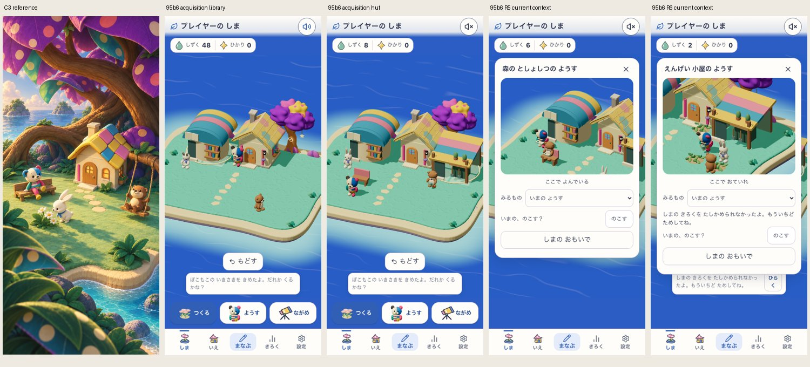
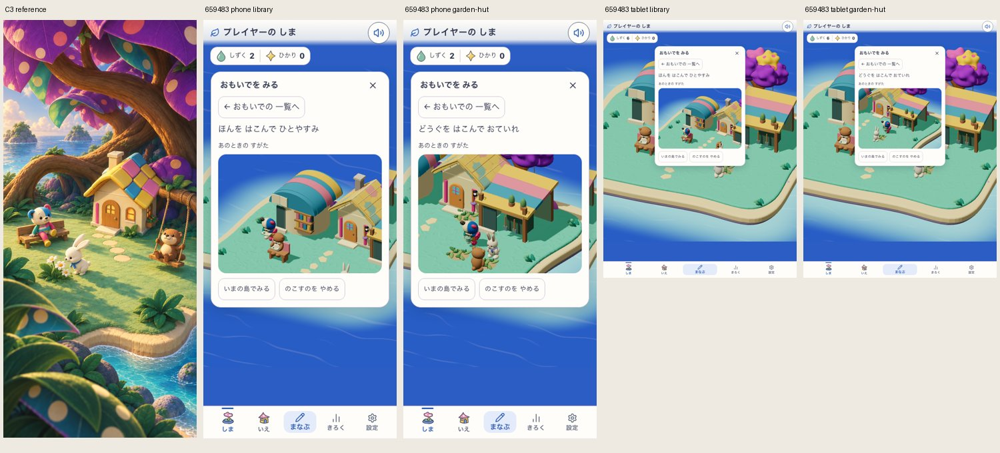

# 実獲得した施設と、観察対象の利用中表示

## 問題と変更

本番用12品ビルドで、園芸小屋から他の住民が使っている花を選ぶと、入口の手入れを続けるだけで、その花を使えない理由が分からなかった。観察画面の現在フレームから、明示したR5/R6の相手を別の住民が利用・予約していることを判定し、「いまは ほかのこが つかっているよ」と再試行を表示する。

保存済みactionの再生や通常の入口利用への戻り方は変更しない。他の住民をどかさず、すでに運び終えた本・道具は、後から入口へ来た先客のために利用中と誤表示しない。キャラ・施設の形・価格・学習writerは変更しない。

## 初回の事実と診断

- `initial/`: 前版の実本番用build、app source `f03b6f45255db23a342d71341251614fb476d0f9003c19e7971bd999c879c25f`。実初回設定と通常入力60問から120しずくを獲得。図書室72・ベンチ4・園芸小屋36・花2を購入。図書室の単体読書とR5の表示・本人保存までは進んだ。花を他の住民が使っていたためR6を待つハーネスが45秒でFAIL。空きを仮定した検査だった。
- `selection-probe/`: 同じ隔離ブラウザの実所有を続け、花を明示しても「ここで おていれ」のままで理由が表示されないことを確認。DB注入や時計変更はしていない。元buildのversion/SHAは[前版の記録](../2026-09-14-open-catalog/README.md)。
- `busy-fix-first-run/`: 修正後は利用中の案内を実表示できた。しかし追加した2個目の花も別の住民が使い始めたため、R6待ちが再びFAIL。アプリのエラーとせず、空きを仮定した検査を修正した。
- `free-plant-probe/`: 同じ実所有の続きで3個目の花を購入し、実際の住民poseから空いている花を選ぶとR6を表示できた。これは限定診断であり、新規獲得からの全通しPASSとして扱わない。

初回・2回目それぞれの正確なハーネスとFAILログを保持している。ブラウザのプロフィールフォルダはローカルの隔離検査用で、リポジトリへ含めない。

## 修正後の固定入力

app source `95b6c3563962db005ca9a31fc5c18411134bf9d0f77c2cbaafe3f177474d2629`。親revision `deadece`。本番用buildは `development-local:c1d3d034-2a95-43f3-9dc0-7caecf1f3c51`、ローカル配信 `http://127.0.0.1:5308`。Island/Life/Discovery=true、Life preview/BuildPlay=false。manifestに全app入力と配信物のSHAを保持する。

対象13テストとcore411ファイル/3960テスト、lint/typecheck/build/assets PASS。公開設定の変更や外部デプロイを含まない。

## 最終確認の範囲

最終runは新しい隔離ブラウザから、各幅で初回設定・通常入力60問・実購入を行う。図書室の単体読書、園芸小屋の単体手入れ、R5/R6の現在の観察・本人保存、利用中の説明、空いた別の花の明示選択、offline reload後の所有と保存ID保持を検査する。Learning/Island/Exploreの7ストアと同じ次問を観察前後で比較する。全21ストアの比較とは言わない。

この検査はbotによる実UI操作であり、子どもの理解や学習効果を測るものではない。観察は本人が選ぶ `current-context-test` で、自然発見に読み替えない。新しく置いた物が必ず空いているとは仮定しない。

## 実行結果と再演修正

`acquisition/report.json` は上記95b6 sourceで両幅PASS。phoneは利用中分岐を通り、花を計3個購入・残高2・版14。tabletは最初の花が利用可能で、残高6・版13。利用中案内の実表示はphoneだけで確認した。各60問、単体利用、R5/R6の保存、offline保持が成立。取得時の園芸観察には保存確認失敗の文言が残った画面がある。最終保存IDと再読込は成立しているが、この文言の原因は未解決で、pageerrorが0という理由で正常表示とみなさない。

その実所有者の保存場面を再演すると、R5の相手ベンチが可視判定を満たさずFAIL（`replay-initial/`）。元snapshotの本を運んだ住民は正しく、無関係なM3の影controllerが生成した形によりカメラが影用へ切り替わっていた。影操作を提供しない再演ではcontrollerを無効にし、元snapshot・住民・配置を保持した。回帰検査のRED/GREENを保存。全景など既存呼出しは既定で有効、無効→再有効も検査した。

最終renderer source `65948365dabf82b88530f272606e2ab80da65c233aad893a3042463716bae4d2`、親revision `deadece`、build `development-local:2d9c3134-97f9-4b19-a429-6f2abef1d5ec`。同じ5308 origin、同じflags/candidate（moon-garden / mystic-island-shore-garden-v18）を使用。`final-build-source.json` と `final-core-output.txt` に固定入力とcore411/3960 PASSを保持する。獲得runをこの新sourceで実行したと扱わない。

`replay-json-compare/` は実SW更新後、JSON reportでは省略されるundefined propertyを直接比較してFAILした限定ハーネス不備。JSON同士の比較へ直し、`replay-final/report.json` で両幅の旧R5/R6をoffline再演できた。元保存scene、残高、学習等7ストアを保持。phoneは前回runで更新済み、tabletは最終runでentry JS更新を待った。単一runで両者の更新全工程を再実行した証拠ではない。

視覚: HOLD。C3の包まれる巨木/奥行きは現productionに届かず、観察/思い出の白い枠が世界を囲う課題も残る。建物の違いは読めるが全体の完成としない。

無文字理解・安全: HOLD、Human N=0。利用中案内は文字に依存する。独立観察による理解・安全判定は未実施。

Runtime: 対象の取得/保存/offlineと修正後再演はPASS。取得時に残ったエラー文言は未解決。全release・実機・全ルールの合格ではない。

視覚は従来のmoon-gardenで、C3の全体合格は未認定。無文字理解・安全の独立観察者は0人。全12品の全ルール・旧v1経済の実移行・実機・完全なrelease matrixは引き続き別の残件。
