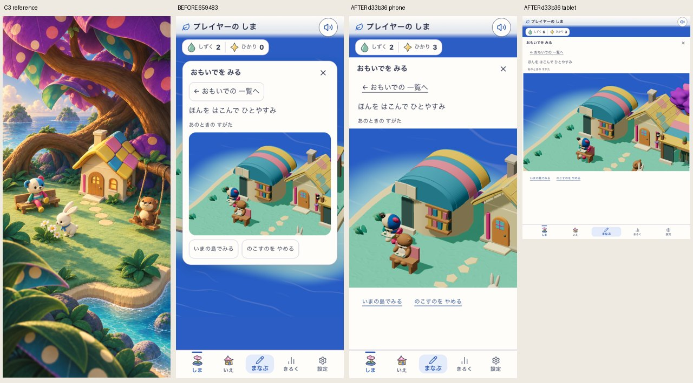
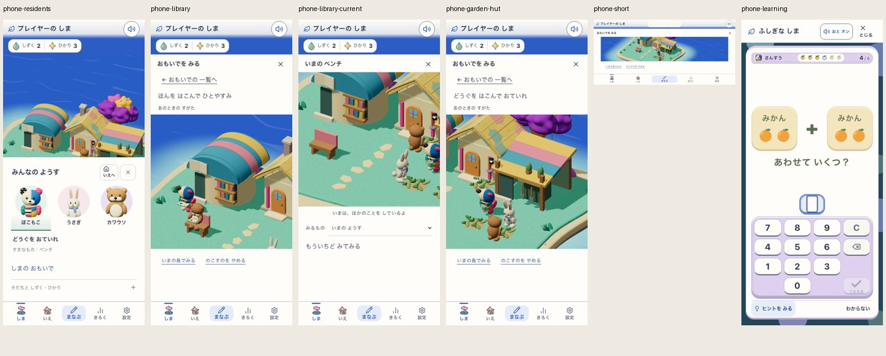

# 観察と記憶の箱を外す

ユーザーの「ボックスUIださい」に対応する、観察と保存場面の表示面の変更。全景の上の360pxカードをやめ、共通header/残高の下に横幅いっぱいの面を置く。場面を拡大し、一覧・タブ・保存/戻る・選択欄の入れ子の枠を外す。紙色・文字色・操作色は既存pokomoko tokenを用いる。

C3から移すものは住民と暮らしを見せる広さ、色面のまとまり、余白。生成された住民差分・固定配置・地形は移さない。今回は画像/住民/形/保存schema/操作契約を変更せず、既存の実sceneのための余白と寸法を変更する。元の施設再演の失敗/修正は[前の記録](../2026-09-14-facility-production/README.md)に分離する。

初回app source `1d4db7f5e337e9224ae36930854562138c8e368ab6d5983a6f9dee629eeb8706`、親revision `62fb33e`。対象はlocalhost:5308の固定production。Island/Life/Discovery=true、Life preview/BuildPlay=false。worldはmoon-garden / mystic-island-shore-garden-v18のまま、C3を配信素材として扱わない。外部公開反映の記録ではない。

対象は元の実60問/施設購入の隔離ブラウザに保存されたR5/R6。再演と現在画面、保存解除の取消、元保存scene/残高/学習等7ストアの保持を確認する。新規取得全行程をこのCSS変更で再実施したものではない。元の獲得sourceは前の記録を参照する。

初回はcore411/3960 PASS後、CSS疑似要素で追加した矢印がボタンのaccessible nameまで変わり、元の「しまの おもいで」の操作がFAIL。`initial/`に画面/例外/sourceを保存。矢印を取り除いて操作名を保持した。また「ようす」の外側の枠/影も外し、つくるの面とそろえた。

中間source `a24318c52f67d5035272e7d80277fa311abe867a5b5086fb363bcb6552990f45`。調整はCSSのみで、TypeScript/テストは初回coreと同じ。初回coreを後のsourceの全検査と書き換えない。

## 中間結果と表示回帰

中間build `development-local:4740c9ae-b42f-4040-9284-fe549557fc16`。lintは既存Fast Refresh警告1件/エラー0、typecheck/build/assets PASS。`runtime/report.json` の両幅で対象操作はPASS。横幅はphone390px / tablet760px、scene高さは371px / 451px。元R5/R6のoffline再演、現在画面、保存解除の取消、844×390での操作/閉じる/Escape、全数字キーの見える学習入力への復帰、元scene/残高/学習等7ストアの保持を確認した。通常motionとreduced motionを分けた自動検査で、利用者評価ではない。

取得時から残る別件の保存確認エラー文言は前の記録の未解決事項のまま。無関係なエラーをこのCSS変更で解決したとしない。

「ようす」の `runtime/*-residents.png` では島が欠けた。再描画待ちと仮定したが、`settled-dock/` の750ms後も欠けたため、この仮説を棄却。余白変更では欠ける列が余白に追従、transformだけでは改善せず、1pxの角丸で背景表示が戻った（各 `dock-*-probe/`）。描画呼出しとcanvas寸法は保持され、島のデータは変わらない。Chromiumで直角の不透明面を重ねる際の合成に関わる現象と推測するが、ブラウザ内部の原因は未確定。最終CSSは枠/影なし、角のみ1pxとする。中間画面を完成の根拠にしない。

## 最終候補

source `d33b36d7981f098f561c226cbfbcd0083e49e0ae2061a08f46bde3260f7b068e`、build `development-local:006a373e-6f61-4b7c-8d5c-da1558e816ea`。manifestは `final-build-source.json`。最終変更は上記角丸1pxのみで、typecheck/build/assetsを再実行した。初回coreのJavaScript/TypeScript入力は同一。

`final/report.json` は両幅PASS。同じ保存scene/残高/学習7ストア、再演と現在画面、解除取消、低い横画面、学習全数字キーへの復帰を再確認した。最終 `final/*-residents.png` では背後の島も実表示される。比較画像はこの最終sourceを使い、中間比較は `intermediate-comparison.jpg` として残す。

三つの判定:

- 視覚: 箱の入れ子を減らし、住民の顔と利用を拡大できた。C3の巨木・局所の陰・奥行きは依然未達で、世界美術の総合判定はHOLD。
- 無文字理解/安全: 独立観察Human N=0、HOLD。既存文言と44px操作を保持したが、読み上げ名の初回回帰は修正前の失敗として残す。
- Runtime: 対象旅程PASS。全問throughput、実機/iOS、全release matrixを再測定したものではない。
