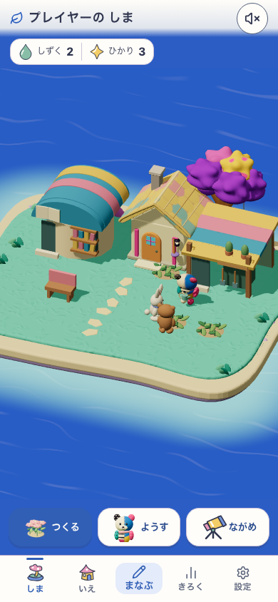

# Sansu 実装の進み具合

2026-09-14、ユーザーの指示で実装をいったん中断。

**主要機能は実装されているが、見た目・遊び心地・全体受入は未完です。**

このタスクがmainへ反映したアプリcommit `cfb67f6` までと、独立worktreeの未反映作業を分けています。別作業の未commit変更、本番公開、利用者検証は含みません。

以前の「約7割」は概算で、仕様の全受入項目を照合した数字ではありません。確定した進捗率としては使いません。数えられる品目は **12/12実装**、住民の移動改善とC3美術は **未完** です。

## できたことと残っていること

| 対象 | 状態 | 確認できている範囲 |
|---|---|---|
| 学習から島へ | 反映済み | 通常入力→しずく→購入。実60問から施設を取得する経路を確認。 |
| 品ぞろえ | 12/12実装 | 花・ベンチ・ブランコ・灯り・苗・水鉢・テーブル・風車・アーチ・砂場・小屋・図書室。公開flagと所有済み品の保持を実装。 |
| 配置・保存・オフライン | 反映済み／範囲検証 | 実購入、移設、収納、保存場面の保持、4品→12品の実build更新を確認。全配置の保証ではない。 |
| 観察・思い出 | 反映済み／範囲検証 | 本・道具の運搬、明示観察、本人保存と再演。全組み合わせの受入は残る。 |
| ボックスUIの削減 | 一部反映済み | カタログ・観察・思い出・住民パネルを整理。アプリ全体のデザイン完成ではない。 |
| 建物の描き分け | 反映済み | 図書室は丸い屋根と本棚、小屋は開いた作業場。C3相当の品質には未到達。 |
| 魔法・特別な出会い | 実装あり／確認残 | 水・影・足あと、蝶・小鳥・読書などを接続。自然なX3出現や総合確認は未完。 |
| 住民が歩き回る改善 | 作業中・未反映 | 20〜32秒の利用と散歩を分ける試作。実際の建物配置で歩行が不足し、実画面検査FAIL。 |
| C3の世界表現 | 未完 | 巨大な枝葉に包まれる空間、局所的な陰、奥行きのある光が残る。キャラは維持。 |
| 仕様全体の完了判定 | 未完 | 混合配置・全中断・旧経済移行・実機/PWA総合・利用者の無文字理解が残る。 |

## 現在の画面と目標

以下はmain相当のproduction previewで、実際に学習・購入した島です。

目標は[世界表現の参考C3](../references/2026-09-13-canopy-dots/reference-c3.png)。現状は、大きな枝葉に包まれる空間と局所的な光・陰が不足しています。参考画像の生成キャラを設定画へ置き換える作業ではありません。

画像のapp sourceは `d594fd9d6751c0308a654d62c688e8a8c9f9e0f8bf8bcf21393092758ed27194`。localhost:5308、Island/Life/Discovery=true、Preview/BuildPlay=false、moon-garden。外部デプロイの証拠ではありません。

## 今回止めたところ

住民の移動は独立worktree `/tmp/sansu-canopy-material-worktree` に未commitで保持。保存版15を含む試作はmainへ入れていません。

試作段階で3968テストは通りましたが、実画面の90秒確認で自律住民2人の歩行条件を満たさずFAIL。建物と家具のある狭い配置では、既に歩き終えた他の住民の経路まで予約扱いに残るケースを絞り、再現テストを追加したところで中断しました。**現在の追加テストは1件FAILで、修正・再検証が必要です。**

- [実画面検査の失敗結果](evidence/resident-runtime-failure.json)
- [狭い配置の再現テスト](evidence/resident-path-regression.txt)

失敗した試作のapp sourceは `688fd1fd4b3178e7d08cb8311b1e8512f67e85eee5e358f8ee56edc193f56845`。全体テスト後に上記の再現テストを追加したため、現在の作業ツリー全体へ3968 PASSを流用しません。試作は隔離ブラウザの島だけを版15へ進めています。ユーザーの本番データの移行証拠ではありません。試作を配信していたローカルサーバーは停止しました。

## 直近のmain反映

| commit | 内容 | 証拠 |
|---|---|---|
| `5537d38` | カタログの入れ子枠を減らし、図書室と小屋の外観を分けた | 実装commit |
| `deadece` | 4品→12品のPWA更新と購入済み品の保持を検証 | [更新検査](../2026-09-14-discovery-upgrade/README.md) |
| `62fb33e` | 施設利用中の案内、保存場面への影の混入を修正 | [施設の実取得検査](../2026-09-14-facility-production/README.md) |
| `bd9f9dd` | 観察・思い出・住民パネルのボックスUIを整理 | [実画面](../2026-09-14-open-scenes/README.md) |
| `cfb67f6` | 歩行中の拒否を保存エラーとして表示する文言を修正 | [検証範囲と未確認部分](../2026-09-14-observation-feedback/README.md) |

## 判定を分ける

- **視覚:** UIと建物は一部改善。C3美術はHOLD。
- **無文字理解・安全:** キャラと学習契約を維持。実利用者の理解確認は未実施（N=0）。
- **runtime:** mainの各段階で対象チェックを実施。住民移動の試作はFAIL。全release PASSではない。

再開する場合は、住民の経路予約の修正→同じ実配置での歩行確認→C3美術と残りの全体受入、の順で進めます。この中断後に自動で新しい作業範囲を広げません。
