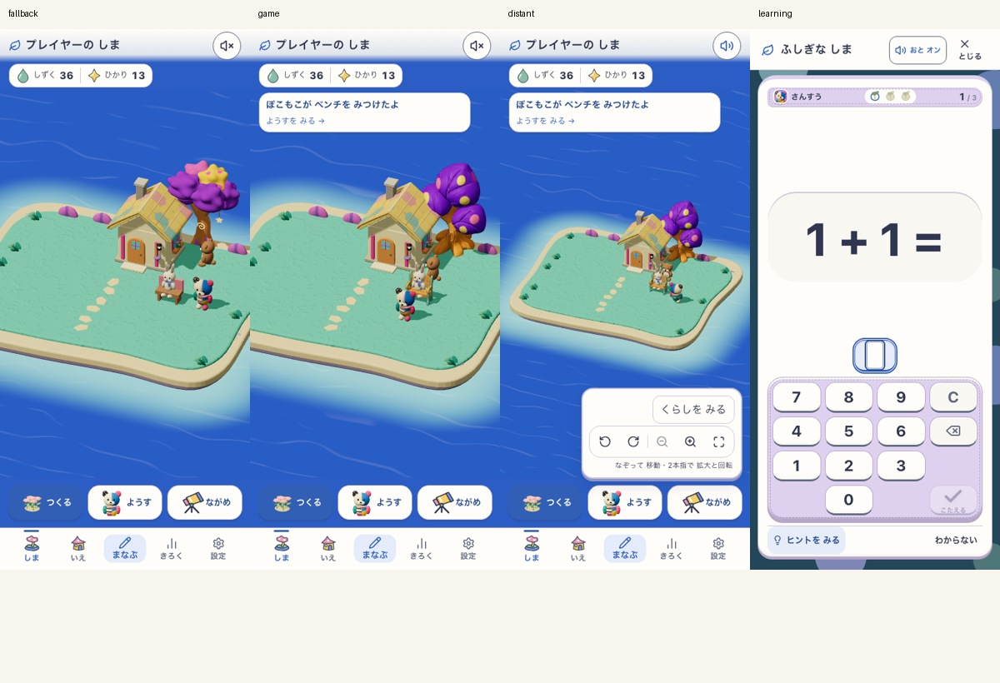
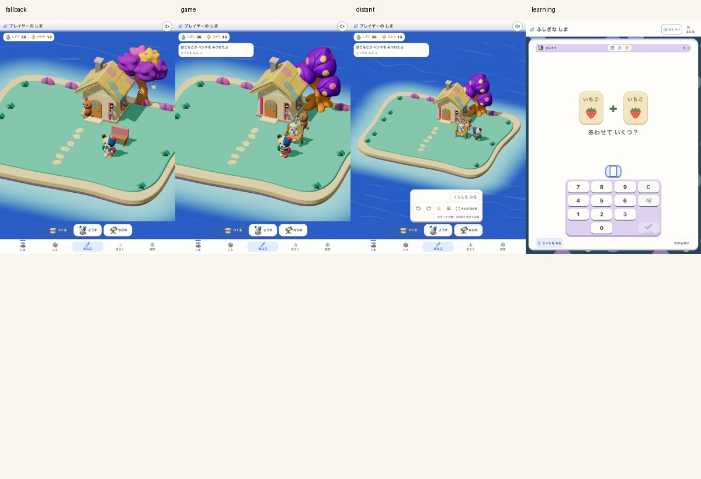

# 圧縮素材・LODのLifeゲーム内組込み

2026-09-17。ローカルの実LifeWorldへ接続した候補。公開・本番既定の変更はしていない。追加Meshy生成/消費0。

- 配信flag：`VITE_ISLAND_ENABLED=true VITE_ISLAND_LIFE_ENABLED=true VITE_ISLAND_RUNTIME_ASSETS=true`
- 新素材候補：`island-life-runtime-assets-v1`。元の世界：`moon-garden-v1`。
- 実画面target：`http://127.0.0.1:5248/` の固定production build。
- 390×844 / 768×1024、後者reduced motion。隔離Chromium、独立したfixture所有者。実機性能の証拠ではない。
- 実version、ソースSHA、素材SHAは `provenance.json`、結果は`report.json`。dirty checkoutなのでGit HEADだけをbuildの同一性と扱わない。

## 実装範囲

旧moon-gardenの背景木、岸の岩、original色の配置済みベンチ。読み込む間と失敗時は従来形状を表示する。学習開始を待たせず、同種の形状・画像は共有する。再構築前に借用モデルを外し、画面を閉じると形状/画像/マテリアル/デコーダを解放する。閉じた後に届いた非同期結果も解放する。

座面は生成ベンチのy=.43を既存の住民接点へ合わせる。占有マスと座る位置は変更しない。正投影カメラの画面寸法で24px未満を遠景、32px超を近景とし、境界で切替が往復しないようにした。

カタログ見本、配置ゴースト、色変更版、C3大樹、成長植物は従来の表示。正式採用時には商品見本と配置中の外観を揃える必要がある。現在の小さな島に、300個配置の削減率をそのまま適用しない。従来の手続き生成素材より軽いと認定した結果でもない。

## 検証

- 全体 `verify:core`：429ファイル/4,049テスト、lint・typecheck・build・assets check成功。既存のFast Refresh警告1件、文書の棚卸し期限警告あり。
- 座面/非等方スケールの最終調整後：対象7テスト・typecheck・対象lint・素材flag有効のproduction build成功。
- `e2e:smoke`：31シナリオ成功。Life素材の実画面検証とは別の既存ルート回帰確認。
- 固定buildの実Life：初回導線、3素材読込、通常/全景/縮小、再読込、GLB通信失敗のfallback、保存されたactions/creditsの保持、学習入力readyへの復帰を2画面幅で検査。
- unit：正投影/透視投影、切替境界、再構築の共有、失敗時の再試行ループ防止、終了後に届いたモデルの解放、座面の接点と遠近の往復。

初回の診断では古い保存形式のfixtureが、現行版のcutover時刻と矛盾して保存読込エラーになった。新規の明示fixtureから正規移行する方法へ修正。開発サーバーの依存最適化による自動reloadも避け、最終結果は固定buildで取得した。最初のproduction試行はLife有効flagが不足して旧ルートに入ったため無効とし、正しいflagで作り直した。

## 判定を分ける

- 見た目：実画面で色・接地・座面を確認したローカル候補。比較は同じカメラのfallbackと並べる。住民の姿勢は時刻が違うため画素差の点数にはしない。正式アート承認は未取得。
- 無文字理解・安全：遊びの契約は維持。独立参加者の観察0人なので未判定。
- Runtime：上記の対象検証は成功。スマホ実機fps、長時間メモリ、全PWA更新/完全offline、新素材のカタログ整合は未検証。

[sansu-art-direction-loop](../../../../.agents/skills/sansu-art-direction-loop/SKILL.md) の「Keep production on the rollback default until all three gates pass.」に従い、本番既定は保つ。追加承認を待って作業を止めたものではなく、ローカル組込みと必要な対象検証を完了し、未確認の本番採用を区別したもの。

次は対象スマホで固定buildを操作し、移動・再入場時のフレーム時間とメモリを測る。区画ロードはその結果で必要性を判断する。

## 実画面

左から従来表示（通信失敗fallback）・圧縮素材・縮小表示・学習復帰。表示時刻の異なる同じfixture。

今回の実ゲームfixtureは12配置。両画面幅とも最小表示でも閾値より大きく、遠景切替数は0だった。画質維持として妥当だが、実ゲーム画面でLODによる負荷減少を確認した証拠ではない。正投影での遠近の往復は対象unitで確認し、300個配置の性能結果は前段の別ベンチマークとして扱う。
