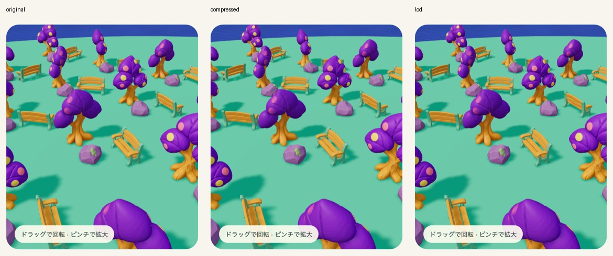
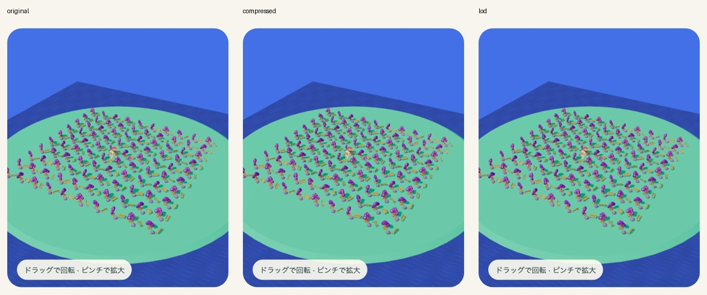
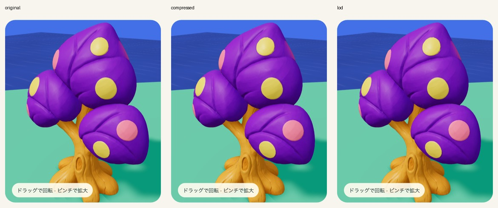
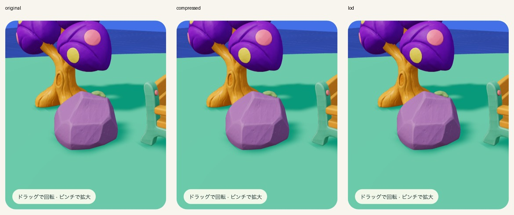
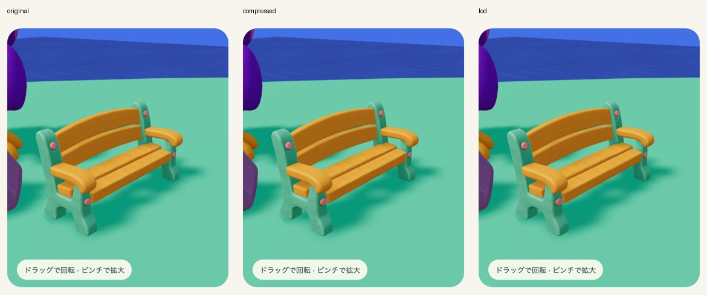

# GPU圧縮・遠景LOD：300個配置検証

2026-09-17。候補 `island-runtime-uastc-lod-v1`。木・岩・ベンチの既存3素材を処理。追加Meshy生成・消費クレジットは0。本番ゲーム未組込みの開発専用試験。

| 同一シーンの指標 | 元1K | GPU圧縮 | GPU圧縮＋遠景LOD |
|---|---:|---:|---:|
| 総転送量（デコーダ・JS等込み） | 12.85MB | 5.69MB | 6.02MB |
| 画像保持量※ | 56.01MB | 11.97MB | 11.97MB |
| 全景の描画三角形 | 2,482,260 | 2,482,260 | 693,860 |
| 全景の描画回数 | 350 | 350 | 350 |
| 近接の描画三角形 | 266,559 | 266,559 | 263,809 |

MBは10進。※圧縮画像は実際に変換されたmip配列のbyte長、その他はRGBA8+mips推定。GPU全体の実測ではなく、ドライバー・描画先・shadow map等を含まない。遠景形状の追加により形状配列は8.56→9.45MBへ増える。

3素材のnear合計4,916,908bytes、far合計326,512bytes。GLB合計5.24MB。配置を複製しても画像を共有する。種類が増えれば画像保持量も増えるため、この結果は300種類の検証ではない。

## 設定と保存先

`assets/island-{tree,rock,bench}-v1/runtime/`に `near.glb`、`far-geometry.glb`、設定・SHA256を記録した`profile.json`。source/raw/final/optimizedは保持。

nearはbaseColor1024、normal/metallicRoughness512、全画像UASTC level2/RDO0.5/Zstd18/box mip。元の形状・UV・法線配列が一致することを生成処理で検査する。

farはUVを重視したmeshoptimizer簡略化、境界固定。木2,690・岩1,255・ベンチ2,275三角形。画像は埋め込まず、実行時にnearのマテリアルを共有する。far GLB単独では完成した外観にならない。画面上の直径24 CSSpx未満で遠景、32px超で近景へ戻す。

## 見た目・理解・実行の判定

- 見た目：今回の比較画角では色・シルエットを保つ試験候補として採用。最小容量のETC1S候補は中距離の模様の乱れで不採用とし、UASTCへ変更。normal縮小や遠景の形状差は残る。ゲームの最終アート承認ではない。
- 無言での理解・安全：人工的な300個配置であり、実際の遊びや子供の理解は未評価。
- 実行：production比較build、3種類9枚の圧縮画像読込、全景300個のLOD切替、近接257個の高精細復帰、WebGLエラー0。10 Pythonテスト・対象ESLint通過。GLB6ファイルのvalidatorエラー0。

validatorはKHR_texture_basisu未対応のため画像形式等の警告が残る。tangent属性なしの警告もありThree.js側で生成する。farの未使用UV通知は、実行時にnearマテリアルを割り当てるため意図的に保持している。ブラウザー描画検証で補完したが、他エンジンの互換性は未確認。

## 計測の限界と次の段階

390×844/DPR1.5、ローカル通信、キャッシュ無効、各視点45フレーム・先頭11除外。実際のrendererはANGLE SwiftShader（ソフトウェア）。全景の中央値760→239msはこの環境だけの結果で、スマホのfpsや速度改善率を示さない。移動中にはLODに伴う影更新のスパイクも残る。

元1Kは先の基準実行を使用。最終候補とscene/cameraは同じだがハーネスのsource hashは異なる。双方の日時・revision・hashと全数値は`report.json`に分けて記録。配信フラグはdevelopment benchmark only。

本番統合時にはKTX2Loader＋basisデコーダ、マテリアル共有、LODを導入したうえで、対象スマホで移動時のフレーム時間を測る。島拡大には区画ロード・不要区画の解放を追加し、独立種類数と同時保持画像量を制限する。今回のLODはロード済みの形状を切り替えるだけで、ストリーミングは未実装。

## 比較画像

左から元1K・GPU圧縮・GPU圧縮＋LOD。同一カメラの描画領域。

途中で見つかった不具合はPNG置換時のJPEG MIME残留、farの画像削除とpruneに伴うUV削除。前者は置換処理と回帰テスト、後者はkeepAttributesとUV必須検査で修正。
