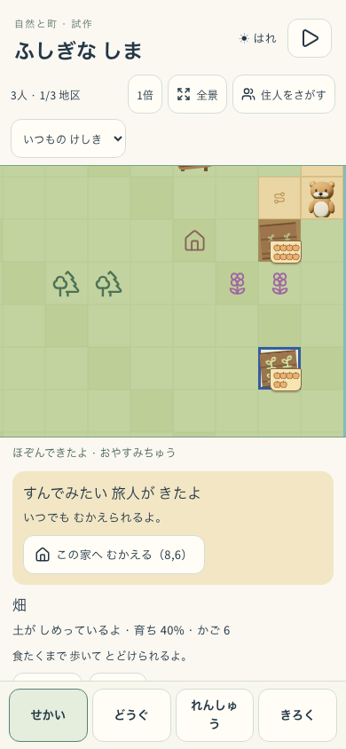
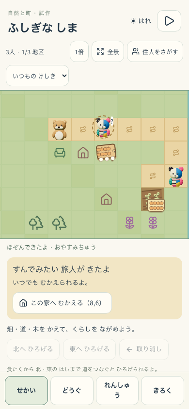
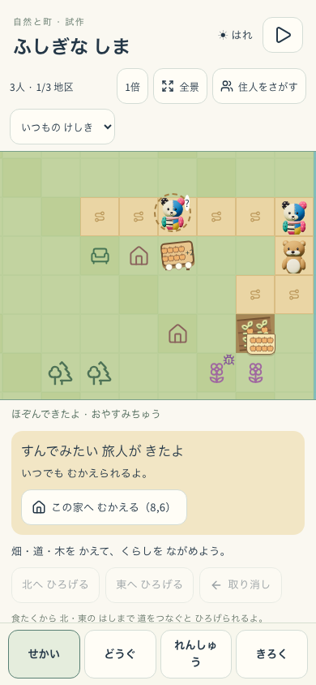
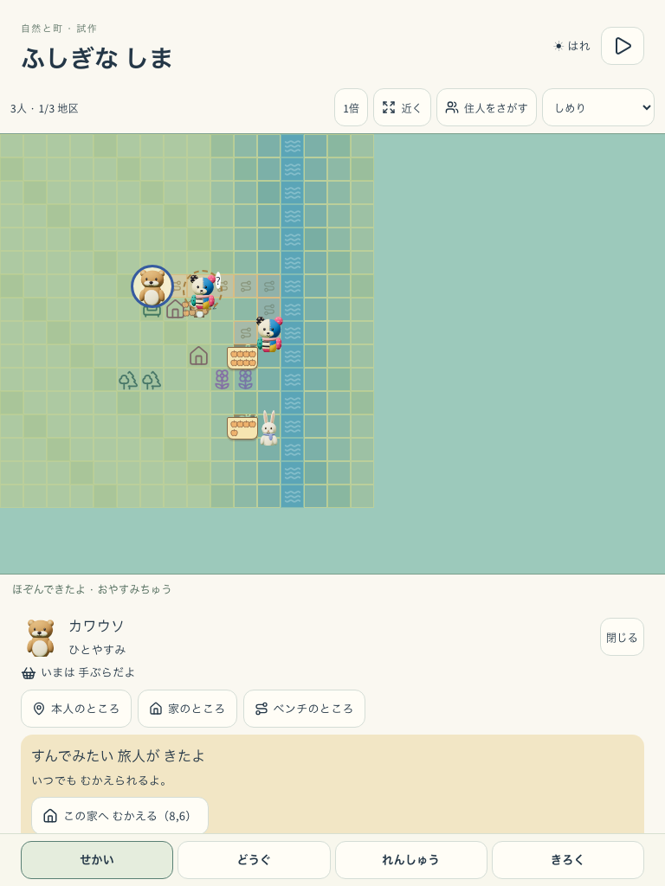
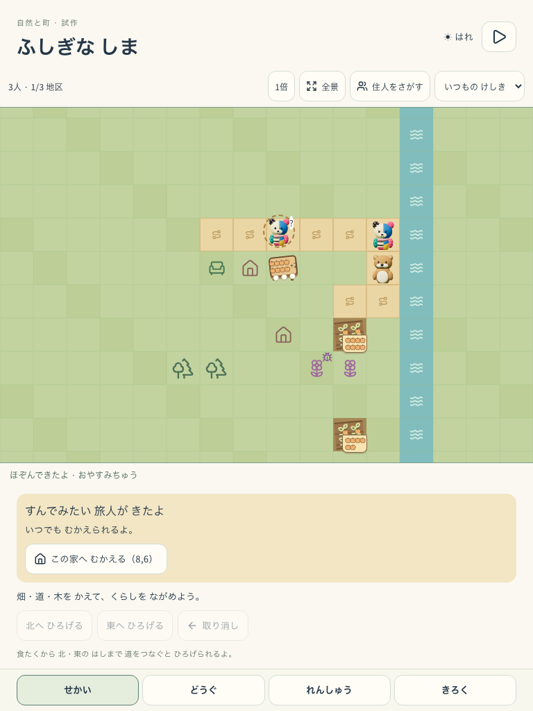

# Nature Town：画面再開とプロフィール切替

2026-09-18。対象はmainへpush済みの `11d0d25` と同じGit treeを隔離して作った本番形式build。[版・全dist SHA](build-manifest.json)、[実測](runtime-report.json)、[先行診断](prior-diagnostics.json)。flagは `VITE_ISLAND_ENABLED=true`、`VITE_NATURE_TOWN_ENABLED=true`、候補は `nature-town-living-s1`。対象URLは `http://127.0.0.1:5337/#/nature-town`。

## 確認方法

`tools/e2e-nature-town-replay.mjs` を使い、使い捨てプロフィール2人分だけを登録する。家・畑はUIで配置し、アプリの1秒タイマーを診断用dispatcherから1回ずつ呼んで保存完了を待つ。世界・候補・抽選回数を注入せず、実計算で300tickの候補が現れた時点のIndexedDBを別contextへ複製する。この時間送りは通常速度の自然プレイとは区別する。

- 390×844：通常motion・通常表示で180tickを進める。
- 768×1024：reduced motion、全景、水分表示、住人選択を変更。途中でreload、設定往復、音OFF→ON、プロフィールBへの切替と5tick進行、Aへの復帰を行う。
- 各操作後に元の世界が同一であることを比較。両contextの480tick時点で住人・物量・候補・抽選回数を含むWorldState全体が一致した。候補は `offer:300` のまま。実SW制御あり。同一buildの比較であり、two-build更新やoffline試験ではない。

## 判定と残件

**RNG-03：PASS。RNG-02：未完了。** 表示設定変更時の論理結果は一致したが、通常RAF／30向け間引きの観測コールバック頻度は約69.7／19.6Hzだった。固定30／60fpsを確認したとは扱わない。この値も端末性能のベンチマークではない。

初回はサウンドと読み上げに同じOFFボタンがありlocatorが曖昧。次は単一プロフィール用helperがappDataの一覧を置換し、検査用の2人目を一覧へ登録できていなかった。3回目は切替後の既定ホームへのredirectと検査側の遷移が競合した。対象欄の限定、2人の明示登録、ホーム表示完了待ちへ修正し、4回目で全比較PASS。アプリ側の変更はない。

検証scriptの構文・lint、文書検査を実施。アプリのbuildはコミット対象だけを隔離してPASS済み。実装入力を変更していないため全unitの再実行はしていない。

視覚的魅力：HOLD（既存の地図試作）。無文字理解・安全：未判定（参加者0人）。runtime：上記の再開比較はPASS、固定fps・two-build・実機は未確認。

## 実画面

| 初期候補 | 390中間 | 390再開後 |
|---|---|---|
|  |  |  |

| 768表示変更 | 768切替・再開後 |
|---|---|
|  |  |
