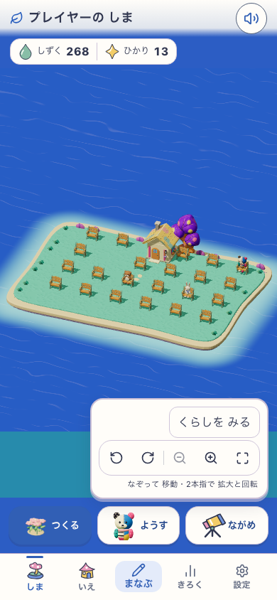

# 拡張したLife島でのLOD検証 / 実機計測の準備

2026-09-18。Meshy消費0。アプリ本体・公開設定・保存形式は変更せず、固定production buildに対する検証ツールを拡張した。`game-integration/provenance.json`のLifeソースhashと現在のソースは全て一致した。

## 結果

既存のcommandLifeを使い、西・東・南へ正式拡張。隔離ブラウザーの明示fixtureへ200件の仮想学習creditを入れ、通路を残して22個のベンチを配置。実際に学習して取得した証拠ではなく、Meshy/APIクレジットとも無関係。土地96マス、木・岩を含めた生成素材の配置37個。

| 指標 | 390×844 | 768×1024 / reduced motion |
|---|---:|---:|
| 読み込んだGLB | 6ファイル / 5,243,420 bytes | 同左 |
| 近景で遠景モデルを使う数 | 8 / 37 | 0 / 37 |
| 全景で遠景モデルを使う数 | 14 / 37 | 0 / 37 |
| 読込失敗 / pageerror | 0 | 0 |

配置数が増えても、3種類のnear/farを共有し、GLB合計5.24MBを維持した。数値はResource TimingのencodedBodySizeで、JS/デコーダを含む総転送量ではない。キャッシュ条件もあるためcold load時間とは扱わない。全景→近景への復帰、再読込、所有actions/credits保持、故障注入によるfallback、学習入力readyへの復帰も通過。

rendererはANGLE SwiftShader。30フレームの診断でフレーム間隔中央値は約92ms/122ms。画角変更前後で大差はなく、LODがfpsを改善したとは断定できない。実スマホの性能・合否は未判定。



## 再実行

素材flag有効の固定buildを5248番で配信してから実行する。

```bash
RUNTIME_GAME_URL=http://127.0.0.1:5248/ RUNTIME_GAME_EXPANDED=1 RUNTIME_GAME_OUTPUT=output/playwright/life-runtime-expanded-new node tools/asset-pipeline/verify-life-runtime.mjs
```

`expanded-life-fixture.mjs`は現行commandLifeで生成する。初回fixtureは間隔を空けた配置で22個になり、25個以上という試験側の条件で停止した。通路を残す目的に合わせ20個以上の条件へ修正し、最終結果は22個と記録した。ゲームの上限や配置ルールを緩めたものではない。

## スマホ計測の準備と残る条件

`tools/asset-pipeline/device-check.html`を固定buildのルートへコピーすると、同じ実ゲームをiframeで操作しながら20秒計測できる。最初の1秒を除き、RAF間隔、renderer、機種名、描画統計、LOD数、GLB読込をJSON保存する。iframeの実寸を記録し、GPU単独の処理時間とは呼ばない。

PCで計測ページの初回設定→島→20秒記録を検証し、477サンプル・pageerror 0。`device-harness-desktop-only.json`はツール動作確認でありスマホの実測ではない。

接続端末確認（xcrun xctrace）ではMac miniのみ。Android用adbも未導入。Wi-Fi LANのHTTP接続を試すと、非secure contextのため`crypto.randomUUID is not a function`が発生した。HTTPS、または端末からlocalhostへ接続できる適切なUSB経路が必要。計測ページは非secure contextではゲームを読み込まず、その条件を表示する。アプリ本体へ暗黙のpolyfillを入れたり、認証・証明書設定を変更したりしていない。

ユーザーへ端末種別・機種を確認中。端末の接続が整うまでは実機計測完了としない。本番既定は従来表示のまま。

## 検証範囲

対象ESLint、実productionゲームの2画面幅、保存保持・通信失敗・学習復帰、実機計測ページのPC動作が成功。アプリコードは未変更のため全coreを再実行していない。視覚は拡張配置の実画面を確認。子どもの無文字理解・正式なアート採用・実機性能は別判定。
