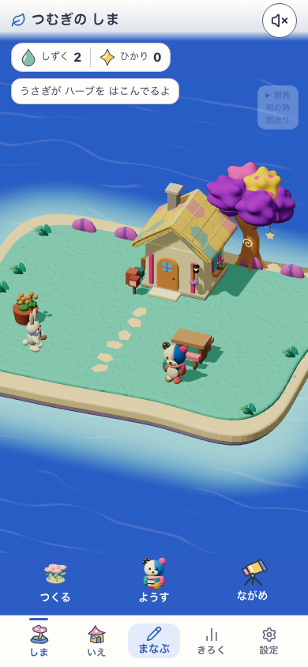
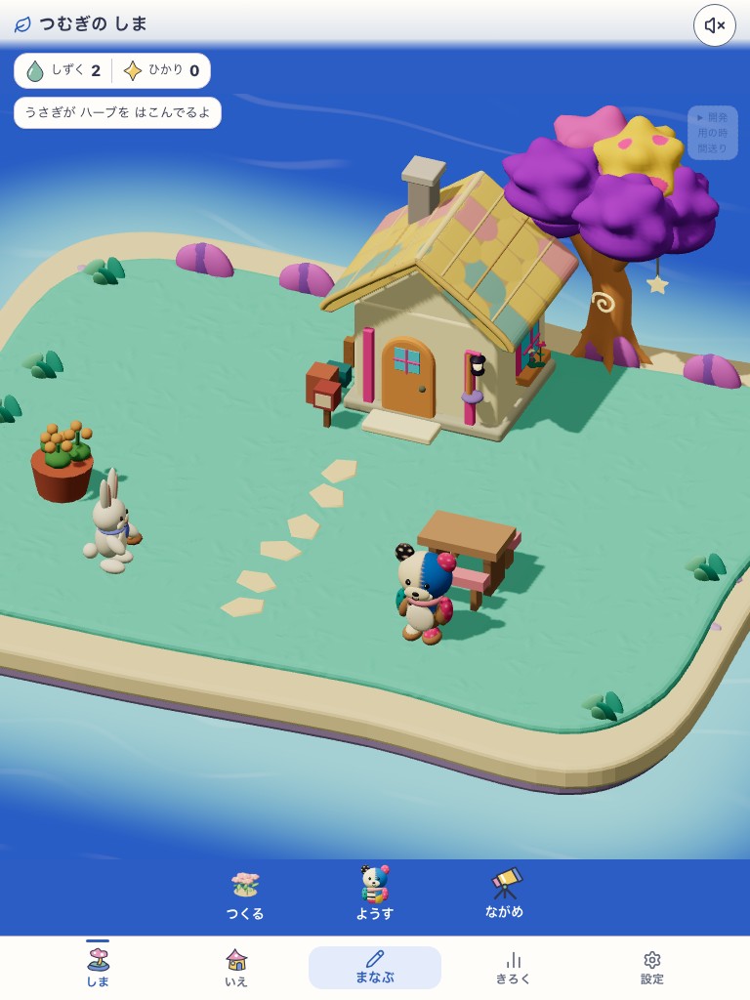
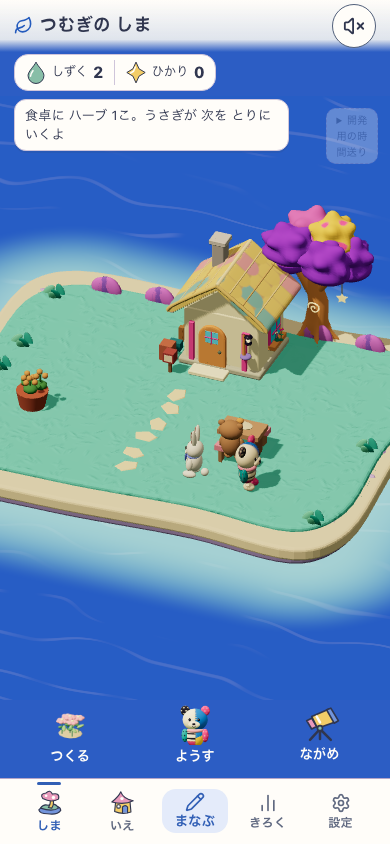
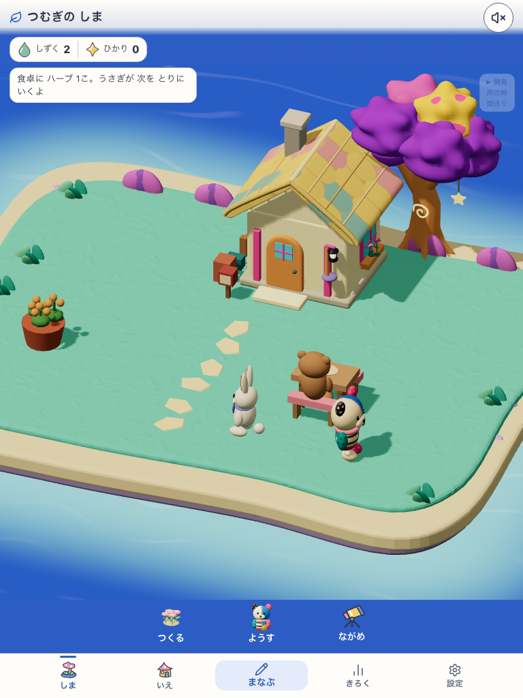
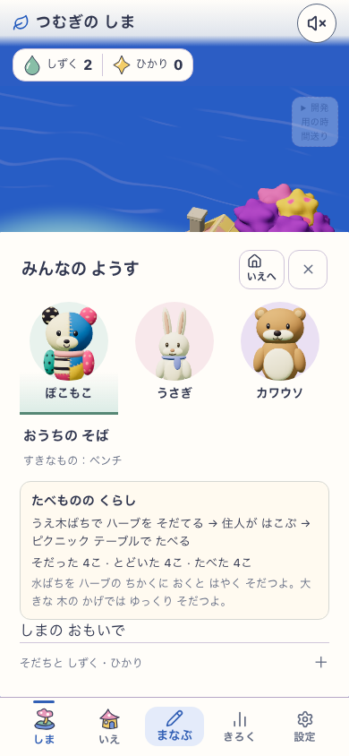
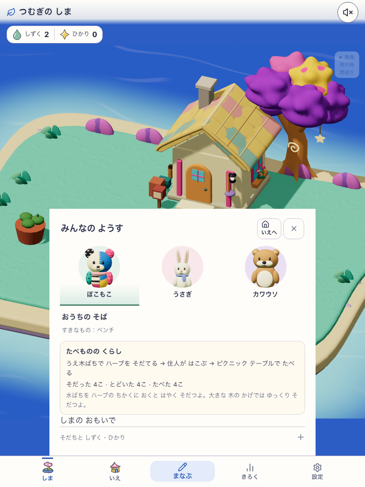

# 今の島で育つ→運ぶ→食べる：ローカル画面記録

- 画面: 現行の島 `/#/island`。別のNature Town画面ではない。
- 実行: `VITE_ISLAND_ENABLED=true VITE_ISLAND_LIFE_ENABLED=true` で起動したローカル開発サーバー。画面の記録上の build revision は `development-local`、delivery は `mystic-island-v1`、島の美術候補は `mystic-island-shore-garden-v18`、食料候補は `island-food-loop-v1`。
- 入力: 開発用プロフィールに配置・学習の事実・経過時間を記録した検証データ。子どもの実使用や公開版の結果ではない。
- 条件: 動きを抑制、音なし、Service Worker 制御なし。記録時の判定は [report.json](report.json) に保存。

| 順 | スマホ幅 390×844 | タブレット幅 768×1024 |
|---|---|---|
| 収穫物を住人が運ぶ |  |  |
| 食卓へ届く |  |  |
| 島のようすと食べた記録 |  |  |

同じ保存を読み直しても収穫・配送・食事を重複計上しないことを自動確認した。これらの写真は経路と保存の実装確認であり、絵の魅力や子どもが説明なしで理解できるかの合格証拠ではない。比較する現行島の画面例は [2026-09-14の画面記録](../2026-09-14-island-life-two-build/normal/phone-new-world.png)。実機・更新・オフラインは別途確認する。
