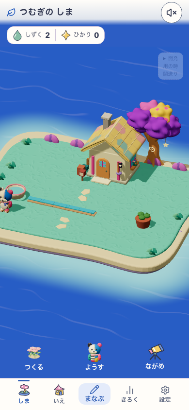
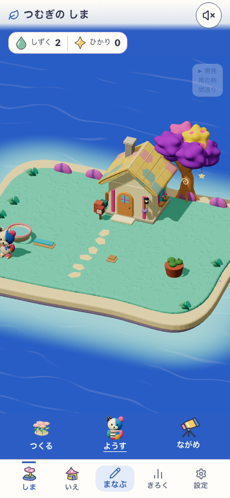
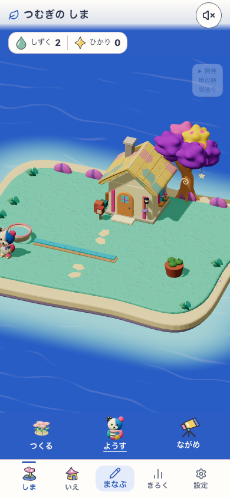
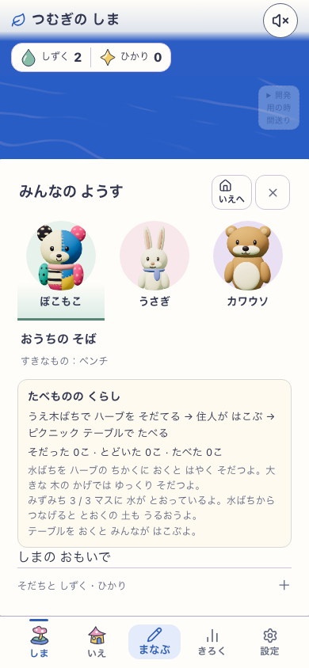
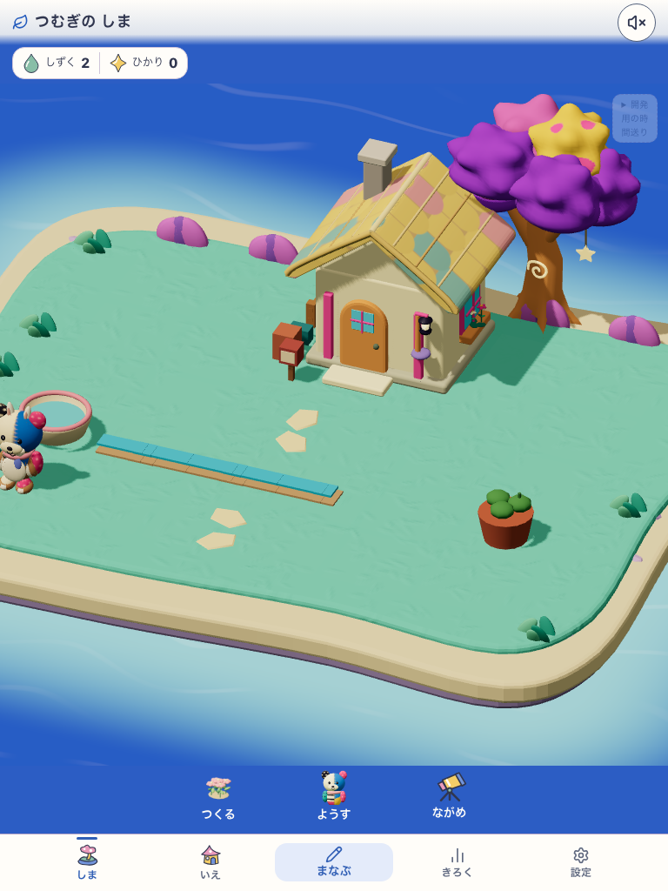
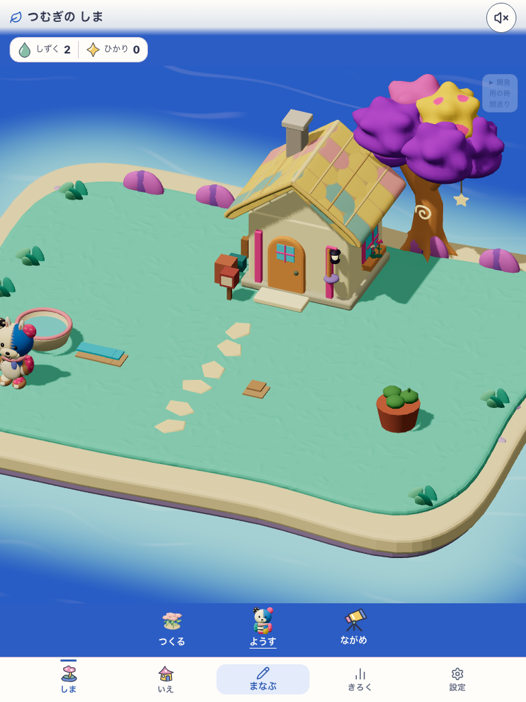
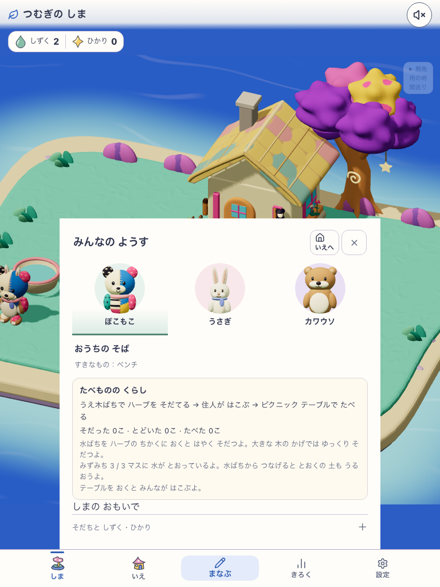
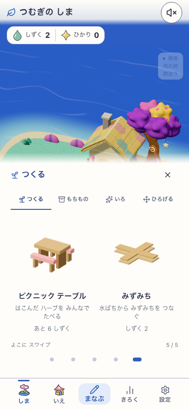
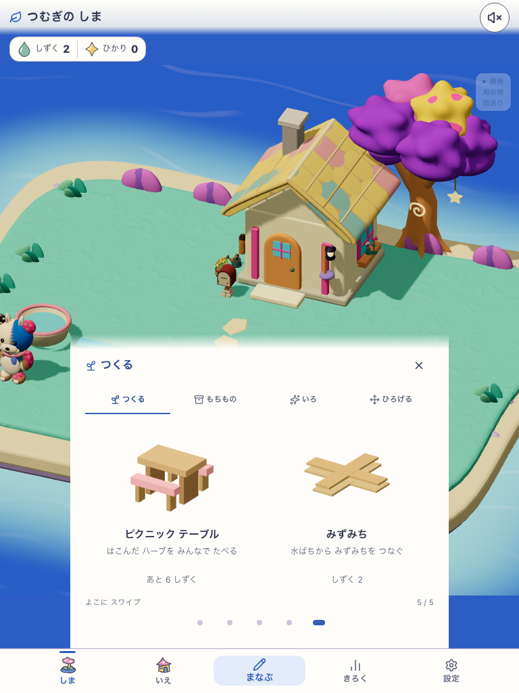

# 今の島のみずみち：ローカル画面確認

2026-09-27。現行の島に追加した「みずみち」の接続、切断、再接続を同じ画面で撮影した。画像は生成画像ではなく、実際のWebGL画面のスクリーンショット。[仕様](../../product/48_island_life_spec.md)と[自動実行結果](report.json)を併せて読む。

| 幅 | つながる | 中央を収納 | 同じ物を戻す | 文字で確認 |
|---|---|---|---|---|
| 390×844 |  |  |  |  |
| 768×1024 |  |  |  |  |

通常の「つくる」入口にも、1マス2しずくの品として表示される。

| スマホ | タブレット |
|---|---|
|  |  |

## 対象と方法

- `npm run e2e:island-water-channel`。DEVの新規プロフィールに学習事実をLife writer経由で与え、水ばち・水路3マス・遠い鉢を正式な購入commandで配置した。`SansuIslandLifePreviewV1` だけを使用したテストfixtureで、通常利用者の成果を示すものではない。
- 実対象は `http://127.0.0.1:5224/#/island`、app revision `development-local`、build version `development-local:e1efaf8e-8942-4c9e-8dc1-5a298a326f91`、delivery `mystic-island-v1`、configured delivery `snap-root-v1`、現行の島 candidate `mystic-island-shore-garden-v18`、Life visual candidate `moon-garden-v1`、水路 candidate `island-water-channel-v1`。`islandFeatureEnabled=true`、`natureTownFeatureEnabled=false`。作業中のローカル版で、固定した公開ビルドではない。
- 390×844 / 768×1024 のタッチ設定、動き抑制で再読込後の画面と通常の購入入口を撮影。通水3/3→中央収納で1/2→再配置で3/3。遠い鉢の水の影響は約0.67→0→約0.67。同じ水路IDと在庫を保持し、版20の購入receiptが3件、ページエラーなしを確認した。

## 判定を分ける

- **絵の魅力:** ローカル画面では水色が地面から見え、実際につながる方向だけ連続した線になった。[直前の食料画面](../2026-09-27-island-food-loop/README.md)と同じ島・家・住人の絵で比較した。美術の正式採用・実機表示は未判定。
- **説明なしの理解と安全:** 青い通水と乾いた茶色、島のようすの `みずみち 3 / 3` を確認。切っても購入物と食料在庫を失わない。子どもが説明なしで因果関係を理解するかは未観察。
- **動作・保存:** 実canvas描画、保存再開、切断・再接続、購入receipt、歩行と水路上限を確認。各幅の接続時は214 draw calls / 約10.6万 triangles。実機の速度、オフライン更新、学習画面との往復、土の水分の時間変化は未確認。
