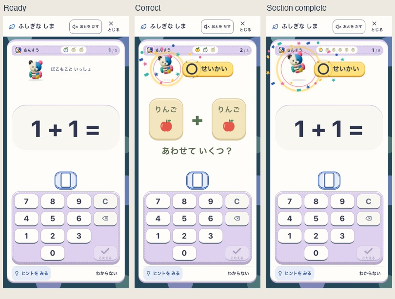
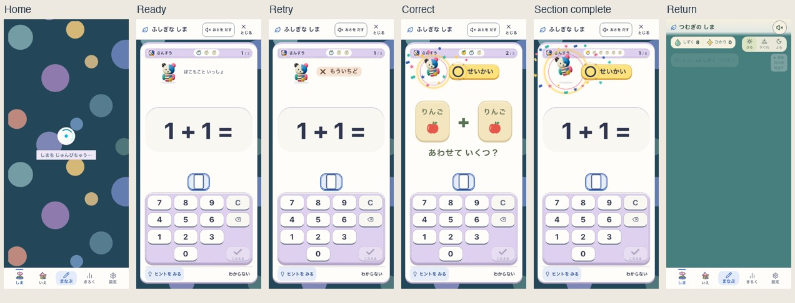
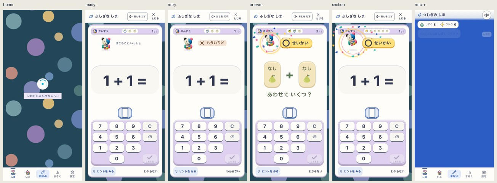

# ぽこもこと学ぶ瞬間の演出

2026-09-27。ユーザーの「ある程度派手なエフェクト」という依頼から、今のIslandの通常学習に入力・一問完了・区間完了の反応を追加した。仕様の正本は[UIガイド07](../../product/07_ui_design_guideline.md)。ローカル作業ツリーの実装候補であり、公開版の確認ではない。

[実画面の短い動画（約6秒、無音）](preview.mp4)。三問を実入力し、最後に最初の区間を完了した記録。撮影時のruntimeは[preview-runtime.json](preview-runtime.json)に保存した。

## 参考と適用範囲

参考は[ドパドリルの投稿](https://x.com/grmchn4ai/status/2103807453406388538)（2026-09-26）。調査範囲はこの投稿の本文と53秒の動画を0.25秒ごとに確認した視覚表現。連続再生・音の評価や学習効果の裏付けではない。操作に対する反応の早さと、成功時の複数の動きを参考にし、Sansuでは相棒の周囲へ演出を集めた。

ぽこもこは[既存の承認portrait](../2026-09-19-life-startup-stills/source/pokomoko-original.png)そのものを使う。顔・耳・頭身・布・配色を描き直していない。画面上の反応は次のとおり。

| きっかけ | 実装した反応 |
| --- | --- |
| 実際に受理された数字 | 入力位置に青い輪、ぽこもこの小さなうなずき。未採点の値への正解表示はしない |
| 筆算の途中行 | 短いうなずきと小さな輪・6粒の星など。「このだんは せいかい」を保持 |
| 保存された一問完了 | ジャンプ、黄色と桃色の輪、18粒の星・布の紙吹雪。約0.95秒 |
| 保存された区間完了 | 大きな二段の跳ね、広い輪、28粒の紙吹雪。約1.25秒。次問へ自動で進む既存の動きを保持 |
| 支援での完了 | 同じ祝福。「ひかりを とどけたよ」と芽の記号で独力の正解とは区別 |
| 誤答・支援中 | 中立の相棒と既存の案内。誤答で成功の演出を起こさない |

音は既存のtap/step/correct/clearと本人の設定を継続し、追加の重ね鳴らしはない。問題・入力を動かさず、演出中も入力できる。最新一件へ置き換えるため反応が溜まらない。背景化・退出で破棄し、再開・再読込で過去の祝福を再生しない。reduced motionでは飛翔とジャンプを止め、文字・記号・淡い輪を残す。

Islandと幻想の庭から入る共通の通常学習が対象。独立したStudyの復習・テスト、既存3Dの造形、通貨・報酬・保存・採点・SRSは変更していない。

## 実画面と候補の識別

| 項目 | 確認した対象 |
| --- | --- |
| 実アプリ | `http://127.0.0.1:5230/#/island?learn=1`、Vite DEV |
| 作業元HEAD | `67406a186e227ef3d66983d2b5dea72739c5d1db` ＋共有作業ツリー。HEAD単体の証拠ではない |
| runtime revision | `development-local` |
| runtime version | `development-local:e5760ae7-3e39-4d58-8750-2141fd0072ee` |
| 有効な候補flag | Island / Life preview / Fantasy が有効 |
| delivery | `mystic-island-v1`。app rootのconfiguredDeliveryは`snap-root-v1`、visualLineageは`pokko-field-v1` |
| 既存root候補 / 学習候補 | `mystic-island-shore-garden-v18` / `mystic-island-learning-v2`。rootの文字列は既存識別子 |
| 今回のfeedback候補 | `data-feedback-candidate="pokomoko-learning-party-v1"` |
| 画面確認時のアプリ入力hash | `5dabb5fa6c1e1ce8f2e1cdd3d4edd8054a4047569b55b683d82ff0b86da7003c`。src全体とpackage-lock、開始・終了で一致 |
| 画面幅 | phone 390×844、tablet 768×1024、landscape 844×390 |

完全なファイルmanifestは[source-manifest.json](source-manifest.json)。manifestはsrc/public/configも含む別の入力集合で、上の画面確認hashとは集計方法が異なる。SW非制御のDEVであり、公開ビルド・端末PWAの証拠へ転用しない。

上のcontact sheetは今回の実runtime。待機とピークを並べ、問題・入力の読みやすさと相棒の同一性を確認した。[横画面](landscape-motion-ready.png)、[タブレット](tablet-motion-answer.png)、[動きを減らした画面](phone-reduced-section.png)も保存した。

## 検証

- `npm run verify:core`: PASS、472ファイル / 4,221 tests。docs・入口guard・lint・typecheck・build・asset budgetを含む。
- 最後の入力位置と横画面の修正後に`npm run lint`、`npm run build`: PASS。PWA asset budgetは8.29 MiB / 12 MiB。
- `npm run e2e:smoke`: PASS。既存のclassic/探索の回帰確認であり、今回のIsland演出の主証拠ではない。
- [画面確認6条件](visual-checks.json): 3画面幅×通常/reduced motion。実入力・保存・一問/区間の演出中の次問入力・誤答・支援完了・帰島/復帰/再読込・44px以上のキー・横はみ出しなしを確認。
- [入力確認6条件](input-checks.json): phone/tablet×足し算筆算・分数・英語選択。お手本中の物理キーで回答や入力の光が出ないことも確認。
- [複数行の筆算2条件](multi-row-checks.json): phone/tabletの二桁×二桁。途中行を各2回実際に通り、6粒の小さな反応と一問完了の祝福を区別。[途中行の実画面](phone-multi-row-step.png)。

専用検査は`node tools/e2e-pokomoko-feedback.mjs`。使い捨てprofile/memory fixtureから通常plannerで予約し、実UIで回答する。追加入力だけは`SANSU_POKOMOKO_INPUTS_ONLY=1`、複数行だけはさらに`SANSU_POKOMOKO_INPUT_CASE=hissan-multi`を指定。6+6+2の計14条件を確認した。各レポートには実行時のQA hashを保存し、全14条件を初期QA hashで一括実行したとは扱わない。画像はanimationを止めずに撮影したもの。物理端末、音声出力、子どもの観察は含まない。

## 速度比較の対象固定

共有Viteでの初回80 runは速度と操作の基準を満たしたが、実行中に別作業の`src/components/island/life/fantasy/garden.ts`が更新されたため、[原レポート](throughput-invalidated.json)は`eligible=false / pass=false`。合格の証拠にしない。今回変更した学習UIのファイルはその間に変わっていない。

再計測は共有作業ツリーを`/tmp/sansu-pokomoko-verify-20260927`へ固定し、別のVite `http://127.0.0.1:5246`で実行した。初回固定時に不足していた`assets/`を補い、実行前に画像を含めた[frozen-source-manifest.json](frozen-source-manifest.json)を確定した。固定コピーのsourceHashは`bf71255a4b9d112b6be5c02cffc60f80de17e05ac6f372a2982333588ebfdae1`、runtime versionは`development-local:54619fa7-dc2d-48ff-b481-d66ab8697238`。Git checkoutではないためレポートのGit revisionは空であり、作業元HEADはmanifestのprovenanceで確認する。上の動画もこの固定コピーで撮影した。

最初の画面6条件と追加入力6条件は庭の更新前、複数行2条件と固定コピーは更新後。三つの検査とも開始・終了のアプリ入力hashは一致し、更新差分は今回対象外の庭の1ファイルだけ。今回のfeedback候補と既存のportraitは共通で、別の美術候補を混ぜた評価ではない。

[固定環境の最終レポート](throughput.json)は80 run、`eligible=true / pass=true`。全入力とrunnerの開始・終了hashも一致。最後に今回変更したアプリ10ファイルと共有作業ツリーの内容が同一であることを再確認した。

| 計測 | phone | tablet | 基準 |
| --- | --- | --- | --- |
| 正答後に入力可能になるP95 | 212.6ms | 213.3ms | 650ms以下 |
| 誤答後に再入力可能になるP95 | 207.4ms | 208.9ms | 550ms以下 |
| 区間境界の入力可能P95 | 205.5ms | 211.2ms | 650ms以下 |
| 全問正解のIsland / Study throughput比 | 2.264 | 2.260 | 1.0以上 |
| 通常問題間の追加操作 | 0 | 0 | 0 |

コマンドは`SANSU_ISLAND_BASE_URL=http://127.0.0.1:5246 SANSU_ISLAND_BUILD_SOURCE=/tmp/sansu-pokomoko-verify-20260927/build-source.json SANSU_ISLAND_THROUGHPUT_OUTPUT=/tmp/sansu-pokomoko-throughput-frozen-v2.json node tools/e2e-island-throughput.mjs`、実行ディレクトリは固定コピー。各幅で交互に10反復、誤答40サンプル（各幅20）を含む標準fixed-ten fixture。reduced motion・音off・自動キーボード入力の比較で、通常motionの操作は上の別検査。Studyとの差は既存の完了/継続仕様を含み、今回の演出による改善率や子どもの速さを示すものではない。

## 独立した三つの判断

| 観点 | 今回の判定と限界 |
| --- | --- |
| 見た目・また触りたくなる反応 | 実装者の実画面レビューPASS。既存のぽこもこと配色を維持し、正解と区切りで目に見えるピークがある。ユーザーによる最終の好みの評価と、幻想の庭全体の美術評価は別 |
| 音なしの理解・安心 | 記号と文言、入力領域、支援との区別、reduced motion、誤答時の中立性は自動/実画面確認PASS。子どもの無説明理解・楽しさの独立観察は未実施 |
| runtimeの正しさ | 保存receipt後だけの祝福、次問入力、帰島/復帰、既存回帰、build、固定版fixed-tenはPASS。DEV対象の確認。実機Safari、SW更新・offlineと公開版は今回未検証 |

今回の修正途中では、誤答直後に入力の短い反応が残る問題と、横画面の既存CSSが待機中の相棒を隠す問題を検出し修正した。最終画面確認は両修正後のもの。検査の初版で出たzero-size anchorの可視待機と再読込時の画面期待値は検査側を修正している。

変更区分はUI・toneとその検証。親仕様01とUIガイド07を更新し、月次doneと共有done indexへ接続した。保存や運用の新契約はないため、schema仕様・runbook・durable memory・ADRの変更は不要。実装完了時点では共有作業ツリーの別作業を保持し、commit・push・公開設定の変更は行っていなかった。

## mainへ提出する候補の確認（2026-09-27）

追加の「コミットメインプッシュ」依頼に対し、`67406a186e227ef3d66983d2b5dea72739c5d1db`のmainから今回のアプリ10ファイル・専用QA・仕様01/07の該当箇所・done・検証記録だけを抽出した。共有作業ツリーの幻想の庭・自然/食料/水路・旧試作削除は含めていない。元のステージ済み削除を保持する別indexを作り、リポジトリ外へ書き出して検証した。

- [抽出候補のcore出力](commit-core.txt): `verify:core` PASS、468ファイル / 4,213 tests。lint・typecheck・build・docs・assetsを含む。先行共有候補の4,221件と対象が異なる。
- [抽出候補の画面/入力検査](commit-ui-checks.json): 14条件を一括実行してPASS。phone/tablet/横画面、通常/reduced motion、足し算・複数行筆算・分数・英語、支援・誤答・区間完了・復帰を確認した。
- 対象は別Vite `http://127.0.0.1:5354`、Island/Life previewが有効。runtime versionは`development-local:3f66acb7-c99d-4157-9573-16d2d2cadec2`、feedback候補は`pokomoko-learning-party-v1`。アプリ入力hashは`e998e3a18b8c0f8459981f5029eec5a19a8dbe843d875938c109e036fb339d05`で開始・終了が一致。
- 上の80 runは先行共有候補での性能証拠。抽出候補で80 runを再計測したとは扱わない。公開版の動作・SW更新・実機・子どもの観察は今回の提出検証に含まない。

[提出候補の区間完了](commit-phone-section.png)でも、同じぽこもこ・輪・紙吹雪と全テンキーを確認した。文書と生成portalは提出indexの内容で検査し、共有作業ツリー全体の合格をコミット単体の合格へ読み替えていない。
