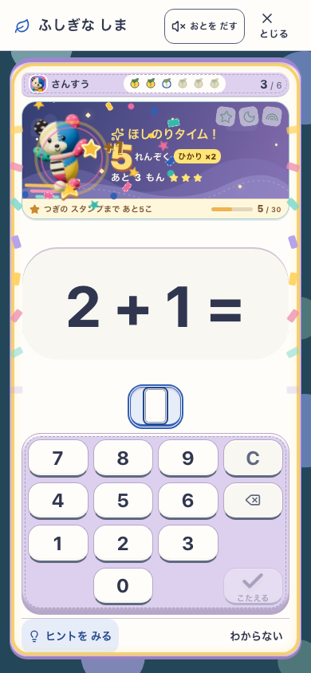

# ぽこもこの連続正解とほしのり — 2026-09-27

候補 `pokomoko-star-ride-v2`。ユーザーの「足がない」「単調」「反応だけでなく仕組みも」という指摘への改訂。元のぽこもこの全身を使い、3連続のジャンプ、5連続で3問のほしのり、光10/20/30個のスタンプへつなぐ。星・月・虹の乗り物、昼から夕色・星空への変化、節目の外縁の紙吹雪を持つ。スタンプは購入通貨や学力評価ではない。

[実画面の約15秒の動画](preview.mp4)（自動入力の検証映像。途中の帰島・再開も検査操作であり、ゲームが自動退出するわけではない）。[状態の比較](critical-path.jpg)。

## 参考と今回の遊び

参考は[gear machineの投稿](https://x.com/grmchn4ai/status/2103807453406388538)、2026-09-26公開。対象はこの1投稿と53秒の動画。初回のフレーム調査に加え、改訂時にx-readの本文・メディア情報とブラウザ再生の画面を確認した。音や学習効果の検証ではない。

| 取り入れる | 今回の表現 |
|---|---|
| 続けるほど展開が変わる | 連続数、5段の予告、3問のほしのり |
| キャラクターが物に働きかける | 全身8ポーズ、光のキャッチ、踏み切り、星への着地と飛翔 |
| 普通の時間と特別な時間の差 | 夕色→星空、乗り物、外縁の短いピーク |
| 次を試したくなる獲得 | 3種類の保存されるスタンプと乗り物 |

元モデルの顔・布・耳・体型を保持。足のない選択用portraitは使わず、`tools/render-pokomoko-learning.mjs` で同じgeometry/materialから8×192×224のWebPを描画した。70,070 bytes。学習中にWebGL contextや連続描画を追加しない。参考の秒数制限、桁数の膨張、顔から伸びる接触表現は採用していない。

- 誤答やヒントなしの一問完了だけで連続数を増やす。筆算途中行は数えない。
- 誤答・支援で連続数だけが0になる。訂正・お手本完了は光1個。既得の光・スタンプ・乗れる回数は消さない。
- ほしのり中の独力完了は光2個。回数は問題完了でだけ減り、時間・退出・誤答では減らない。
- `IslandRecord.learningParty` を正式回答と同じtransactionで保存。旧保存は省略を空状態として扱い、履歴を遡って獲得を作らない。
- 採点・SRS・既存の通貨と所有は既存のwriterに従う。演出は次の入力を待たせない。本人ごとの音offとreduced motionを保つ。

## 最終の対象と証拠

作業中にmainへ入った庭と保存の修正を含む `8b0f4df5a18357469f6e7601a62c121efbaa8e56` に、今回の学習変更だけを統合した候補。別の管理worktreeで検証し、共有フォルダの未完作業やstaged削除は含めない。[app入力hash](integrated-source.json)と[本番形式の全dist/実version](production-manifest.json)で候補を特定する。

| 証拠 | 実際の対象と確認範囲 |
|---|---|
| [最終の画面・実回答・offline](production-ui.json) | `127.0.0.1:5357`、Island/Life/Fantasy=true、Life preview=false。本番形式。390×844 / 768×1024 / 844×390、通常/reduced motionの6条件で21正解・全スタンプ・誤答・支援・再開 |
| [最終core](integrated-core.txt) | 最新mainに統合した固定候補。475ファイル、4,251 tests、docs/lint/typecheck/build/assets PASS |
| [classicの実2ビルド更新](two-build.json) / [log](two-build.txt) | 旧classic→統合候補classic。実SW更新、入力保護、1回reload、全保存、stale worker・切断・offline復旧。庭の旧writerへ戻せることの証明ではない |
| [筆算・分数・英語8条件](input-checks.json) | 統合前のDEV 5230。最終版と同じ学習実装で、複数行の途中では光・連続数を増やさないことを確認 |
| [classic smoke](smoke.txt) / [classic更新](classic-pwa.txt) / [既存Island更新](island-pwa.txt) / [4地区の回帰](island-regression.txt) | 先行候補の別flag構成。classic31件、classic更新4経路、既存Island更新8経路＋実SW offline、全4地区成熟と8種の学習。現行の庭の美術証拠には使わない |

最終productionの実versionは `development-local:c98741c5-5eaf-4717-a40d-62c94148616e`、app入力hashは `51dd7ca18bab6ef41c022415372ea6fa181455f999a517bcbbf0501ee9c1e49a`。ローカルpreviewの検証であり、公開URL・実機での確認ではない。主要PNGと動画はこのbuildの実画面。各captureのURL・revision・candidate・SW・viewportをJSONに保持する。

6条件すべてで実SWのCache Storageに70,070 bytesの全身atlasがあること、offlineの再読込後にdecodeできることを確認。連続5・光5・残り3を再開し、次の実回答で連続6・光7・残り2へ進む。本人分離・同じreceiptの並行再送・保存abort/retry・既存の棚の保持は単体で検査する。

### 固定10問の速度比較

最新mainに統合した[最終80 run](throughput.json)は80 run、eligible/passともtrue。正答P95最大221.6ms、誤答210.6ms、区間境界224.2ms、通常問題間の追加操作0。開始/終了の全app入力hashが一致した。

| 画面 | 正答後P95 | 誤答後P95 | 区間境界P95 | Island / Studyの中央値比 |
|---|---:|---:|---:|---:|
| phone | 218.5ms | 210.6ms | 203.4ms | 2.30 |
| tablet | 221.6ms | 210.6ms | 224.2ms | 2.30 |

固定10問・各10反復、DEVの自動キーボード入力・reduced motion・音offでの比較。子どもの速度、通常plannerの真正性、本番端末のFPSを示す値ではない。通常motionとtouchは最終production6条件で分けて検査した。
先行の `620236a5` 上の[80 run](throughput-preintegration.json)はeligible/passともtrue、正答P95最大213.3ms、誤答207.2ms、区間境界211.2ms、追加操作0だったが、最終統合版の測定と区別する。

## 実画面で発見して直した問題

- 初回[6条件の機能検査](layout-mechanics.json)は通っても、横画面の帯が旧CSSに上書きされ38pxへつぶれていた。強いselectorと左右分割の配置を直し、全身が収まる寸法を必須にした。[横画面の修正検査](landscape-checks.json)と最終production6条件で再確認した。
- 初回productionも保存と回答は通ったが、offline再開で相棒が消えた[画像](offline-image-before.png)をレビューで発見した。[初回report](production-ui-before-offline-image-fix.json)は画像復元の合格証拠にしない。撮影前のdecodeを追加した[再現](offline-image-repro.txt)でEncodingErrorを確認。SWのglobから漏れたatlasだけを追加し、実cacheの存在とoffline decodeを検査するように修正した。
- 旧テストの「通常回答でIsland recordは不変」という期待が新しい保存進捗と矛盾した。遊び以外の全fieldが不変という検査を維持して更新し、個別10件と最終coreでPASS。
- 分数の答えが整数になるケースの型決め打ち、productionでDEV回答helperを使った失敗は検証器を修正した。分数入力になる実問題まで回答してから検査する。保存エラーや仕様変更とは扱わない。

先行の[抽出core](index-core.txt)（4,221 tests）・[抽出UI](index-ui.json)・[抽出source](index-source.json)も保持する。横画面修正前の速度測定は途中で停止し、最終判定へ使っていない。重い全体検査と並行した一部DEV撮影の数字描画欠けも合格画像へ使わず、最終productionの数字全桁と実入力を確認した。最終lintの既存Fast Refresh警告1件と既存のchunk-size警告は残る。

## 判定を分ける

- **見た目・遊び**：全身と足、異なるポーズ、連続正解の先の変化を最終の実画面で確認。参考と同じ面白さを達成したとの認定ではない。旧候補の実装者PASSを採用根拠にしない。スタンプが3種類に限られる長期の飽き方は未評価。
- **無説明の理解・安全**：誤答に失うコレクションや時間切れはない。独立した子ども5名の観察は未実施。作者の理解で代用しない。
- **runtime**：上記の自動検査範囲。実機iOS、音の実聴、公開URL、長期の学習効果は未検証。ユーザーのmainへの反映依頼と、子どもの面白さ・理解の認定は分ける。
