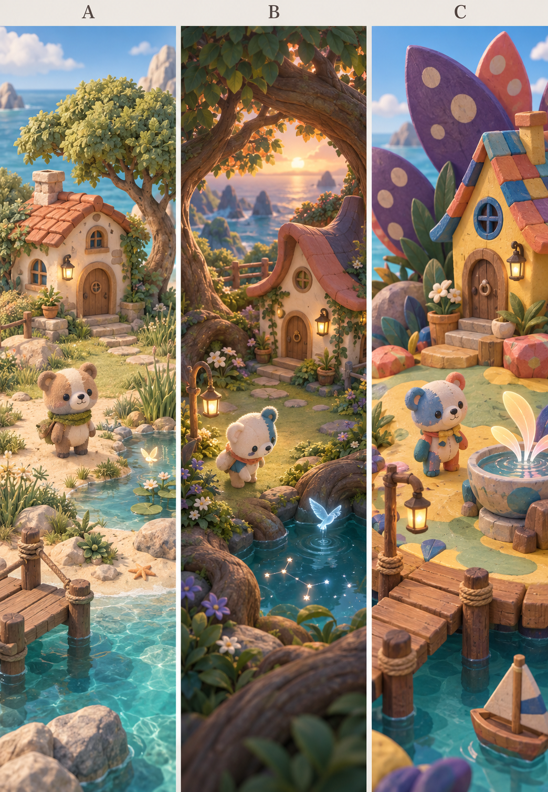

# ぽこもこの世界観と遊びを選び直す

> 後続の「網羅的に仕様を策定して」という依頼を受け、[包括仕様51](../../product/51_living_fantasy_island_spec.md)へ具体化した。本稿は比較検討時点の記録。Bは次期の仕様基準として使用するが、この生成画像の最終美術承認・実装・公開を意味しない。以下の「未採用」「選択待ち」は比較当時の状態として読む。

2026-09-27。ユーザーの「仕様で決まっているところも含めて見直してよい。デザインや世界観なども」という依頼による再検討。

**状態：方向比較と推奨案。未採用・未実装。** 仕様の検討範囲は広げたが、既存の保存データを変更・削除する承認、コード実装、公開の依頼ではない。

## 今回の出発点

[前段の分析](../../wiki/little-habitats-direction-study.md)は「既存のキャラクター、色、家、学習連携を守りながら参考作を取り入れる」案だった。今回はその保存条件自体も再検討する。

既存仕様は、現在の動作と変更の影響を知る資料として読む。既に書いてあることや実装した量だけを、将来も残す理由にはしない。造形・名前・配色・水玉・地形・カメラ・通貨・購入・成長・住人・発見・ナビゲーションを検討対象にする。

検討の評価軸は、入りたい、触る理由がある、自分の場所になる、学習と気持ちよく往復できる、繰り返すうちに愛着が増す、の五つ。学習記録の正確さ、既存利用者の作品の保持、説明なしでの操作、実機での成立は、見た目とは別に確認する。

## 提案する作品の核

> **ぽこもこと、小さな世界を育てる。育てた場所には暮らしが生まれ、ときどき、その場所だけの不思議が見つかる。**

主役は「本人が手をかけた居場所」と「そこで一緒に暮らす相棒」。植物の成長・住人の使い方・発見した出来事が、その場所に時間を積み重ねる。学習は世界へ働きかける機会を増やす。

島に戻る理由を三つ持たせる。

- **確かめる**：前に育てていたものがどうなったか。
- **試す**：ここを変えたら、誰が来て、何が起きるか。
- **会う**：ぽこもこが今日は何をしているか。

成長ログの箱庭化には本人の選択が必要である。正解数に比例して花が機械的に増えるだけでは、本人の作品としての違いが弱い。どんな場所にするかを本人が選び、育った後にも配置と暮らしを楽しめるようにする。

## 三つの美術方向

2026-09-27にimage_genで新規生成した一枚の比較ボード。各列は縦画面を想定した世界表現の候補。実アプリ、3Dモデル、採用済みキャラ設定画ではない。元画像とプロンプトは[制作記録](generation.md)へ。

| 案 | 世界の主役 | 魅力の仮説 | 懸念 | 判断 |
|---|---|---|---|---|
| A：自然の小さな箱庭 | 木、草、水、生き物の暮らし | 穏やかで、植物の成長や生き物の来訪を読み取りやすい | 自然系の箱庭の中で固有性を作る工夫が必要。幻想が追加演出に寄りやすい | 比較候補。自然の見通しを学ぶ |
| B：絵本のような幻想の島 | 大きな自然に包まれた小さな暮らし | 日常の居心地と、覗きたくなる不思議な奥行きを両立しやすい | 枝葉による遮蔽、暗さ、細密化。美しい一枚絵が遊べる画面になるとは限らない | **主方向として推奨** |
| C：手づくりの玩具世界 | 色、模様、布、木、陶器の楽しさ | 既存のぽこもこと連続し、触る・組み立てる体験に強い | 模様や色数が景色を分断し、静かな幻想や光が弱くなる場合がある | 既存方向を選び直す場合の有力な対案 |

Bを推す理由は、今回ユーザーが惹かれた幻想性と、本人の庭に暮らしが残る体験を、一つの風景で結びやすいから。A/B/Cの美術を等分に混ぜる意味ではない。Bを選ぶならBの光・尺度・素材を基準にし、読みやすさを満たすよう整理する。

比較画像では、Bの太い枝のアーチ、温かい家、青緑の水面が、上から下へ視線を導く。ぽこもこが水辺へ向くことで魔法と住人の関係も見える。一方、三案とも植物の描写が細かく、Bは中央の庭が狭い。これは気分の比較として使い、固定構図・密度・描画負荷まで採用しない。方向比較では複数の要素を一緒に変えており、照明単体の効果を測った実験でもない。

## 決まっていたことを、どう見直すか

| 項目 | 今の出発点 | 新しい推奨案 | 変える理由・代償 |
|---|---|---|---|
| 世界観 | 不思議な島、暮らし、布の住人、模様 | 小さな暮らしを包む幻想の自然 | 色や装飾を超えた、場所としての一貫性が欲しい |
| 配色 | ミントの床、紫の植物、黄・青・桃の色瓦 | 草と木を基調に、青緑の陰と琥珀の灯り。紫・桃は植物や住人の局所色 | 主役と光が見つけやすくなる。既存のポップな印象は弱まる |
| 水玉 | 世界と周辺UIの強い共通記号 | 必須条件から外す。使う場合は一部の植物・小物・布に限定 | 模様以外の形と空間で固有性を作る。旧ブランドとの橋渡しは必要 |
| ぽこもこの造形 | 多色のパッチワークのくま | くま型の相棒は第一候補。色面を減らし、顔と姿勢を読みやすく再設計 | 顔・身体・布の情報を小画面で読ませる。全面別キャラ化の利益はまだ不明 |
| 家 | 色瓦と玩具的な形 | 丸みと少し曲がった屋根、温かい窓、植物との接続 | 機能アイコンとしての建物から「帰る場所」へ。大きな色瓦は必須にしない |
| 島 | 広い配置床と海、固定景観 | 岸・木陰・水辺のある連続した庭。低い高低差と曲がった境界 | 場所の違いが生まれる。地形変更は配置・経路・保存との調整が大きい |
| カメラ | 全景と任意の観察 | 居場所を眺める通常画角、編集時の全景、選んだ出来事の近景 | 島全体の管理と相棒への愛着を両立。自動で視点を奪わない設計が必要 |
| 品揃え | 個別の家具・植物の購入と配置 | 木・花・水・灯り・休む物という少数の素材から、多様な居場所が育つ | 商品数より組み合わせの深さを重視。種類を増やす速度は落ちる |
| 学習との接続 | しずくで購入、学習履歴で成長速度が変化 | 学習の成果は一つの分かりやすい仕組みに整理。最初の候補は材料を選ぶための一通貨 | 通貨と成長倍率を同時に説明する負荷を減らす。既存経済の再設計が必要 |
| 成長 | 学習・時間・配置条件が関わる | 植えた後の成長は時間とその場所の環境を中心にする | 学習の効果を材料選択に集め、育つ理由を見やすくする。学習直後の手応えを別途確認する |
| 自然・運搬 | 水、土、食料、配送の仕組み | 暮らしが見える範囲を優先。細かな物流最適化を主目的にしない | シミュレーションの深さより、見て分かる出来事へ開発を集中する |
| 発見 | 条件判定、観察面、実表示記録 | 普段の庭で気付き、必要なら近づいて試せる | 魔法をメニューの中へ隔離しない。表示・遮蔽・記録の作り直しが要る |
| 精霊 | 参考作からの候補 | 場所に結び付いた少数の来訪者 | 収集数より記憶に残る一回を重視。再会と見逃しの扱いを設計する |
| 記録 | 家、写真、思い出、学習記録など | 子どもには庭の思い出を一つの入口へ。保護者の学習記録は分ける | 実写真と再演の区別は残し、探す入口を整理する |
| 主ナビ | しま・いえ・まなぶ・きろく・設定 | 子どもの常設入口は「しま・まなぶ・おもいで」を第一候補とする | 家は島の家と文字付きの補助入口から入る。設定・保護者記録は常設主ナビから分ける。到達性の比較が必要 |

いずれも推奨・比較候補であって、表に書いたことで仕様や既存権利は変更されない。特に通貨の一本化・成長規則・地形・ナビは美術調整とは別の仕様変更である。

## 世界の文法を少数に絞る

新案の不思議には、場所との関係が分かる共通性を持たせたい。以下は発想の核であり、確定した発見条件ではない。

- **水は、見えない空を映す。** 小さな水面に星が現れ、波紋を渡る光の生き物が来る。
- **植物は、居場所をつくる。** 葉が屋根になり、根が囲みになり、花の集まりが休める場所になる。
- **灯りは、暮らしと不思議をつなぐ。** 家や道を照らす灯りが、水面や植物との関係で別の姿を見せる。

星、水晶、精霊、虹、花火、きのこ、浮島をすべて一度に増やさない。世界を覚えるための形と現象を、まず少数で成立させる。実際の自然の仕組みと、世界固有の魔法は混同して教えない。

## ぽこもこを何者にするか

役割は、所有物を巡回する住人の一人から、本人と同じものを見つける相棒へ強める。ただし、説明を続ける案内係にも、指示どおりにしか動かない人形にもしない。

最初に必要な仕草は、気付く、近づく、のぞく、座って見上げる、本人に振り向く、のような少数の読みやすい行動。表情パーツを大量に増やす前に、顔の向き、身体の傾き、間で意図を見せる。

造形は変更してよい。今回のB案のような「生成りの身体＋青い片側の特徴＋小さな暖色」を候補とし、現在の青と生成りの顔を認識の橋渡しにできるか比較する。名前の「ぽこもこ」は音と柔らかな相棒の関係がよいため、今は残す推奨。これは名前やくま型を変更禁止にする判断ではない。

主役以外の住人は、同じ大きさと動作で人数を増やすより、暮らし方の違いを優先する。小さな虫・鳥などは庭の環境を示す存在、ぽこもこと動物の友達は愛着を持つ存在、精霊は特別な出来事の存在として役割を分ける。

## 遊びの中心を「居場所」にする

材料は自由に置ける。近接や環境によって、土・草・水際などの見え方がつながる。これを住人が使い、不思議な現象の舞台になる。完成形のパッケージやレシピを選んで購入する方式にはしない。

たとえば、木と休む物の関係から木陰の居場所、植物と水から小さな水辺、花と灯りから夕暮れの庭が生まれる。本人が同じ材料を別の置き方にでき、配置の変更には即時の小さな反応を用意する。成熟や来訪を待たなければ、操作の結果が一切分からない構造を避ける。

「庭で遊ぶ」と「学ぶ」の両方を自分で始められる。既にある材料での移動・観察・再現は追加学習を要求しない。新しい選択肢が欲しくなったとき、学習がその一つの入口として見えるようにする。

## 学習と成長は、三案を比べて選ぶ

| 案 | 体験 | 強み | 弱み |
|---|---|---|---|
| 完了ごとに自動で庭を成長 | 練習の直後に毎回変わる | 因果が短く分かりやすい | 同じ完成形へ近づく作業になりやすく、配置の自由を支えにくい |
| 一通貨で材料を選び、庭で育てる | 学習→蓄積→選択→配置→暮らし | 学習の成果と本人の選択が両立し、既存の仕組みも部分的に生かせる | 買物が主役になる可能性。価格と初回の手応えを調整する必要 |
| 学習区切りで種や材料の贈り物を受け取る | 小包から選んで庭へ持ち帰る | 世界との物語的なつながりが作りやすい | 強制受取、抽選の外れ、不要な材料が増えやすい |

推奨は一通貨案。現行しずくを候補に、新しく学習の効果を成長倍率にも重ねる設計を見直す。ひかりの別財布を将来も主役にする理由は弱い。初回には少ない学習で選べる材料を用意し、継続する子には見た目・用途の選択肢を増やす。大量学習だけで精霊を抽選する設計にはしない。

学習途中に購入や演出の確認を割り込ませず、帰島時に本人の意志で材料へ進める。しずくの変化と「何を選べるか」は短く示す。成長ログは単に通貨残高へ変換せず、本人が選んだ場所の成長前後や実際に見た暮らしとして見返せるようにする。

数値、問題数、価格、成長時間、既存残高の移行は、この方向検討では決めない。参加と独力習得は引き続き分ける。旧所有物、途中の問題、学習履歴、残高・既得権を保持する移行設計を作るまで切り替えない。

## 光・動き・音・UI

**光**：昼から魅力のある世界にする。生成り・草・木を明るく保ち、木陰と水辺に青緑、家と灯りに琥珀を使う。薄明かりは幻想性を強める場面。夜限定の利用を要求せず、世界内の時間や任意の眺めで体験できる案を比較する。

**動き**：環境の小さな動き、住人の目的ある動き、短い不思議の三段階。見どころでは、気配→ぽこもこが気付く→対象が変わる→結果が残る、という順序を見せる。毎回カメラを自動で回したり、全住人を集合させたりしない。

**音**：水、葉、足音など場所の音を土台にし、不思議の成立時に短い音色を重ねる案。参考動画の音は未確認なので、この提案は聴取結果ではない。音を消しても現象と次の操作が分かるようにする。

**UI**：自然の景色を広く取り、選んだ物の近くに短い操作を出す。絵だけの隠れた操作にはせず、文字付きの入口を残す。メニューは読みやすい生成り面、落ち着いた文字、少数の強調色。装飾の多い額縁や全画面の水玉は必須にしない。子ども向けでも極端に幼い字形・幼児語へ寄せない。

**学習面**：世界と色や余白の調子を共有しながら、問題と入力を読みやすくする。学習中も常時動く庭を背後へ表示する案は推奨しない。移動先が「別アプリ」に見えないことと、回答に集中できることを両立する。

## 表現方法の判断

| 表現方法 | 向いていること | 問題 |
|---|---|---|
| 高品質な一枚絵／2.5D中心 | 決めた画角の雰囲気を保つ | 自由配置、重なり、住人の接触、カメラ変更が難しい |
| 全てを自由に造形する3D箱庭 | 地形編集と創作の広さ | 地形・経路・保存・カメラの組み合わせが大きく増える |
| **造形した地形＋自由配置できる植生・小物の3D** | 居場所の美術と本人の配置を両立する | どこまで変えられるかを画面で正直に伝える必要がある |

三つ目を最初の候補として推奨する。家・木陰・水辺がつながる基本の地形を丁寧に作り、その上に本人の庭が育つ。海岸まで自在に削る地形編集は、遊びの価値を別に確かめてから広げる。

絵の密度をそのまま大量の細かなmeshへ置き換えない。実機向けの形、素材、光、草のまとまりを先に一画で確かめる。開発環境の速さや生成画像の美しさから、スマホで同じ画質を保証しない。

## 次に確かめる順番

1. **作品の方向を選ぶ。** A/B/Cの比較から、入りたい世界と相棒の役割を選ぶ。今回はBが推奨で、ユーザーの選択待ち。
2. **遊べる見え方を選ぶ。** 同じ場所の昼・薄明かり、少ない所有物・育った庭、全景・近景、通常・不思議の状態を比較する。文字と操作を置いた実際の縦画面サイズへ落とす。大きな枝や前景が邪魔なら直す。
3. **一つの体験をつなぐ。** 材料を選ぶ→置く→場所の見え方が変わる→ぽこもこが使う→小さな不思議→思い出→学習へ、の流れを小さく試作する。水面の星は候補の一つで、旧M4の存在だけを理由に決定しない。
4. **経済と進行を比較する。** 一通貨案で初回と数日後の選択が成立するか、買物の負担や長い待ちがないかを検討する。定着や学習効果は仮説として扱う。
5. **採用した内容だけ仕様へ戻す。** 美術はデザイン憲章/07、暮らし・経済は48、発見は50、ナビは43、親仕様01へ責任を分ける。全体を別作品として複製しない。

最初の実装を「水面の星の見た目だけ」で終えない。一方、全ての品・四季・精霊・地形編集を作り込んでから評価もしない。本人の選択と世界の返事がつながる一周を、方向判断の単位にする。

## 採否の判断と未確認

- **視覚**：何も起きていない昼でも入りたいか。主役と場所が見えるか。精霊や発光を隠しても魅力が残るか。
- **遊び**：自分の操作に対して何が変わったか分かるか。試し直したいか。別の配置にする理由があるか。
- **愛着**：ぽこもこが共に過ごす相手に見えるか。自分の庭の前後を覚えているか。
- **学習往復**：次の学習へ戻れるか。学習の区切りが世界の受取操作で止まらないか。
- **Runtime**：実機、390×844 / 768×1024、入力、保存、再起動、オフライン、更新、音なし・動き抑制を独立して確かめる。

本稿は新規の実画面監査ではない。生成絵の比較と既存資料・コードの読解による提案で、数値の採点、利用者の好みや理解、実機性能、release判定は行っていない。

## 出典と既存仕様への接点

- [Little Habitats公式](https://wavedash.com/games/little-habitats)。タイトル画面とサンプルの庭、説明を前段の調査で確認。
- [公開動画](https://x.com/DannyLimanseta/status/2103875934944440584)：2026-09-27 JST。[制作背景動画](https://x.com/DannyLimanseta/status/2103493389778125083)：2026-09-25 JST。指定2投稿のみを調査し、映像は抽出フレームで確認。制作時間や利用者全体の評価は根拠にしない。
- [デザイン憲章](../../product/design-charter.md)、[UI仕様07](../../product/07_ui_design_guideline.md)、[暮らす島48](../../product/48_island_life_spec.md)、[発見50](../../product/50_mysterious_island_discovery_spec.md)、[ナビ43](../../product/43_island_navigation_spec.md)。今回はこれらを変更可能な設計の出発点として参照。
- [成長・ひかりの現行規則](../../../src/domain/islandLife/economyRules.ts)、[カタログと状態](../../../src/domain/islandLife/model.ts)、[自然と町の統合方針](../../product/island-nature-integration.md)。並行作業のあるツリーの読解で、固定版の本番監査ではない。
