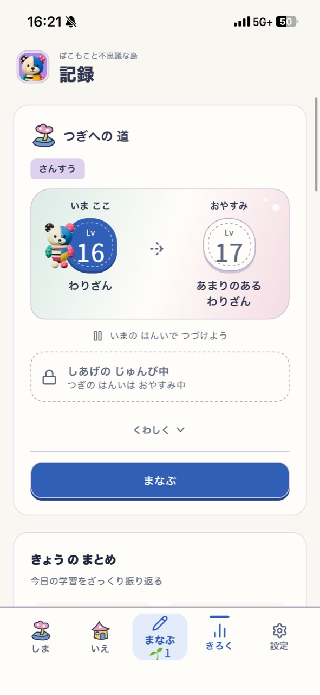
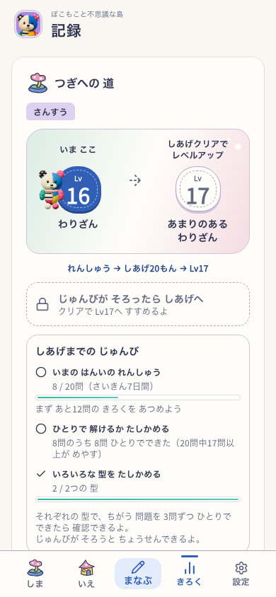
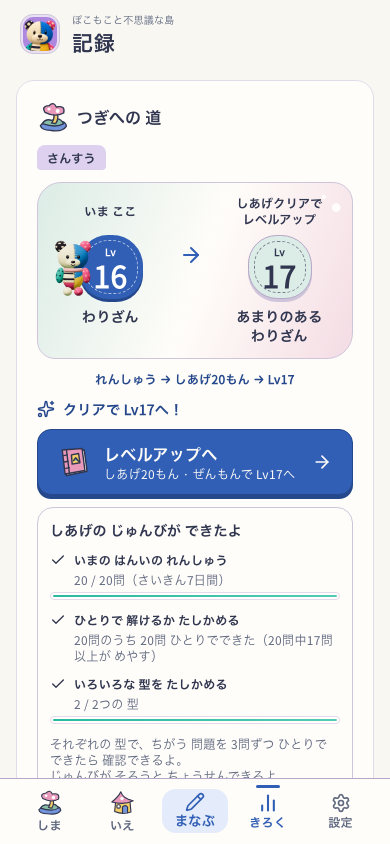
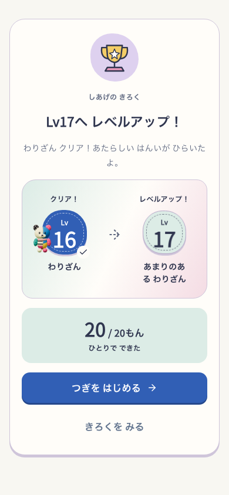

# しあげまでの準備とレベルアップの表示

2026-10-01。記録の画像では、準備があとどのくらいか分からず、しあげが進級に結びついて見えないという指摘に対応。愛着の柱へ、実際の学習の前進を見えるようにする。学習を急がせる締切や報酬は追加しない。

## 実装

- 記録の「つぎへの道」は `finish-path-v2`。現在/次レベルと「れんしゅう→しあげ20もん→LvN」を結ぶ。
- 20回答の記録、独力17正解、型/語coverageを別の数字で常時表示。「まずあとN問の記録」は回答数だけの不足で、残りN問で必ず挑戦できるとは約束しない。算数の異なる代表問題3問ずつと英語の70%以上も説明する。
- 次範囲が設定で無効でも準備を表示。無効設定と設定の不整合を区別する。保護者設定を勝手に変えない。
- 挑戦可能なら準備の一覧より先にレベルアップの入口を出す。まなぶの入口は「クリアでLvNへ」、結果は保存された進級にだけ「LvNへレベルアップ」を出す。
- 判定・20/20・SRS・出題・保存・確認テストの進級しない契約を変えない。読取失敗と再読込、最高レベル、未クリアの回復、予約済み練習の続きを保持。

正本は[仕様06](../../product/06_screen_specs.md)と[仕様29](../../product/29_learning_progression_spec.md)。新しい保存形式や移行は不要。

## 検証の範囲

`ui.mjs` は既存の生成器・教材文脈で作る明示プロフィール/記録fixtureから、実アプリの記録・まなぶ・Study・次のIsland学習を操作する。画面や回答hookを差し替えない。DEV Chromium、Island flag-on、390×844/通常motionと768×1024/reduced motion、音OFF。自然な初回取得や実端末/子どもの理解/公開PWAの証拠ではない。

14ケースは記録なし・途中・回答数は足りるがcoverage不足・次範囲無効・挑戦可能・英語・最高レベルの両幅。挑戦可能のケースではまなぶの入口も読み、記録から実20問を回答し、保存されたLv16→17と次の練習への到着を照合する。root revision/version/feature flagと画面候補、全src入力の開始終了hashを記録する。

初回は記録のボタンがまなぶの入口を経由するという検証側の誤った前提で停止。実際は既存契約どおりStudyへ直接進むため、まなぶの入口の検査を別にした。次回は実行中に今回の文言と並行する島の成長処理の入力が変わり、tablet回答中も停止した。入力不一致の結果を最終PASSに使わず、最終文言と統合候補で再確認する。ログと失敗時の画像は保持する。

初回の全体checkは並行作業の `growingIsland/town.ts` の未使用型importでlint/typecheck/buildが止まり、成長ルールの3テストも失敗。今回のUIで直した問題とは扱わず、統合後の最終結果と分けて保持する。

全体 `verify:core` の最終実行結果は510ファイル/4,547テスト・docs・lint（既存warning1件）・typecheck・build/assets PASS。ただし並行作業の成長画面/テストが画面検証中に更新された。14ケースすべてが通っても全入力hash不一致の結果は最終画面の証拠に使わない。最後は共有作業内容を固定した `/tmp/sansu-finish-clarity.hrpPC0` のDEVコピーで14ケースを再実行し、今回の実装ファイルと共有作業内容の一致を確認する。全体coreの実行ログは固定コピーの全体release認定ではない。

## レビュー

固定コピーの最終14ケースPASS、開始/終了の全src入力hash一致。今回の実装と共有作業内容の対象ファイルも一致。[結果](verification.json)、[実行記録](ui-report.json)、[全画面](screens.html)。関連16テストPASS。[core実行ログ](core.log)。本番配布・PWA/実機・子どもの理解と定着は未評価。

| 元の実機画像 | 準備の見通し | 挑戦の入口 | 保存済みのレベルアップ |
|---|---|---|---|
|  |  |  |  |

- 視覚/情報設計: 実画面で現在と次のLv、入口、3つの準備を読める。phoneの「レベルアップ」の末尾とボタン文言の一文字だけの折返しを発見し、改行位置と短いラベルを修正。
- 無音理解/安全: 数字と文言・チェックの形で状態を示す。時間や正解不足で責めない。利用者の自発的な再挑戦・無説明理解は未評価。
- runtime: 最終結果を `verification.json` と `ui-report.json` へ保存する。準備表示は既存判定のread-only view。昇格の書込やSRSの変更はない。
- 継続性: 実アプリの記録→Study→保存済み進級結果→次のIsland学習を照合。共有Utilityの外装・既存ぽこもこ素材を保持。島全体の美術の再評価ではない。

ローカル実装。今回のコミット・push・本番配布は行っていない。
