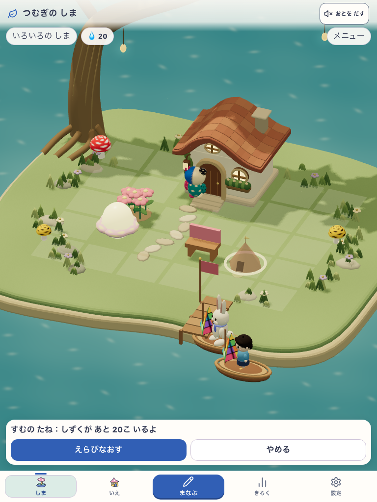

# 20問/日を基準にした島の経済

2026-10-04、ユーザーの「学習せずに配置ばかり」を受け、[仕様52](../../product/52_growing_island_game_spec.md)と[経済・保存契約](../../product/growing-island-balance.md)を更新して実装した。柱はくふう・にぎわい・愛着。学習を本人が選び、新しい物が増える楽しみにつなげる。

## 変更

- 1日20問で40しずくを基準にする。花/しぜん10、ベンチ/水ばち/木のなえ20、家/畑40、あそぶ60、いちば120、おまつり160。めじるしは旧価格の5倍、土地は120/240/480/720/960、以後1200から240ずつ。解放条件・土地の形・回数上限なしを維持する。
- 新規完了1件のまち時間は4→2。20問で40時間。既存のclock/bank、残高、物・住人・土地・学習記録・完了IDを再計算しない。旧種の取消は保存されたpaid（例えば4）を返し、新規40の種は40を返す。
- 既存品の移動/収納/再配置は無料、初回の無料家も維持する。ノルマ、日次ボーナス、維持費を加えない。
- 20問は設計の目安。島の予約は初回3問・通常最大6問（複雑な問題は3問）を維持し、複数の区切りの合計で考える。前の会話の「通常10問を2回」という説明は別経路の取り違えで訂正した。

## 検証対象

共有checkoutから固定コピーを作り、そこでcoreとブラウザーを実行した。基点 `3b8b36545f87c0b25c30253ed3eaedf66605281f` に未commitの変更を含む候補であり、commit済み版/公開URLの認定ではない。同時進行の他作業の最終版と区別する。今回のruntime変更は `src/domain/growingIsland/rules.ts` と `commands.ts`。保存schemaや学習plannerは変更しない。

- URL: `http://127.0.0.1:5260/#/island`。Growing/Island/Life preview/Fantasyは有効。本人DBは `SansuGrowingIslandPreviewV1`。
- 島candidate: `growing-island-v1`。学習candidate: `pokomoko-pop-live-v8`。DEVのrevisionは `development-local`。実撮影ごとのversion/flag/画面を[検証情報](verification.json)に保存した。
- app/QA入力の開始・終了hash一致。詳しい各ファイルSHAはローカル生成物 `output/playwright/2026-10-04-economy-run2/report.json`。固定コピーの入力manifestは `economy-source-manifest.json` に保存した。

## 結果

- `npm run verify:core`: PASS（536ファイル・4,690テスト、docs/current-entry/lint/typecheck/build/assets）。既存のFast Refresh warning1件、期限切れタスクの警告、Browserslist更新案内は失敗ではない。
- Growing対象: 33ファイル・171テストPASS。新価格の購入境界、返金、旧bank/既払完了の保持、旧writer隔離、保存のrollback/再送を含む。
- `npm run e2e:smoke`: 初回30/31。旧ExploreのQ7発見ダイアログ待ち1件がtimeout。app入力を変えず `SANSU_E2E_EXPLORE_RESUME_ONLY=1` でその1件を再実行してPASS（10.3秒）。初回の失敗ログを保持し、初回31/31や全体再実行PASSとは表記しない。
- DEVの390×844/通常motion、768×1024/reduced motion: 4scenario PASS。隔離本人profileだけをfixtureで作成し、学習・報酬・購入は実UIで取得。10問で20しずく/20時間→家の不足20→取消→同じ学習へ戻って20問/40しずく/40時間→家40→reload/同じ予約へ復帰。実取得ケースへ残高/所有/まち時間を注入していない。
- 旧保存1→3、既得5段階の土地、20,000しずく/bank500は別の明示fixture。追加地区3方向とbankの保持、新地区への家を確認。実取得や利用者の観察の証拠とは分ける。
- 初回の診断run1は保存確認中の表示をすぐ照合して失敗した。QAを表示完了待ちへ直し、core後のrun2で両幅を完走。元の失敗report/画面をローカル生成物に保持した。runtimeコードの修正は不要だった。

## 成長シミュレーション

1日20問・住居/供給優先のscriptで、初日1人、7日6人、30日20人、90日42人、365日104人。1日6問の30日は7人。装飾優先は場所不足時に所有の花を無料収納し、畑/家へ使うscriptで、365日98人、土地192マスまで成長。固定人口/土地上限で終わらないことを確認した。標準の最初の1か月の残高はほぼ消費され、年単位では貯蓄も残る。全残高の強制消滅を合格基準にしない。

実際の子どもが10問で止めず次へ進むか、翌日戻るか、後日の復習で独力正答できるか、難しい問題の所要時間は未確認。購入と島の進行を緩めすぎず、負担が大きい子を追い立てないことを次の観察にする。

## 実画面

| 10問後：家まで20しずく | 20問後：家40しずくを購入、再読込 |
|---|---|
|  |  |
|  |  |

## 独立したゲート

- 表示: 両幅の価格不足と操作は読め、横overflowなし。新規美術は範囲外。子どもの見た目の評価は未確認。
- 理解/安全: 所有・無料の試し直し・学習進行を保持。無説明理解/自発的な継続は未確認。
- runtime: 対象テスト/coreとDEVの実回答/保存/再開はPASS。実SW/two-build、実iOS、公開URLは未確認。本番公開は未実施。
