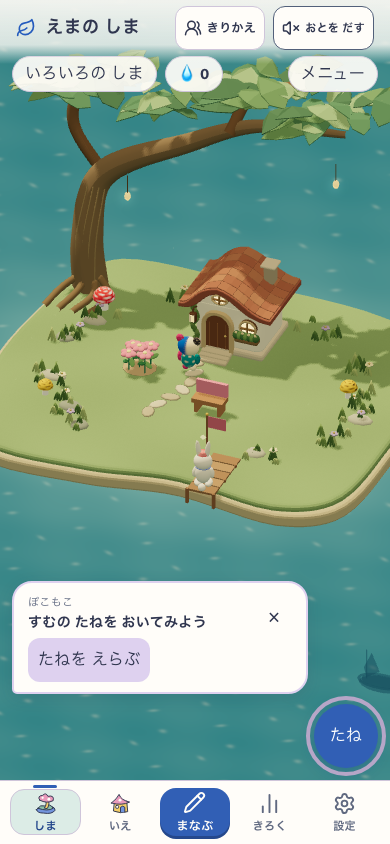
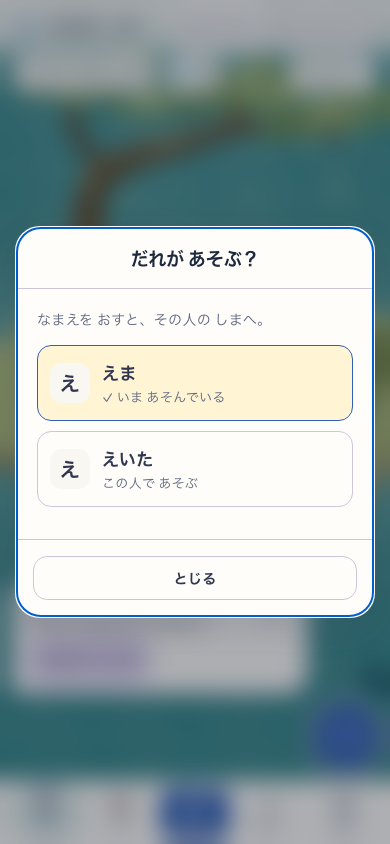
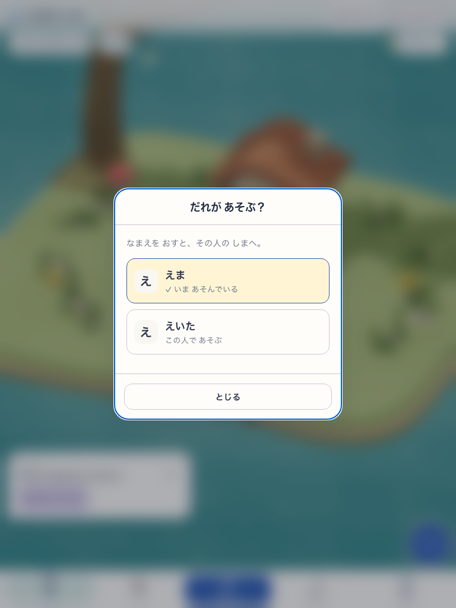

# 島から使う人を切り替える

2026-10-04。愛着の柱に効く追加。島ホームの見出しに「きりかえ」を置き、設定を開かず、同じ名前カードをdialogで選ぶ。閉じる・Escapeは本人を変えず島へ戻る。学習中は入口を出さず、配置/名前編集中と実際の島保存中は無効にする。育つ島の読み取り準備と保存を区別し、読み取りで切替を長く止めない。設定とdialogの名前カードは共通部品。

## 実画面

| 島の入口390×844 | 名前カード390×844 | 名前カード768×1024 |
|---|---|---|
|  |  |  |

対象: `http://127.0.0.1:5262/#/island` の現行checkout、Island/Growing=true、NatureTown=false、Growing実DOM `data-growing-island=ready` を確認。delivery=`snap-root-v1`、revision=`development-local`、version=`development-local:285d203e-0a7e-4980-8aeb-e017a351e241`、Utility dialogは共有 `whole-app-atelier-v1`（専用候補なし）。DEV/SWなし。音off、tablet reduced motion。2人の隔離プロフィールは明示fixtureであり、実家庭の利用記録ではない。

## 検証と境界

- 実UIのphone/tablet: 入口→カード→別人の島、現在の人のno-op、Escapeで取消/focus復帰、44px以上、保存の明示put故障→元の人の保持→再試行、Enter選択、reloadで選択保持、両プロフィール全体の不変、元の人への切替 PASS。
- 通常Islandの5198でも同じ入口/カード/切替を確認。320幅では見出し側を省略して入口と音ボタンの44pxを保持。短い横画面はModalの本文スクロールと固定footerを使う。
- core537ファイル/4,698 testsとclassic smoke31 PASS。core後の表示/待機保護の補正は対象lint・build/typecheck/assetsと関連21 testsで確認。共有checkoutで同時進行の保護者設定変更があるため、他作業の最終版を固定したrelease検証とは区別する。
- 保存schema・SRS・プロフィールの更新規則は変更しない。既存のatomicなactive ID切替を使う。PWAのcritical persistence holdを切替writeの間だけ保持する。
- 詳細のローカル診断: `output/playwright/island-profile-switch/`。5260は別の一時checkoutのserverだったため、その失敗を対象違いとして残し、現行checkoutの5262で再実行。focus待ち/keyboard入力の時機、HMR中の診断と帰島後の待機状態の結果も最終PASSとは別に保持した。

作者の実画面確認では、景色を残す短い入口と既存の紙/藍のカードで使用中を文字でも示せる。子どもの無説明理解・実機・実SW/offline・本番公開は今回の証拠ではない。見た目、無説明理解/安全、runtimeを別ゲートとして扱い、子どもの評価は未確認。
