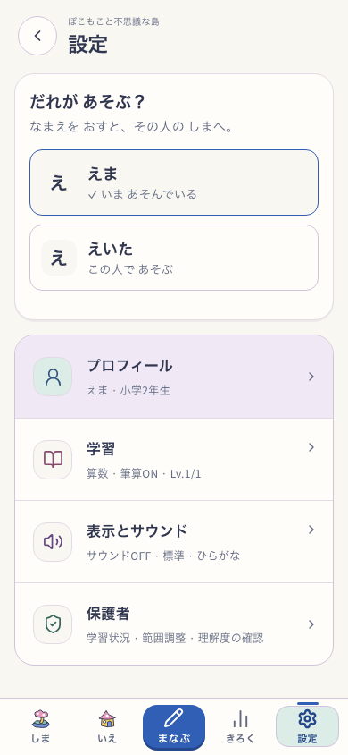
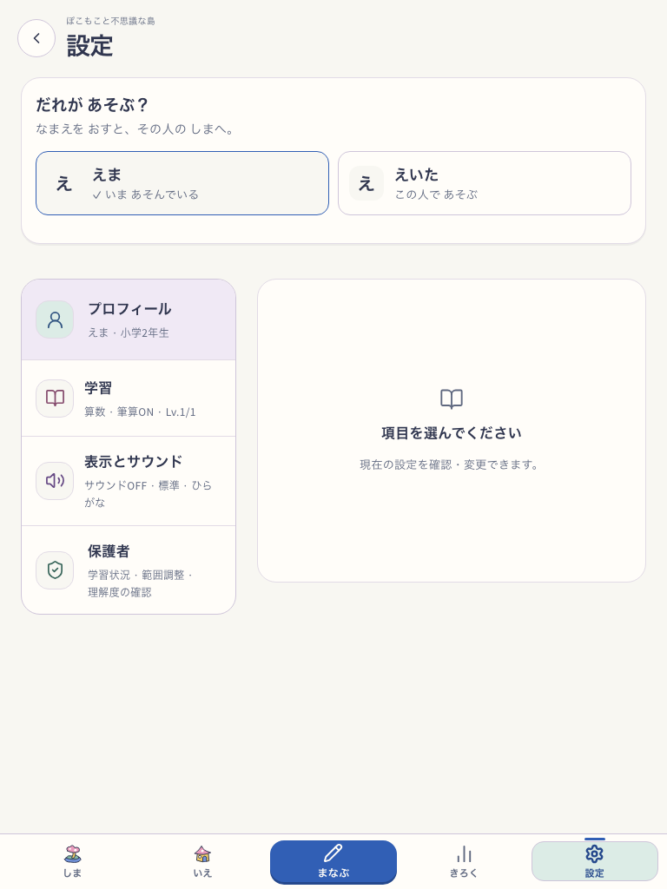
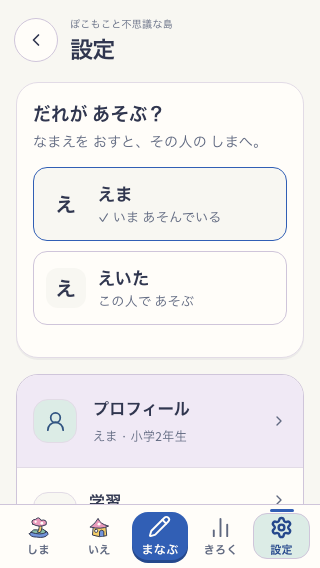

# 使う人を2回のタップで切り替える

2026-10-04。愛着の柱に効く変更。家族で同じ端末を使っても、自分の島へ戻る操作を短くする。島の遊び・学習の規則は変更しない。

設定の先頭に「だれが あそぶ？」を表示。名前カード全体を押してその人のホームへ移る。使用中は文字とチェックで示す。編集・追加・削除は既存のプロフィール管理に残す。保存失敗は使用中の人を保持し、もう一度選べる。active IDの保存をtransactionへ入れ、成功後に端末のactive IDを更新する。

## 実画面

| スマホ390×844 | タブレット768×1024 | 小さいスマホ320×568 |
|---|---|---|
|  |  |  |

対象は `http://127.0.0.1:5198/#/settings` の実アプリ。Island=true / NatureTown=false、delivery=`snap-root-v1`、revision=`development-local`、version=`development-local:2da709b6-3023-4b98-9bb2-20854c51b911`。Utility候補は共有 `whole-app-atelier-v1`（画面固有候補なし）。DEVでSW更新の検証ではない。2人の隔離プロフィールを明示fixtureとして作成し、音off、タブレットはreduced motion。

## 検証

- `npm run verify:core`: 534ファイル / 4,675 tests、docs/current-entry/lint/typecheck/build/assets PASS。共有checkoutの実行時の結果であり、別作業の島描画変更の最終版を固定した検証ではない。
- 新規repository回帰3件: 切替時に両プロフィールを保持、保存失敗時に元のactive IDを保持、削除済みの切替先を拒否。
- 3サイズの実UI: 島→設定→別人の名前→その人の島、44px以上かつ下部ナビに隠れないカード、現在の人の選択で移動しない、明示put故障→元の人を保持→再試行、Enterで選択、reload後も選択保持、両プロフィール全体が不変、元の人へ切替 PASS。
- ローカル診断のスクリプト・失敗時画面・集計: `output/playwright/profile-switch/`。初回診断はDB import先の誤りで失敗し、`src/db/index.ts`へ修正して再実行。アプリの保存失敗とは別。

見た目は既存の紙・藍のutility面として実画面を確認。使用中の判別は音や色だけに依存しない。runtimeの上記確認はPASS。子どもの無説明理解と家族の日常の切替評価は未実施で、作者の画面確認を代用しない。本番公開、実機、実SW更新・offline、長期間の学習実績の観察は今回の検証範囲外。

既存classicの `npm run e2e:smoke`: 31ケース PASS。Islandのプロフィール切替は上記3サイズの独立した実UI確認で検査した。
