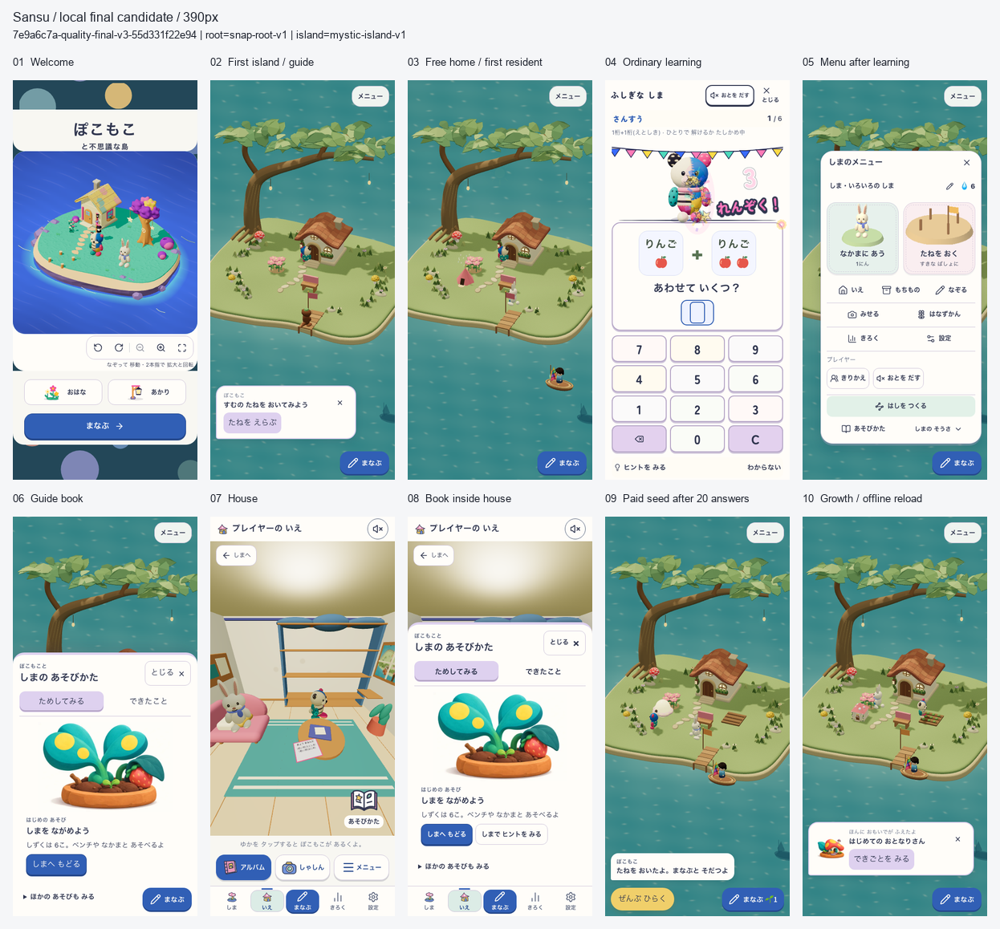
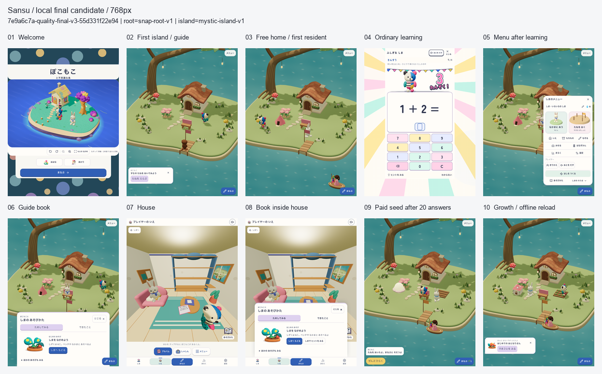
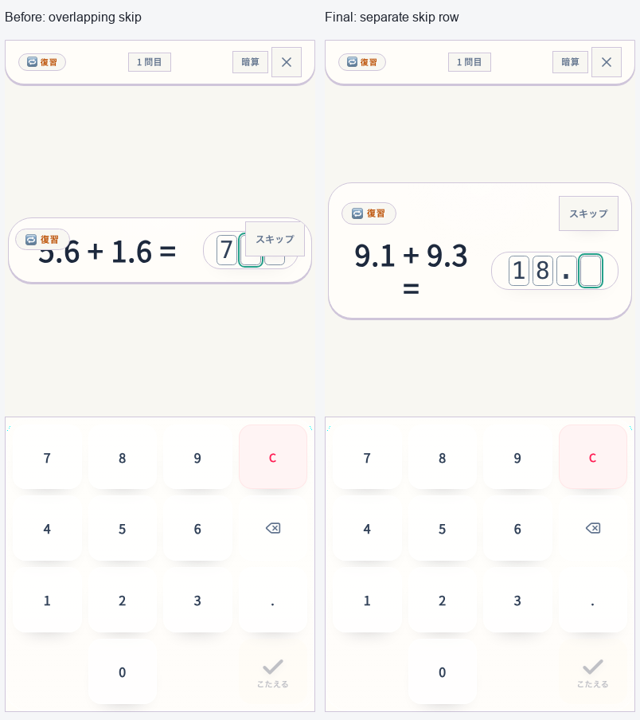
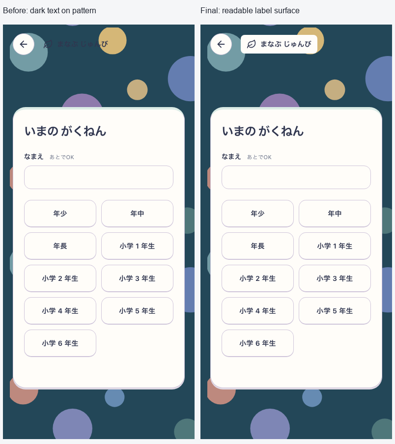
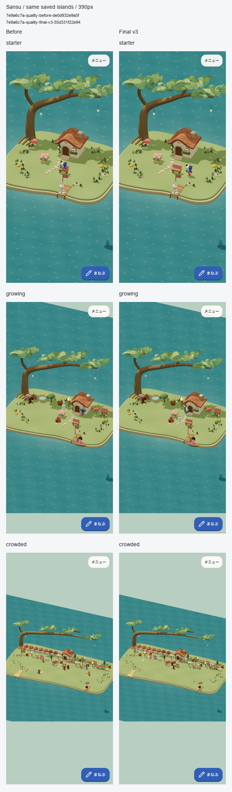
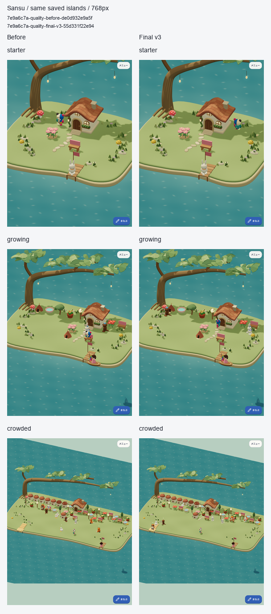

# 島の一周を磨く — 固定ローカル候補

2026-10-09。ユーザー指定の「こちらでできる範囲」の品質ゴール。初回・遊び・学習・家・成長の一周を整え、保存と描画の不具合を直した。**ローカル候補の実装・検証を完了。** 配置応答と描画資源の寿命を改善した。起動・入室・定常描画の全指標改善は認定せず、残る待ちを下記へ記録する。

[品質ゴール](../../tasks/archive/2026-10-09-local-quality-goal.md)、[親仕様01](../../product/01_app_spec.md)、[Growing仕様52](../../product/52_growing_island_game_spec.md)に対応する。既存の静かなホーム、初回案内、遊び、描画cacheの差分を含む候補で、既存差分を巻き戻していない。

## 対象と変更

- 固定候補: `7e9a6c7a-quality-final-v3-55d331f22e94`。
- build version: `7e9a6c7a-quality-final-v3-55d331f22e94:a3e3e986-dfbd-4bec-b95a-2acaeb08889d`。
- sourceHash: `55d331f22e94cc91f80e6250ca6246dd7a840744d04e6b9a5e2b954aa324d3be`。16,674入力、153 distファイルを固定。
- 対象: localhostの本番形式の初回設定・島・家・本・学習・本人切替。公開URLではない。
- 配信: root `snap-root-v1` / Island `mystic-island-v1`。Island/Growing有効、NatureTown無効。
- 描画候補: onboarding `island-touch-first-v1`、shell `mystic-island-shore-garden-v18`、home `island-quiet-home-v1`、world `growing-island-v1`、learning `pokomoko-pop-live-v8`、book `guide-pop-toys-v6`。各画面の候補を区別する。

実在する購入物・収納ベンチ・未完成の種へ案内するよう修正し、背景保存中でも本人一覧を開けるようにした。本人変更自体の保存lockとPWA保護は保持する。Studyのスキップを解答欄から分離し、初回設定の補助見出しに既存paper/ink色の面を追加した。

退出したactorの固有geometry・sparkle材質と、家の共有描画資源の寿命を修正。同じstateの二重再構築と非表示の試作住人生成を除き、配置候補・選択・ヒントだけの変更では建物・住人・船を保持する。資源観測hookは元のshader program keyを維持し、観測対象と他の材質のshader共有を妨げない。学習・所有の保存形式は変更しない。

## 実画面

全てv3の実画面。同じ固定buildの2旅程で、welcome→最初の島は新しい初回撮影、無料家以後はguidance旅程。同一profileの連続撮影とは扱わない。guidanceは通常の実出題23回答と実購入/成長、実SW offline/reloadで、保存・所有の注入なし。390は通常motion、768はreduced motion、guidance撮影時は音off。元画像・版・flag・cache・SHAは[capture-evidence.json](capture-evidence.json)、元解像度画像は `screens/`。画像の修整なし、接触シートは縮小のみ。

自然に出題された別問題のレイアウト比較。小数入力・削除・筆算の誤答全消去・2桁の途中で進まないことを390/768、Island/Studyの12ケースで確認した。

両幅のgrade/subject/mathで、不透明背景と文字のコントラスト比は11.70:1。戻る44pxと設定カードを保持。対象見出しの確認であり、アプリ全体のアクセシビリティ適合認定ではない。

## 判定を分ける

| 判定 | 範囲と結果 |
|---|---|
| 作者の視覚レビュー | [採用済みquiet-home](../2026-10-09-quiet-island-home/README.md)の常設UI・島の見える面積・表現を保持。両幅20画面と家/見出しの原寸を独立確認し、壁・島の描画欠けや主要操作の重なり、見出しの後退は見られない。世界全体の新しい美術採用や利用者の魅力度の認定ではない |
| 子どもの無説明理解・安全・楽しさ | **NOT_EVALUATED**。実参加者なし。今回の完了条件に含めない |
| runtime | v3のcore/classic/全主要旅程/更新/入力速度PASS。性能36ケースの測定成立条件PASS。速度の判定は下記の実測値と分ける |

## 検証

以下の機能検査は全てv3で再実行した。v1/v2の結果を最終版の実行結果へ混ぜない。

| 検査 | 結果・範囲 |
|---|---|
| core | 544 files / 4,803 tests、docs/lint/typecheck/build/assets PASS。既存のdocs期限、IslandMilestone Fast Refresh、buildのchunk/PWA glob警告あり |
| classic smoke | 32経路PASS。Root Tangle固有の観察と仕様に沿った通常問題のrepresentation retryを確認 |
| guidance | 390/768 PASS。実初回/回答/取得/配置、家/本、同じ予約への復帰、実SW offline/reload |
| balance / single / profiles | 各両幅PASS。実回答/購入、旧URL、本人別記録、同予約、offline |
| party | phone/tablet/横画面×通常/reducedの6条件PASS。計180実回答、誤答訂正、支援、中断再開、offline |
| decimal / written retry | 12ケースPASS。通常plannerの自然な出題を用い、抽選履歴と適格条件を記録 |
| 保存失敗と再試行 | 両幅PASS。実20回答の残高からの購入をIDB abortし、残高/所有/学習不変→同じ配置の再試行で1回だけ購入→reload保持。本人切替のabort/retry/元本人への復帰も確認。第二profileのみ明示fixture |
| 初回撮影 | 両幅の実初回設定→最初のS1、10画面PASS。保存・問題・時計の注入なし。見出しのコントラスト6条件PASS |
| 入力速度 | v3の固定10問×80run、eligible=true、全gate PASS。下記に条件と値 |
| 旧writer / 実SW更新 | 実旧writer診断と更新4ケースPASS。旧保存1→3、学習中の更新保留、通信切断からの復旧、同予約のoffline追加回答、対応writerへのrollback |
| 性能 | 変更前18ケースとv3の18ケースで保存・画質・版・QA・native timingを照合。全指標が改善したとは扱わない |

生のログ・QA・manifest・source archiveは `output/goal-quality-20261009/`。最終版は `final-v3`、旅程/画面は `final-journeys-v3`、更新は `update-final-v3`。入力速度は `throughput-final-v3`、性能は下記の組み合わせを使う。

入力速度はDEVの同じ固定10問、2幅×10反復×正解のみ/誤答あり×Study/Islandの80runで交互に実行。両laneはkeyboard・音off・reduced motion。Islandは実atomic writerとreceipt、Studyは非記録DEV fixtureという差があり、通常plannerや人の解答速度の証拠ではない。正解後に次問を操作できるまでのP95は202.3/202.3ms、誤答再入力は201.8/201.4ms、6問境界は200.6/202.6ms（phone/tablet）。Studyに対する通常正解の自動入力throughput比は2.34/2.35。通常操作の追加なし、全遷移後の空入力、44px操作領域、実writer/receipt、両幅20件ずつの同問題誤答を確認した。

更新の旧buildは `cca109ef0bedfcc125bc116583b704f97dcdd4e5`、候補は上記v3、復旧は対応writerの `b7c6a5627c99a2120169069ce62c2d2b7cfc91dd`。任意の旧版へ戻せる保証ではない。実SWの4ケースとfake IndexedDBの実旧writer隔離診断を分ける。[再実行と復旧手順](../../runbooks/growing-update.md)。実利用者の保存・全写真・物理端末・公開URLを検証したとは扱わない。

## 描画資源と性能

同じfixtureで20回syncした寿命診断では、未解放の固有geometryが309→43（表示中の3actorぶん）になり、最終退出後は309→0。二重disposeなし、共有材質を保持。これはdisposeイベントの個数でありGPUメモリ/FPSではない。

正式計測は初期・成長途中・混雑の3つの合成保存、390/768幅、各3回、変更前後の計36ケース。混雑は13住人・40品。同じIndexedDB/localStorageを復元し、HTTP cacheのない新contextからの起動と同contextのreloadを分ける。Dateだけを固定し、nativeのperformance/rAF/タイマー、reloadのtimeOriginを検査。10秒のrAF、配置予告20回と取消、入室、帰島を測る。音off、390は通常motion、768はreduced motion、DPR1。実rendererはSwiftShaderのソフトウェア描画であり、物理GPUや実iPhone/iPadの計測ではない。OS/filesystem/GPU cacheと温度は制御していない。

配置予告の値は操作後の2回のrAFと操作可能な状態までの待ち時間であり、各マスの新しい予告がGPUへ提示された時刻を直接検出していない。rAF間隔も描画スケジューリングの指標。6箇所のcheckpointで`SansuDatabase`と`SansuGrowingIslandV1`の全storeが準備済み保存と一致することを照合する。他の旧DBや全localStorageの不変を示すものではない。SWを意図的に無効化する計測で生じる既知の登録consoleエラーは、実SW更新/offline検査と分ける。

比較基準は `performance-native-v2` の **before候補18件**。18件の測定成立条件PASSとsource/dist/fixtureの終了時不変を確認した後、v2候補側の入室増加を調査して計測を中断した。測定成立を速度改善の合格とは扱わない。資源観測hookがshader program keyを変える不備を修正し、新規3回帰の修正前FAIL→修正後PASSを確認。未完のv2候補値は診断だけに使う。v3は同じ計測コード・browser・条件・準備済み保存で測り、両reportのQA/保存/画質を照合する。基準の再利用根拠は `performance-baseline-reuse.json`。入室差の何msが当該不備によるかは断定しない。

各3回の中央値。単位はms、左が変更前、右がv3。フレーム/配置のP95は各run内で算出し、その3runの中央値を表示する。集計と元reportのSHAは[verification-summary.json](verification-summary.json)。

| 保存・幅 | HTTP cold起動 | warm reload | 入室 | 帰島 |
|---|---:|---:|---:|---:|
| 初期390 | 2120.5 → 2096.5 | 2083.3 → 2084.3 | 1444.1 → 1483.4 | 1448.2 → 1407.5 |
| 初期768 | 2185.4 → 2139.1 | 2171.4 → 2124.6 | 1569.6 → 1567.2 | 1504.1 → 1449.9 |
| 途中390 | 2171.2 → 2098.1 | 2152.4 → 2088.0 | 1470.6 → 1457.3 | 1485.7 → 1423.0 |
| 途中768 | 2222.7 → 2229.0 | 2241.3 → 2243.8 | 1579.2 → 1677.6 | 1540.7 → 1540.5 |
| 混雑390 | 2327.5 → 2420.4 | 2340.6 → 2325.0 | 1511.8 → 1573.6 | 1645.3 → 1645.1 |
| 混雑768 | 2380.3 → 2374.3 | 2412.9 → 2398.3 | 1745.8 → 1685.9 | 1678.3 → 1656.5 |

| 保存・幅 | 配置操作→2rAF P95 | 配置確認が操作可能になるまで P95 | 定常rAF間隔 P95 |
|---|---:|---:|---:|
| 初期390 | 389.5 → 322.0 | 394.8 → 328.7 | 40.0 → 40.0 |
| 初期768 | 402.0 → 336.7 | 412.6 → 346.2 | 54.1 → 54.3 |
| 途中390 | 402.0 → 335.0 | 413.3 → 337.1 | 41.3 → 41.0 |
| 途中768 | 428.2 → 365.9 | 539.2 → 391.7 | 66.0 → 66.7 |
| 混雑390 | 400.8 → 382.1 | 419.8 → 889.0 | 80.9 → 106.7 |
| 混雑768 | 433.2 → 388.0 | 994.2 → 440.0 | 93.4 → 93.4 |

配置操作後の2rAFは6条件で約5〜17%短くなった。一方、起動・入室の全面改善は確認できない。混雑390の操作可能待ちも増えており、通常応答の改善だけで相殺しない。両版とも20操作中1〜2回に`pending-sync-or-command`の待ちがあり、その回数で20標本のP95が大きく変わる。v3の混雑390は1,148.6 / 889.0 / 419.5ms、変更前は895.0 / 403.6 / 419.8ms。同期に重なる待ちは残る。

混雑390の定常rAFはv3が107.2 / 106.7 / 80.4ms、変更前が81.1 / 80.1 / 80.9ms。同時期のrAFだけの追加6回は、変更前/最終版をAB・BA・ABの順で実行し、1組目 80.7 → 80.8ms、2組目 80.7 → 80.2ms、3組目 80.7 → 106.8msだった。各回は新しいbrowser、同じ保存・画質・rendererで、cold開始から10秒rAFと撮影まで元の測定処理とbyte一致。3箇所の保存checkpointとsource/dist/QA不変を確認した。元の36件は破棄・置換せず、この確認を配置・入室の改善認定へ使わない。温度や動作位相を制御しておらず、最初の差の原因は未特定。元reportは `performance-paired-v1/report.json`、集計JSONに全6値と測定処理の一致根拠を保持する。

各条件の1回目を固定採用し、見栄えによる選別はしない。同じcanvas寸法・pixelRatio=1・qualityCeiling=1.25・standard画質を採取中も照合した。地面・木・家・桟橋・配置物の継続を作者が確認。住人の位置や動きの位相は一致しない。[撮影の帰属とSHA](performance-capture-evidence.json)。

## 描画量の追加診断

元の遅い値を残したまま、Threeの観測口から統計を読む別診断を各版3回行った。新しい描画loopやclock差し替えは加えず、WeakRefで現在のrenderer/sceneを観測する。P95は変更前 80.2 / 80.9 / 81.2ms、v3 80.4 / 81.2 / 80.5ms。これは採取処理を加えた診断で、正式計測を置き換えない。この6回では約107msを再現しておらず、その遅い状態の描画量は未観測である。

登録geometry数は変更前 607〜622個、v3 562〜562個。描画呼出しは変更前 904〜910回、v3 896〜910回で、program保持数10・texture数10・scene上の可視mesh560・actor14は同じ。geometry数の減少/安定化とunitの解放診断は整合するが、各増減を特定のactorへ直接帰属せず、GPUのバイト容量にも換算しない。描画統計は直近のrenderer.render内の影を含む値であり、全CPU/GPU仕事ではない。actorの乱数・歩行位相や温度は未固定。**この観測から元の約107msの回を無効化せず、混雑時のばらつき・同期待ちは残課題とする。**

元reportは `frame-diagnostic-v1/report.json`、採取処理の差分・開始終了hash・全6回の統計は集計JSONへ保持。資源観測hookによるprogram keyの23文字差は元hookへの透過で説明でき、fabric/Three本体の変更ではない。

## 固定成果物

`output/goal-quality-20261009/final-v3/candidate.tar.gz` は3,980件のbuild入力とテキスト文書、`dist.tar.gz` は実測した153件の配信ファイル。両方を別の一時領域へ展開し、manifestの各ファイルhashと一致することを確認した。全16,674入力を含む一時sourceは保持しており、source archiveが全画像を含むとは扱わない。archiveのSHA・サイズ・範囲は `final-v3/archives-proof.json`。現在のrootの1,946件のbuild/runtime/QA入力も固定候補と一致し、検証後の変更は文書・画面証拠・無視された診断ファイルである。

## 中間結果と未評価の範囲

- 暫定 `performance-before-v1/v2` はPlaywrightの時計がperformance/rAFも差し替えていたため**無効**。元結果と除外理由を保持し、改善率へ流用しない。
- `performance-native-v1` は候補とrootのCSS差を事前検出し、時間計測前に停止。時計の無効計測とは別。
- v1のdecimal抽選失敗は、15回で2桁問題を得られず最後の3桁問題を2桁として検査したQA不備。通常plannerを維持し、抽選上限・採用条件・全履歴・枯渇時の明示失敗を追加。採用後の実DOMを理由に問題を捨てず、2桁入力と全消去のassertを保持。元のFAILを消さず、v2/v3の全12ケースで解決を確認した。
- v1/v2の検証と限定的な結果適用の根拠は履歴として保持。最終機能検査と接触シートはv3で更新した。

実iPhone/iPadの起動・GPU・温度、音の聞こえ方、子どもの理解/再訪/学習効果は未評価。デプロイ・push・実利用者の保存操作は今回行わない。
