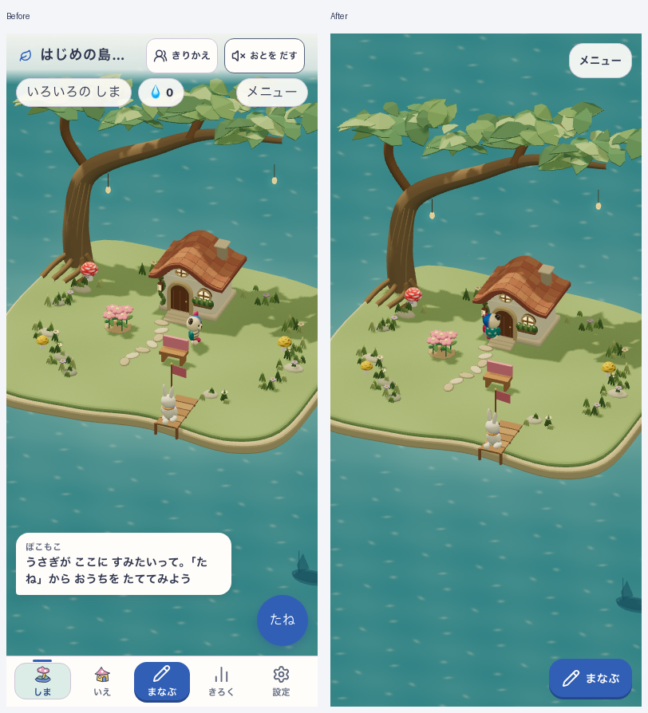
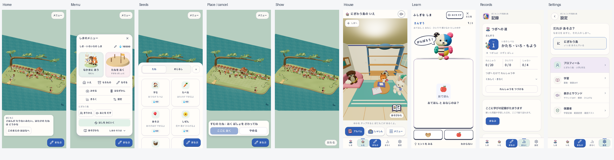

# 島ホームの常設UI整理 — 2026-10-09

通常の島ホームは「メニュー」と「まなぶ」を常設する。名前・しずく・遊ぶ人・音・記録・設定・家などはメニューから開く。何も起きていない時の吹き出しと常設の種ボタンを外し、本当に起きた案内・再訪・エラー・初回ガイドは残す。操作後の短い台詞は7秒で消える。家・記録・設定などの画面は従来の5項目ナビゲーションを使う。

正本は [表示レイアウト仕様](../../product/44_display_layout_spec.md)、[島ナビゲーション](../../product/43_island_navigation_spec.md)。親仕様01、UI指針07、Growing仕様52も同期した。保存形式・学習/SRS・3Dの絵柄・配信/PWA方式の変更は今回の範囲外。既存の未コミット作業を含む共有checkoutで、今回のUI変更以外を取り消していない。

## 実画面比較

390×844の同じstarter保存データを隔離候補へ投入して撮影。画像生成によるモックではなく実際のアプリ描画。動く住人の位相は一致しない。比較の候補は `7e9a6c7af56dd8c7e06100307b9ced9b77c3df62-snapshot-4062642065b3`、sourceHashは `4062642065b33035823031ec91076a89100a39a7504deefcdaa7aa6cc9468d07`。後続のメニュー高さと文脈別ボタン位置の調整は、別の最終productionビルドで確認した。

## 対象と検証

- 対象: ローカルSansuの `/#/island`、Growing home。通常の開発プレビューは `http://127.0.0.1:5198/#/island`。
- 最終production version: `development-local:afd56a43-2f13-4bbc-85e5-b585875218c9`、revision: `development-local`。このrevision文字列はdirty checkoutを同定しないため、診断用 `fingerprints.json` にsrc/distの各SHA-256も保存する。
- 配信: root `snap-root-v1`、Island有効/NatureTown無効、Island `mystic-island-v1`。ホーム実DOM候補 `island-quiet-home-v1`。既存world/learning lineageは `growing-island-v1` / `pokomoko-pop-live-v8`、マニフェストのIsland候補は `mystic-island-shore-garden-v18`。
- `docs:check`、current-ui-entry、lint、typecheck、build/assets合格。既存のReview By期限警告とIslandMilestone fast-refresh警告は残る。
- 全unit初回は541 files/4,779 testsのうち4,776合格、Footerの旧5項目期待3件が失敗。ホームの新仕様と既存のブロック条件に期待値を更新し、影響範囲のFooter12件とMenu5件が合格。全件を再実行したとは扱わない。
- 同じ合成fixtureでstarter/growing/crowdedを390/768幅で変更前後撮影し、restore/reloadを含む6ケース比較合格。開発版では390×844、768×1024、320×568、568×320で主要経路とタッチ領域を確認。
- productionは390×844と768×1024でホーム→メニュー→プロフィールダイアログ/Escape→記録/設定/家→種→学習→戻る→reloadを確認。学習を閉じて再開しても同じ予約IDと入力途中の値を維持。種画面の閲覧/取消で7つの学習保存領域が不変、pageerrorなし。配置取消で保存不変、show中は学習ボタンを隠して終了から復帰、きょうだい訪問では帰る操作の実hit targetと学習ボタンの非重複を両幅で確認。src/distのSHA-256は前後で一致。
- classic smokeは30合格/1失敗。旧root-tangleの台詞待ちtimeoutを変更前の隔離ツリーでも再現（4合格/1失敗）。今回の島UIとは別の既存失敗として残す。

生の証拠はignoredの `output/playwright/home-quiet-20261009-*` に保持。最終productionは `home-quiet-20261009-final-production/` のreport、visit-report、fingerprintsと画像を参照。前段のproduction/preservation-proofは前段ビルドの証拠であり、最終候補の証明には流用しない。訪問診断の初回はプロフィールmirrorを含めず投入したため相手が列挙されず失敗。getAllProfilesの正本appDataも合成データとして投入し、アプリを変えず再実行して両幅合格。初回reportも保存。個人データではなく明示した合成プロフィール/島を使用。

## 判定の範囲

- 視覚の魅力: 作者レビューで常設UIによる島の遮蔽減少を確認。利用者による魅力度の合格や、世界全体のアート評価を主張しない。
- 無説明理解/安全: NOT_EVALUATED。初回案内・保存中の停止・エラーを保持したが、子どもの実利用テストは実施していない。
- runtime: 記載したローカル経路で検証。既存smoke失敗を含む全release合格とは扱わない。SW制御を観測したが、two-build更新・実端末・翌日再訪・オフライン全経路の新規合格は含めない。

公開・デプロイ・コミットは行っていない。今回のUI仕様は44/43に集約し、運用手順・ADR・一時的な作業内容のdurable memoryへの追加は不要と判断した。
