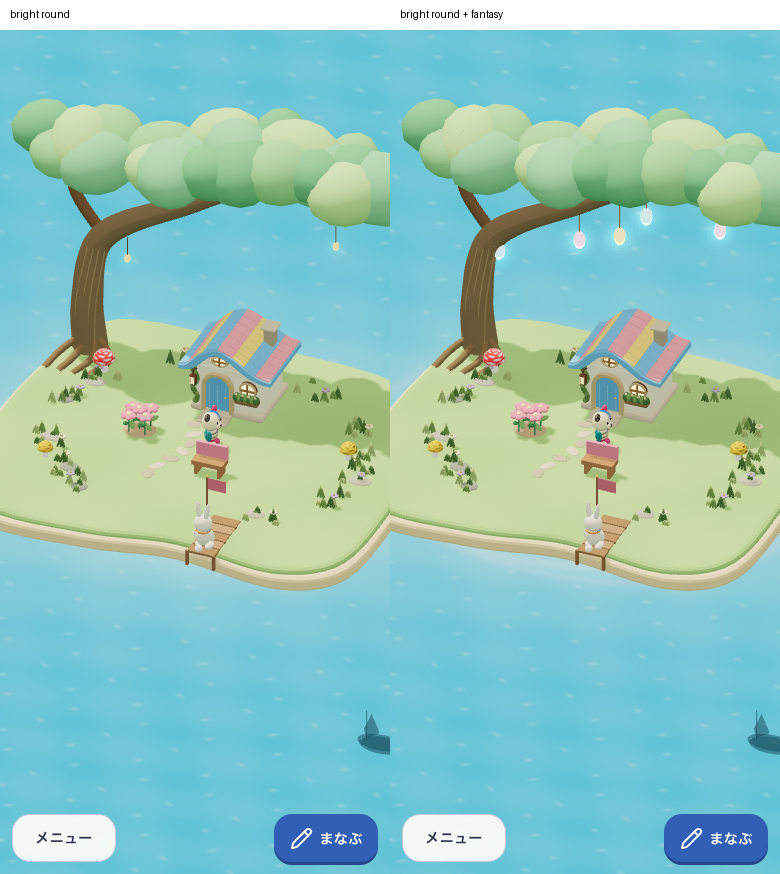
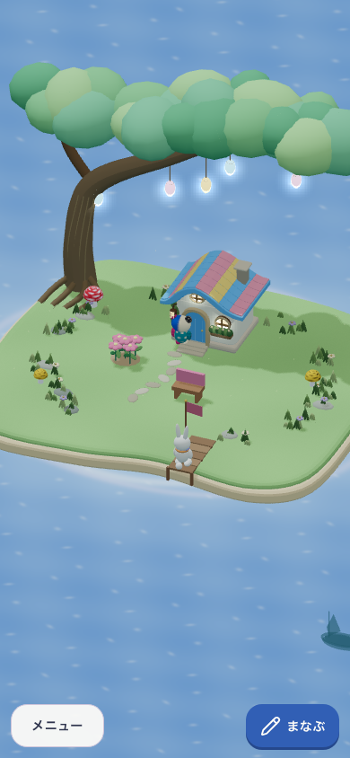
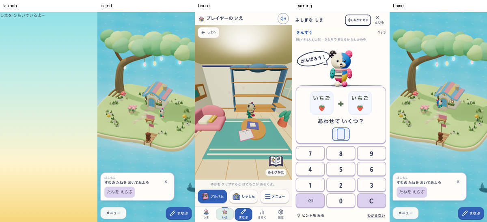
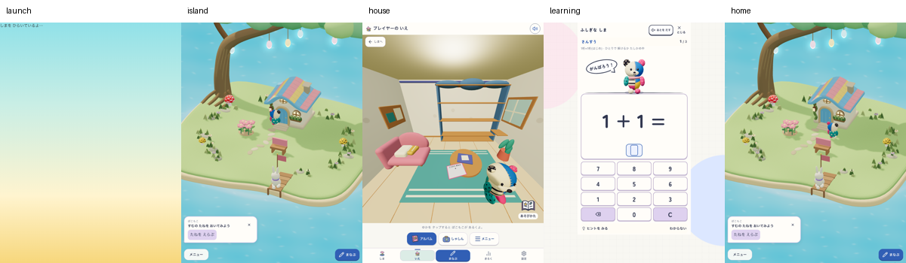

# 明るい丸い島に幻想感を加える

2026-10-10。「幻想的な感じもほしい」という指示への追加調整。[明るく丸い候補](../2026-10-10-bright-round-island/README.md)を土台に、大樹の枝から青・桃・金のしずく型の灯りを下げ、水辺へ淡い青白/藤色の光の帯を加えた。愛着・ふしぎを支え、明るい島へ戻りたくなる表現の仮説。新しい収集物や遊びの規則は追加しない。表現の正本は[美術A-03](../../product/living-fantasy/01-world-and-art.md#a-03-色と光)。

| 引き継ぐ | 加える | 加えない |
|---|---|---|
| 明るい海、丸い岸と葉、多色の屋根、元のぽこもこ | 枝から吊るす形の読める灯り、水辺の淡い光 | 暗転、全面の紫、大量の粒子、偽の収集物、住人/所有物の追加 |

## 実画面

昼は同じ合成保存3種×390/768幅で前後比較。作者確認では明るさと形を保ち、灯りの形・色・枝との接続が見える。水辺の帯は控えめであり、主な幻想感は木の灯りが担う。夜はDate.getHoursだけ20時にした描画診断で、数値時計・保存anchorを変えない。自然な夜の経過・成長の証拠ではない。

連続旅程は実初回設定・通常の実回答1件・家/学習の履歴往復・同予約復帰。旧Town DBの削除を検査するsentinelのみ明示fixture。day/nightの合成保存と実旅程を区別する。390通常motion、768 reduced motion、音off。reduced motionでは水の光の帯と環境の動きを静止。個別画像は無修整、比較は横並び、contact sheetは縮小のみ。[URL・版・delivery/flag・art候補・画像SHA](capture-evidence.json)。

## 独立した判定

- 視覚：作者レビューで明るい丸い表現を保持した追加候補と判断。利用者の最終採用は未評価。
- 子どもの理解/安全/再訪：NOT_EVALUATED。実参加者なし。
- Runtime：ローカル範囲PASS。core（544 files / 4,803 tests、docs/lint/typecheck/build/assets）、3合成保存×2幅の昼/夜の復元・再読込・所有/学習正本不変、同保存前後比較の成立条件、両幅の実初回/回答/家/学習/同予約を確認。夜と旅程のDOMで `bright-round-fantasy-v2` を厳密確認。既存Fast Refresh/chunk/PWA glob/文書期限の警告あり。

対象はlocalhostの本番形式。world候補 `growing-island-v1` を維持し、今回の美術は `data-art-candidate="bright-round-fantasy-v2"`。生ログ・固定source archive・比較の全6組は `output/round-fantasy-20261010/`。学習/保存/PWAの処理は変更しておらず、固定10問throughput・実SW更新・公開・全release・実機・利用者評価は今回未実行。作者レビューと技術PASSをそれらの代わりにしない。
