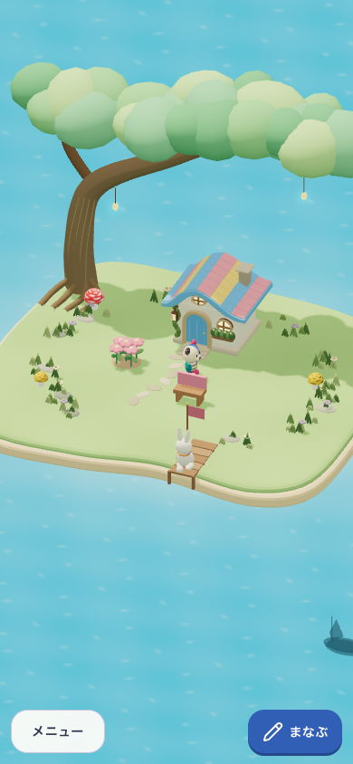
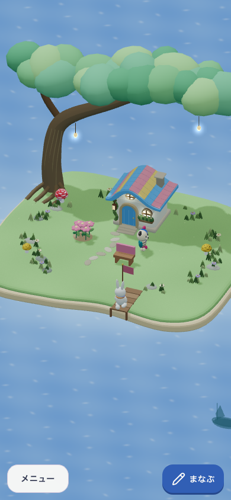
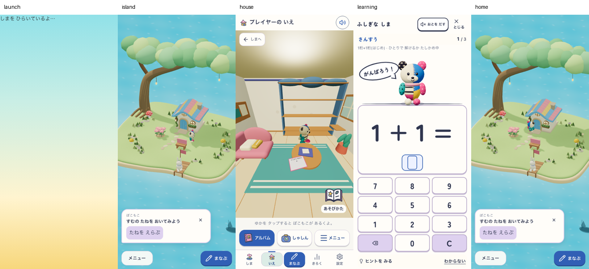
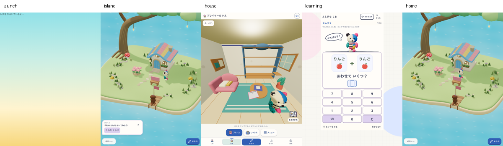

# 明るく丸い3Dの島へ戻す

2026-10-10。「しまの雰囲気暗い」「最初の明るくて丸い3Dの島がかわいかった」という利用者の指示に対応。海と空の明るさ、ふっくらした岸、丸い葉のまとまり、多色の屋根と青い扉を今のGrowing runtimeへ戻した。愛着を支え、島に戻りたくなる見た目へ近づける仮説。土地・配置・ぽこもこ・学習・保存の規則は変更しない。カメラと操作も今回の美術変更の対象外。

## 引き継ぐもの

| 初期実画面から引き継ぐ | 引き継がない |
|---|---|
| 明るい水色の海、丸い岸、青・コーラル・黄色の屋根、青い扉 | 古いUI・住人数・固定の土地上限・旧保存・旧runtime |
| 丸い立体のまとまりと、ぽこもこの元の姿 | 元の顔・頭身・布の再設計、実際にいない住人の追加 |

比較基準は [初期3D runtime](../2026-09-10-island-life/runtime-v1/phone-initial.png) と [直前のホーム](../2026-10-09-quiet-island-home/390-home.png)。保存と画角の違う歴史的画像であり、同保存の前後比較ではない。

## 現在の実画面

夜は数値の時計と保存anchorを固定し、Date.getHoursのみ20時にした描画診断。自然な夜の経過・成長や実機の測定ではない。

critical pathは実初回設定→通常の実回答1件→家/学習の履歴往復・同予約復帰の連続旅程。既存旧Town DBを削除しない検査だけ明示sentinel fixtureを用いる。day/nightは別の合成保存3種。390は通常motion、768はreduced motion。音off。個別画像は無修整、接触シートは縮小のみ。[対象URL・build/revision・flag・画像SHA](capture-evidence.json)。全対象はlocalhostの本番形式で、公開URLではない。worldは `growing-island-v1` を維持し、今回の美術はDOMの `data-art-candidate="bright-round-island-v1"` で識別する。

## 判定と検証

- 作者の視覚レビュー：昼の水色、丸い樹冠、屋根の局所色、岸の厚みを実画像で確認。夜も顔と置いた物が見える。初期方向への復帰候補として提示する。ユーザーの最終美術採用は未評価。
- 子どもの理解・安全・再訪：NOT_EVALUATED。実参加者なし。作者と自動検査で代替しない。
- Runtime：ローカル範囲PASS。`npm run verify:core`（544 files / 4,803 tests、docs/lint/typecheck/build/assets）。既存Fast Refresh・chunk/PWA glob・文書期限の警告あり。3合成保存×2幅の復元/再読込/所有・学習不変を昼と夜の各6撮影で確認。実初回・実回答・家/学習/帰島・同予約を2幅で確認。

生の証拠は `output/round-island-20261010/after`、`night`、`journey`。before撮影は候補コピー中のsource変更で失敗し、前後比較の証拠として使用しない。今回の確定後のafter撮影はコピー/開始終了SHA一致でPASS。画像だけの変更で学習/保存/PWAを変更していないため、固定10問throughput・実SW更新・全releaseは今回未実行。公開、実機、利用者の保存と魅力評価は別。
