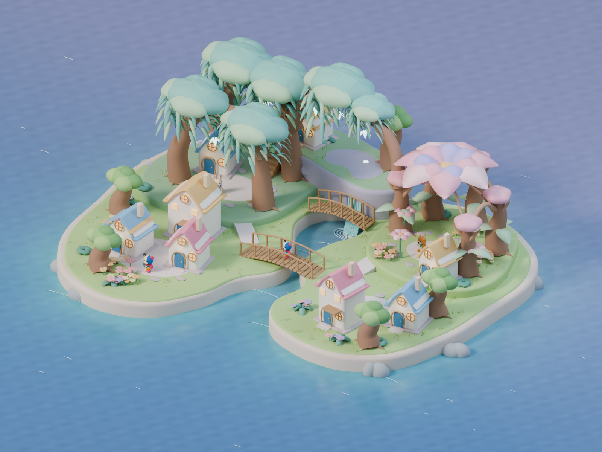

# 島全体の完成目標 — 実際の3D美術1案

2026-10-10。利用者の「実際につくる」「最終ゴールの美術3D」「例を1つ」「画像生成でうまくいかなかった」を制作契約にする。画像生成の方向案を増やす工程を終了し、実際に形・材質・光・カメラを持つ編集可能な全島3Dを1案制作する。

## native-02の制作契約

利用者「参考サイトはもっと幻想的よね」を受け、native-01は幻想性が不足して差し戻し。前版の形/素材/実画面/検査は[履歴](../native-01/STATUS.md)へ保存した。技術PASSを視覚採用へ昇格しない。

Little Habitatsの保存済み春昼・春夕・春夜・夏朝を再観察した。借りるのは曲がった岸と低い段、垂れる葉、庭の局所密度、水の明暗と反射、夕空と光源が地面/水へ届く関係。競合作品のモデルや神社は複製しない。泉/段差/滝、枝の下の庭、海の浅さと反射を同じ島の実3Dで再制作し、明るさと既存の住人を保つ。新しい形はSansu側の提案で、参考作品で観察した造形とは区別する。

## 一つの完成見本

明るい丸い島に、入り江を抱く低い地形、枝と樹冠がつながった森の庭、花木の中庭、共有の足元と広場を持つ集落、両岸を結ぶ橋と住人を一体で造形する。単品の個数ではなく全体の大形と暮らせる空間が目標。段を持つ泉から滝が入り江へ流れ、垂れる葉が森の庭を包み、隣接する花木が一つの大きな花の屋根を支える。澄んだ岸辺の色と水の反射、明るい昼/夕の光を同じ形に与える。

| 基準 | 引き継ぐ | 転用しない |
|---|---|---|
| 好みの初期島 | 明るい青い海、丸い厚み、小さな家のかわいさ | 広い四角い板と単品の散在 |
| 参考作品 | 岸・段・水辺・植物・集落が一体の場所になる | 作品固有のランドマーク/資産の複製 |
| 既存ぽこもこ | 既存のメッシュ/布atlas/顔/耳/頭身を出力して使う | 生成画像の住人を再現して別モデルにすること |
| 前回の画像 | 全島の構図と成長の問題を考える履歴 | 画像を3Dの完成証拠とすること、3方向の再生成 |

実装の分割順ではなく、全景の到達点を先に実物で揃える。現行ゲームの土地/所有/時計/学習/保存をこの制作で書き換えない。制作上の成熟例であり、自然な取得を実証する保存データではない。

## 制作方式

Blenderでネイティブな地形・枝・樹冠・家・広場・橋・花を造形し、実3DからrenderとGLBを書き出す。画像生成・有料のモデル生成を使わない。住人は既存のThree.jsモデルからメッシュと布のデータを機械的に出力し、Blenderへ取り込む。

成果物の本体は編集可能な.blendと.glb。泉/花弁の構造は造形提案であり、自然な取得や接続の条件を決めたものではない。ブラウザーの3D表示で回転・拡大と全体/近景を確認する。静止画はこの実モデルから描画した補助証拠。美術採用とゲームruntimeの合格は別。

## 完成した実物

- [全島3Dビューアー](index.html)：全景/森/集落/花の庭、昼/夕、回転、拡大縮小。ローカルの資料サーバーでは `http://127.0.0.1:8230/design/2026-10-10-island-final-3d/`。
- [編集用Blender](whole-island.blend)：7つのcollection、463本の編集可能なcurve。布atlasを内包し、別の環境へ持っていける。
- [ポータブルGLB](whole-island.glb)：2379 mesh、787,799 triangles、53 material、既存布2 textureを内包。表示側は材質でまとめて描画する。
- [実3Dの全景レンダー](whole-island-render.png)：Blender 5.2.1 LTS / Cycles、1600×1200、同じ島全体の固定camera。



静止画のキャンバスに3D風の絵を置いたものではない。岸・庭の段・樹冠・接続した枝・家・橋・花・住人は形状を持ち、回転すると側面や裏側が見える。native-02では同じ森の幹と枝の大形へ、垂れる葉と枝に咲く花を持たせた。泉の段差/草の切り欠き/水の面と落ちる滝、花木が支える共有の花弁屋根、石と植物の局所的な岸を造形した。滝の管状の初稿、池の中に残った木、森の近景に見えた海planeの端を実表示で修正した。

## 検証と次の判断

[native-check.json](native-check.json)は保存済みBlenderを実際に開き直した結果。[artifact-check.json](artifact-check.json)はGLBの構造/triangle/家/既存住人/内包textureと制作入力・成果物のSHA256。元の住人は3D source/UVを出力し、布atlasのpixelをそのままPNGへ符号化した。新しい住人画像は生成していない。

作者は実レンダーと、全景390/768/1440幅・森の近景390幅・集落と花の庭768幅を確認。44px操作、拡大/縮小、矢印キーの回転、全景への復帰、描画/consoleを確認。画面と詳細は[verification.md](verification.md)。昼/夕を同じGLBで確認し、実モデルのSHA先頭16桁を読込URLとDOMのrevisionへ固定した。利用者のbrowser zoomを維持してCSS viewportを実測。前版native-01は差し戻し履歴として別保存した。

**今回の完了は全島3D美術の実物1案。** 作者の確認を利用者の採用や子どもの独立評価へ昇格しない。自然な取得・隣接計算・配置差・成長状態列・ゲーム入力/保存/PWA・実端末性能は次の統合検証。模型の8戸は上限やレシピではない。実ゲームをこの固定配置へ置換する指示ではない。

## 続けて編集する

Blenderファイルは岸/水と橋/森/花の庭/家と広場/元の住人/カメラと光に分けた。曲線の制御点、家や葉の大きさ、素材、光と全景cameraを直接編集できる。再制作は既存の住人を維持し、全景と近景を同じモデルから照合する。

repo rootから、ネイティブな造形を再制作してrender/GLBを出力する：

```sh
/Applications/Blender.app/Contents/MacOS/Blender --background --factory-startup --python-exit-code 1 --python docs/design/2026-10-10-island-final-3d/build-scene.py
```

地形と水/葉/共有花の改訂は `fantasy-landscape.py`。制作後は `viewer.js` の `MODEL_REVISION` にGLBのSHA256先頭16桁を入れて読み込みcacheを切り替え、同じ版のcaptureとartifact-checkを更新する。

表示のsourceは `viewer.js`。Three.jsとcontrols/loaderを同梱した `viewer.bundle.js` で表示するため、通常のstatic資料サーバーでも使える。表示を変更したら次を実行する：

```sh
node_modules/.bin/esbuild docs/design/2026-10-10-island-final-3d/viewer.js --bundle --format=esm --minify --outfile=docs/design/2026-10-10-island-final-3d/viewer.bundle.js
node docs/design/2026-10-10-island-final-3d/check-artifact.mjs
```

`vite.config.mjs` はこの資料だけのdev/build用。ゲームのconfig・route・PWAを使わない。保存済みネイティブfileの読み取り検証は `--background whole-island.blend --python check-native.py` で行う。
