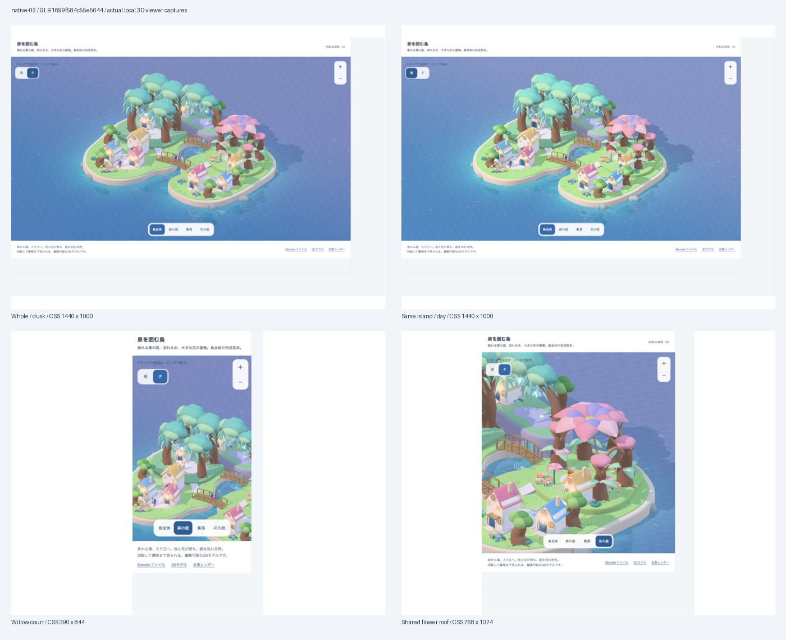

# 全島の実3D美術 native-02 — 確認記録

2026-10-10 / candidate `whole-island-native-3d-02` / GLB revision `1699f584c55e5644` / delivery `standalone-art-viewer`。実ゲームのbuild/flagsではなく、編集用の全島3Dと独立した表示。前版native-01は利用者「参考サイトはもっと幻想的よね」で差し戻し、[旧稿](../native-01/STATUS.md)へ保存した。

| 検査 | 結果 | 範囲 |
|---|---|---|
| 保存済み.blendの実再読込 | PASS | Blender 5.2.1 LTS、2395 object、7 collection、463 editable curve、8戸、packed布2 texture。泉の草capの切り欠き、滝、深さ色の水面を確認 |
| GLB構造/元住人/内包texture | PASS | glTF2、2379 mesh、787,799 triangle、53 material、内包texture2。水の頂点色、滝/共有花の屋根、元の住人を確認 |
| 住人exporterのESLint | PASS | TS exporter。元の顔/頭身/UV/布を出力しており、生成画像の住人は不使用 |
| 表示bundle / 独立Vite build | PASS | esbuild、Vite7。19.56MB GLB、654KB JS。既存Browserslist staleと500KB超chunkのwarning。ゲームのasset予算/性能合格にはしない |
| 実全景/近景の作者確認 | 確認済み | 同モデルの昼/夕、実Cycles全景とGLBを確認。管状の滝→水の面、泉に残った旧木→岸、家の接地/階段、森の近景の海plane端→画角を修正 |
| 独立ビューアーの操作 | PASS | 全景/森/集落/花、昼/夕、拡大/縮小、矢印回転、Homeで全景復帰。CSS 320/390/768/1440幅。横overflowなし、CSS 44px操作、console errorなし |
| 利用者による視覚採用 | 未承認 | native-01の技術PASSから継承しない。今回の実物から再判断する |
| 無説明理解/安全、ゲーム入力/取得/成長/保存/PWA、実端末 | NOT_EVALUATED | 独立美術模型とbrowserサイズ変更で代替しない |

資料整合の`npm run docs:check`はPASS。既存Review By警告12件は当タスク外。`git diff --check`もPASS。入力/成果物/住人sourceとcaptureのSHA256は[artifact-check.json](artifact-check.json)、保存済みnative再読込は[native-check.json](native-check.json)。

## 同じモデルの実表示

全captureの実targetは `http://127.0.0.1:8230/design/2026-10-10-island-final-3d/`。GLBのSHA256先頭16桁をasset URLとDOMのrevisionへ固定し、[viewer-check.json](viewer-check.json)に実DOM/操作とconsoleを保存した。下の数値は実測したCSS viewport。利用者の既存browser zoomを維持したため、viewport overrideの指定値とScreenshot pixelはCSS viewportと異なる。768×1024のcaptureはbackendの丸めで768×1023 pixel。

- [全景・夕1440×1000](viewer-whole-desktop.png)
- [同じ島・昼1440×1000](viewer-day-desktop.png)
- [全景390×844](viewer-whole-phone.png)
- [回転後390×844](viewer-orbit-phone.png)
- [森390×844](viewer-grove-phone.png)
- [全景768×1024](viewer-whole-tablet.png)
- [集落768×1024](viewer-village-tablet.png)
- [花の共同屋根768×1024](viewer-garden-tablet.png)
- [同版の全景/昼/近景contact sheet](viewer-contact-sheet.png)

## 独立した判断

視覚：native-01は利用者により幻想性不足と指摘された。native-02は泉/滝/垂れ葉/大きな花弁屋根/水の深さと反射を実造形し、作者が実表示で形と空間の改訂を確認した。参考の昼/夕/夜と照合したが、ベンチマークを超えたという独立判定も最終採用も未実施。BlenderとWebGLは同じ形/材質入力だが、光とtone mappingの差があり、レンダーだけを表示品質の証拠にしない。

理解/安全：模型に説明なしの独立した観察は行っていない。配置→接続→成熟→利用の因果はこの固定成熟例から証明しない。

runtime：独立したGLB表示と保存済みnativeの整合のみPASS。実ゲームの取得/保存/学習/通水/成長/更新/性能は別。787,799 trianglesと19.56MBは美術模型の規模であり、ゲームへ直接載せる予算を満たしたものではない。
