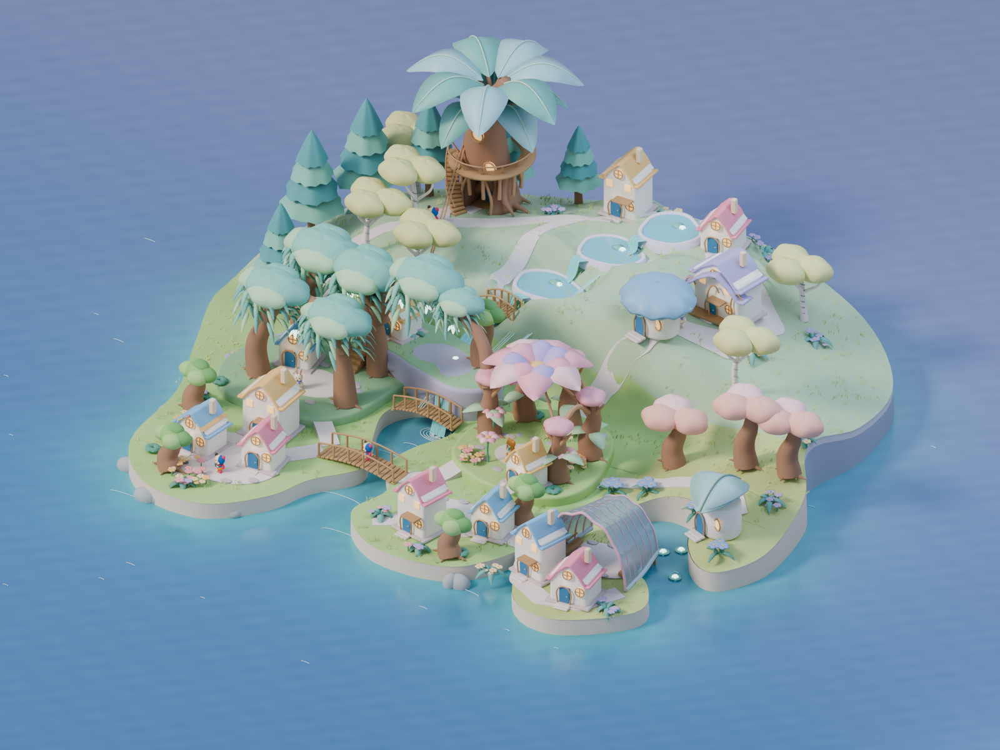

# 育った島全体の完成目標 — 実3D美術1案

**native-04の差し戻し履歴。** このREADMEと制作/表示sourceは当時のroot位置の記録であり、履歴folder単独での再制作手順ではない。検査は[STATUS](STATUS.md)と部分記録の範囲。[現在のnative-05](../../README.md)とは区別する。

2026-10-10 / candidate `whole-island-native-3d-04`。利用者の「実際につくる」「最終ゴールの美術3D」「例を1つ」を制作契約とし、島全体をBlenderで造形した。成果物は編集可能なBlender、内包texture付きGLB、同じ実モデルのレンダーと回転表示。画像生成は追加していない。

## バラエティを、空間の成り立ちから変える

native-01は幻想性不足、native-03の拡張案も「バラエティ豊かじゃない」「幻想的感がやや単調」と指摘された。面積や樹種を増やすだけでは、丸い樹冠と同型の家の繰り返しが残った。実際に提示した[旧稿](../native-03/STATUS.md)を保存し、native-04では三地区の大きな形と素材を作り替えた。

| 場所 | 実際に造形した空間 | 遠景と近景の差 |
|---|---|---|
| 森 | 幹をくり抜いた住まい、枝が支える回廊と螺旋階段、幅広い葉 | 葉の広がりと幹の空洞。中へ入る形と、回り込んだ側面が見える |
| 丘 | 地面に彫り込んだ三段の水庭、連続した水の面と滝、庭をたどる道 | 厚い段と薄い水が連続する。従来の平らな池から、起伏に沿った一つの場所へ変わる |
| 入り江 | 曲がった梁と透ける貝殻状の屋根が囲む共同の庭 | 開いた入口、透過する薄い殻、屋根の下の居場所。独立した小屋や花の屋根と違う構造 |
| 新しい家 | 丸い傘状の屋根の家、二枚の葉が包む家、従来の家と長い共同住宅 | 同じ家の色替えに加えて、幅・輪郭・屋根の成り立ちが変わる |

元の庭から、その先の森・丘・水辺へ一続きに広がる**一つの成熟例**。native-02の元の8軒は位置と寸法を維持し、既存の相棒のメッシュ/顔/頭身/UV/布atlasをそのまま使う。模型には15軒あるが、戸数・面積・配置はゲームの上限や合体レシピではない。

参照の役割と観察範囲は[美術戦略](../../../../product/island-art-strategy.md)と[32枚のショーケース](../../../2026-10-10-island-design-strategy/index.html)に残した。参考作品から借りるのは地形・水・植物・暮らせる場所の関係。空洞の大樹、水庭、貝殻の集会所はSansuの造形提案であり、競合作品のモデルや固有ランドマークは使っていない。

## 見る・編集する

- [全島3Dビューアー](index.html)：島全体/森/水の庭/入り江/花の庭、昼/夕、回転と拡大。同じ視点と世界縮尺でnative-02へ切り替えられる。
- [編集用Blender](whole-island.blend)：7 collection、編集可能な曲線と厚み、実際の空洞/水の段/殻。元の布textureを内包。
- [ポータブルGLB](whole-island.glb)：実際の3D形状と材質、水の頂点色、殻の透過材質、布2 textureを内包。
- [実3Dの全景レンダー](whole-island-render.png)：Blender 5.2.1 LTS / Cycles、1600×1200。

ローカル表示：`http://127.0.0.1:8230/design/2026-10-10-island-final-3d/`。



昼の形と素材の差を先に確認し、夕方の灯りは同じモデルへ与える。比較の前版は[保存済みnative-02](../native-02/README.md)。表示の切り替えで島を拡大縮小せず、元の家の寸法とカメラをそろえて土地の広がりを見る。両モデルの海の表示範囲は同じ外周まで続け、海planeの端が比較へ紛れないようにする。

## 検証と採用の状態

実際に残った検査は[native-check.json](native-check.json)と[viewer-04-partial.json](viewer-04-partial.json)。完全なartifact-checkや4幅の完了記録を作る前に白さへの差し戻しとなった。旧版の検査や後のnative-05の検査をnative-04の完了根拠として使わない。[差し戻し状態](STATUS.md)を正とする。

完了単位は全島3D美術1案の改訂。作者の形/接地/表示確認を、利用者の視覚採用へ昇格しない。採用は未承認。自然な取得、隣接/分離による成長、所有・歩行・学習・保存/PWA、子どもの独立した理解/安全、実端末性能は今後のゲーム統合で検証する。

## 再制作の入口

現在の再制作は `build-final-scene.py`。実際に提示した `history/native-03/whole-island.blend` を明示的な入力として開き、`varied-world.py` で三地区を造形する。入力のSHA256をmanifestへ保存する。`build-scene.py` と `fantasy-landscape.py` からは関数と材質定義だけを読み、旧全島の生成処理を実行しない。中断したnative-03の試行sourceは現在の入力モデルの再現sourceとして扱わない。

repo rootから実行：

```sh
/Applications/Blender.app/Contents/MacOS/Blender --background --factory-startup --python-exit-code 1 --python docs/design/2026-10-10-island-final-3d/build-final-scene.py
```

制作後は `viewer.js` の `MODEL_REVISION` にGLBのSHA256先頭16桁を入れ、表示bundleと実captureを同じ版へ更新する。

```sh
node_modules/.bin/esbuild docs/design/2026-10-10-island-final-3d/viewer.js --bundle --format=esm --minify --outfile=docs/design/2026-10-10-island-final-3d/viewer.bundle.js
/Applications/Blender.app/Contents/MacOS/Blender --background docs/design/2026-10-10-island-final-3d/whole-island.blend --python-exit-code 1 --python docs/design/2026-10-10-island-final-3d/check-native.py
node docs/design/2026-10-10-island-final-3d/check-artifact.mjs
```

通常の資料サーバーで表示できる。`vite.config.mjs` はこの独立資料のdev/build用。実ゲームのroute・PWA・asset予算・配信flagを使ったリリースではない。
