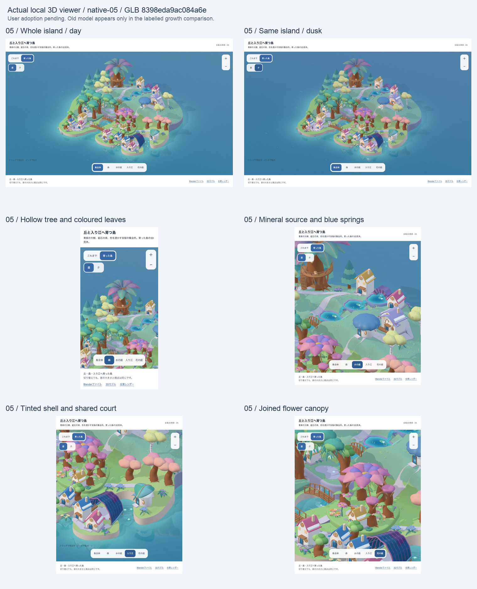
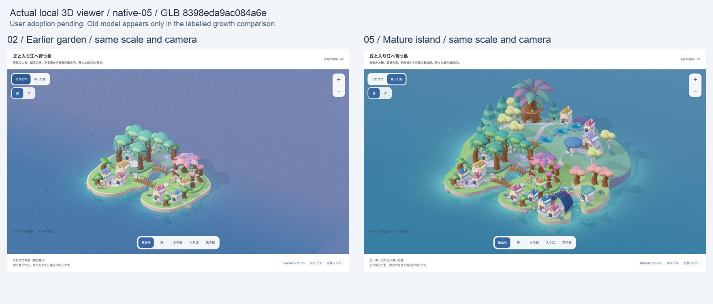

# 全島の実3D美術 native-05 — 確認記録

2026-10-10 / candidate `whole-island-native-3d-05` / GLB revision `8398eda9ac084a6e` / delivery `standalone-art-viewer`。

実targetは `http://127.0.0.1:8230/design/2026-10-10-island-final-3d/`。編集用Blender、GLB、実Cyclesレンダーと独立した表示の検査である。実ゲームのbuild/配信flagを使用していない。作業ツリーのGit HEADと入力/成果物/住人sourceのSHA256は[artifact-check.json](artifact-check.json)へ記録した。

native-03の「バラエティ/幻想性が単調」に対して、native-04で空洞の大樹、段水庭、透ける殻へ構造を変更した。さらに「幻想的が白いだけにみえる」で[実際の白い前版](history/native-04/STATUS.md)を差し戻し。native-05は葉と泉の色、鉱石の水源、色を透かす屋根を実モデルに持たせ、昼の照明でも色を残す。旧版の技術PASSやcaptureを今回の採用根拠へ引き継がない。

| 検査 | 結果 | 実際に確認した範囲 |
|---|---|---|
| 保存済み.blendの再読込 | PASS | Blender 5.2.1 LTS。3,716 object、752 editable curve、7 collection、15軒、packed布2 texture。大樹の入口は幹の実空洞へ通り、3段の水面の下へ地面が下がっている |
| 色/素材と実構造 | PASS | 葉12枚と3つの段泉の頂点色、鉱石の水源、連続した水の面、殻のtransmission 0.72。terrain 45,097 vertices、実高0.789〜5.735。面積比2.76は成熟例の比較値 |
| GLBと元の家/住人 | PASS | 3,690 mesh、1,396,299 triangle、80 material、内包texture2。元の8軒と住人221部品の変換/頂点位置を照合。住人58部品のUVと布画像の内包bytesは完全一致 |
| 表示bundle / 独立Vite build | PASS | esbuildとVite7。GLB 34.93MB、build JS 657.85KB。現行/比較用の両モデルとnative/renderのassetを出力。既存Browserslist stale/500KB超chunkのwarningはゲーム性能の合格へ転用しない |
| 独立表示の操作/サイズ | PASS | 全景/森/水の庭/入り江/花の庭、昼/夕、拡大/縮小、矢印回転、Home、前版切替。4 viewportで横overflowなし、44px以上の操作。console errorなし |
| 同じ縮尺の成長比較 | PASS | native-02と05でcamera位置/target/zoom/frustumが一致。島の切替にscale変更なし。元の8軒の位置/形もGLBで一致 |
| 利用者の美術方向への評価 | 採用 | 後続の「いい感じ。これをもとに…仕組みに落として」を受け、native-05を美術方向に採用。[判断の記録](art-decision.json)。作者の確認や先行の検査JSONを利用者評価の代わりにしない |
| 無説明理解/安全、実ゲーム/実端末 | NOT_EVALUATED | 取得/接続/分離/成長/所有/歩行/学習/保存/PWAと実機の確認は、この固定した独立美術模型で代替しない |

家の生成された未使用UVにはBlenderの再exportで最大 `5.96e-8` のFloat32丸め差がある。textureを使わない29部品で確認し、許容 `1e-7` とした。**家/住人の頂点位置、住人UV、布画像はこの許容を使わず完全一致を検査**した。最初の一律bytes比較の失敗と、その原因を区別する。

資料整合の`npm run docs:check`と`git diff --check`はPASS。履歴へ移したREADMEの相対リンクを修正した。既存Review By警告12件は残る。保存済みnativeの構造は[native-check.json](native-check.json)、実DOMと操作は[viewer-check.json](viewer-check.json)、GLB/入力/出力の整合は[artifact-check.json](artifact-check.json)に記録した。

## 同じnative-05の実表示

以下は全て同じGLB revisionのbrowser capture。最小サイズはviewport指定320×568、縦scrollbarを除く実layout幅305px。その他は実CSS幅390/768/1440。viewportの変更は実端末検証ではない。最終表示前にoverrideを解除した。

- [全景・昼1440×1000](viewer-day-desktop.png)
- [同じ島・夕1440×1000](viewer-whole-desktop.png)
- [全景390×844](viewer-whole-phone.png) · [回転後](viewer-orbit-phone.png) · [森](viewer-grove-phone.png)
- [全景768×1024](viewer-whole-tablet.png) · [水の庭](viewer-village-tablet.png) · [入り江](viewer-harbor-tablet.png) · [花の庭](viewer-garden-tablet.png)
- [最小viewport320×568](viewer-whole-small.png) · [override解除後の最終表示](viewer-final.png)

## 同じ視点と世界縮尺の成長比較

ここだけ左はnative-02の実物、右はnative-05。前版のcaptureは現在の表示から同じcameraで撮り直している。新しい島の検証枚数や同版contact sheetへ混ぜない。

## 独立した判断

視覚：白いパステルへの差し戻しを記録し、昼の実画面で青紫の葉/琥珀色の幹、深い青の段泉、色を透かす殻を作者が確認した。BlenderとWebGLは同じ形/材質入力でも光とtone mappingが異なる。実レンダーだけをGLBの表示品質の証拠にしない。利用者の最終採用は未承認。

理解/安全：この成熟例に対し、子どもの説明なしの独立した観察は行っていない。空洞/水の段/共有の屋根を造形した事実から、配置→接続→成熟→利用の因果が理解できると結論しない。

runtime：保存済みnative/GLBと独立したbrowser表示の整合のみPASS。実ゲームの取得/保存/学習/通水/成長/更新/性能は別。34.93MB・約140万triangleは美術制作の規模であり、ゲームへ直接載せる予算を満たしたものではない。
