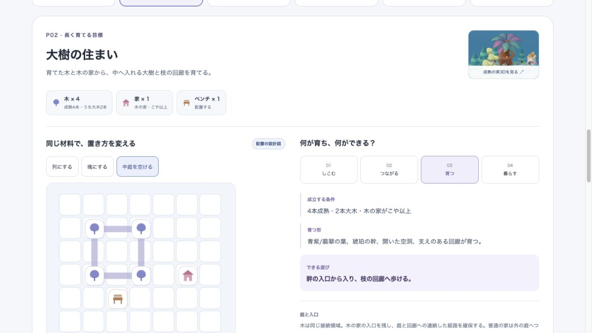

# この島を、どう育てるか — 目標と組み合わせの設計

2026-10-10 / `place-goals-design-v1` / delivery `standalone-design-showcase`。

利用者「いい感じ。これをもとに、目標や組み合わせとか。ゴール戦略や仕組みに落として」を受け、採用した[全島実3D native-05](../2026-10-10-island-final-3d/README.md)を到達方向に、6目標・同じ材料の15配置・4つの場所の関係・実装D1〜D4へ具体化した。

- [操作できるショーケース](index.html)：全島の場所から目標へ、配置の切替、4成長段階、次の場所、4つの組み合わせと実装順。
- [規則の意味と実装契約](../../product/island-place-goals.md)：任意目標、接続/形、既存時計、合流/分離、所有、空間/行動、保存/更新の境界。
- [初期値と配置の正本](../../product/island-place-goals.json)：個数は最小条件の試作初期値。購入レシピや最大所有数ではない。
- [美術方向の判断](../2026-10-10-island-final-3d/art-decision.json)：利用者の指示を根拠にする。先行の技術検査とは別。

ローカル表示：`http://127.0.0.1:8230/design/2026-10-10-island-place-goals/`。docsをrootにした通常の静的HTTPサーバーで動く。HTML/JS/CSSとJSONだけで、アプリのroute、状態、DB、学習、配信flagには触れない。操作中の選択はページ内だけに保つ。

## 読み方

完成3Dは**一つの成熟例**。そこから木陰/大樹/泉/入り江/花/全島の任意目標を選ぶ。同じ目標内の配置例は同じ種類と個数を保つ。列、塊、空けた庭、水の曲げ方で、到達する場所と使い方が変わる。図は配置の設計図であり、その全パターンを実3Dで作った記録ではない。段泉は実際の高さ/下降する通水が条件で、平地には曲がる青い水庭を作る。

「しこむ→つながる→育つ→暮らす」は、予告する形、成立する条件、実際の利用を比較する説明。成長前/途中のゲームcaptureではない。成熟実3Dの画像はnative-05の保存済み実レンダー/実表示を直接参照し、新しい生成画像へ置き換えていない。

2026-10-10にD1〜D4を本体へ統合した。以下は設計時点の制作順と検査であり、実装の最新証拠は本体v1の記録へ分ける。設計順はD1のP01から。先に自分の品の実取得、接続、成熟、席の利用、分離を一周させ、所有/年齢を保持する。D2は大樹/花の実空間、D3は水/地形/入り江、D4は場所の関係と全島の通常取得/保存/更新へ進む。固定模型や説明図の検査を、その自然な一周の合格へ置き換えない。

## 資料の検証

[検証全体の記録](verification.json)。文書検査・構文・空白・カタログ・実操作がPASS。既存タスクのReview By警告12件は残る。

- [カタログ検証](catalog-check.json)：26項目。6/15/4/4、実在する既存品種、配置重複/範囲、同じ入力、木/花の接続、水の辺接続/影響、空いた中庭、参照画像、実GLB版、利用者判断との一致。
- [ブラウザー操作の検証](viewer-check.json)：全15配置・24成長状態、島の場所と次の目標、Enter操作、4 viewportで横overflowなし/全button 44px以上、画像読込、console errorなし。静的ソースとJSONのSHA256を記録。
- [実画面](showcase-desktop.png) · [tablet](showcase-tablet.png) · [phone](showcase-phone.png) · [最小幅](showcase-small.png) · [override解除後](showcase-final.png)。
- 共通文書検査は `npm run docs:check`。ここにあるcapture/verificationは本体統合前の資料検査。現在のJSONは本体へ統合した規則であり、P01のくぼみ配置とstatusが更新されている。資料の旧SHAを現行本体の証拠に流用しない。

再検査：

```sh
node --check docs/design/2026-10-10-island-place-goals/main.js
node docs/design/2026-10-10-island-place-goals/check-design.mjs
npm run docs:check
```

check-designは資料の整合検査で、productionのderivePlacesの実装/テストではない。ブラウザーcapture後に資料のソースやJSONを変更したら、対象の操作とcaptureを取り直す。全島3D自体の検査は[既存の記録](../2026-10-10-island-final-3d/verification.md)を参照。



