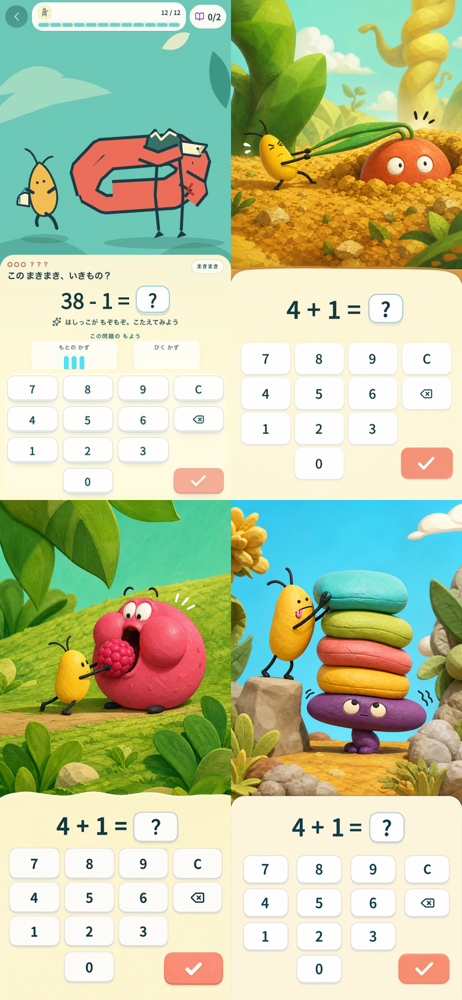

# Sansu three-question cold-open benchmark

- Date: 2026-07-20
- Scope: the first three-question encounter, from a ready math problem through the third-answer payoff
- Target: rapid arithmetic with zero extra taps, an immediately readable physical gag, a pop discovery peak, and a safe reason to replay
- Evidence: current Sansu at 390x844 captured in this audit; three static generated concepts; official product pages for comparator games

## Scoring model

Each lens is worth 10 points. The total is 100 points.

1. One-second comprehension
2. Answer/input tempo
3. Input-to-world causality
4. Physical comedy and surprise
5. Pop visual appeal
6. Desire to see the next beat
7. Replayability
8. Content scalability
9. Child safety
10. Learning integration

The first six lenses form the 60-point moment-to-moment score. Replayability and scalability form the 20-point longevity score. Safety and learning form the 20-point product-fit score.

This is a design inference, not an objective review score. External games are desk-scored from official materials and have an estimated margin of +/-2 points. The three generated Sansu directions are single static frames, so tempo, motion, payoff, and replay scores remain provisional and have an estimated margin of +/-4 points.

## Current Sansu and candidate concepts

Reading order: current Makimodon, Root Pull, Berry Round, Cushion Stack.

| Direction | 1 sec | Tempo | Cause | Gag | Pop | Next | Replay | Scale | Safe | Learn | Total |
|---|---:|---:|---:|---:|---:|---:|---:|---:|---:|---:|---:|
| Current Makimodon | 2 | 8 | 4 | 4 | 4 | 3 | 3 | 5 | 9 | 8 | **50** |
| Root Pull | 8 | 5 | 6 | 7 | 8 | 8 | 5 | 8 | 8 | 7 | **70** |
| Berry Round | 9 | 5 | 6 | 6 | 9 | 7 | 4 | 7 | 6 | 4 | **63** |
| Cushion Stack | 8 | 5 | 6 | 5 | 8 | 5 | 4 | 6 | 9 | 3 | **59** |

### Step health

1. **Current Makimodon — NG.** The answer shelf is usable and fast, but the creature's rule cannot be read without labels. Its body changes roles from coil to trap to path to vehicle.
2. **Root Pull — Attention.** The contact chain and anticipation are readable. It is the only concept worth taking to motion validation, but its three states, safe consent cue, 650 ms handoff, and repeat variations are not yet proven.
3. **Berry Round — NG.** Feeding is instantly readable and visually pop, but the frame looks like forced feeding and the berry can be mistaken for a quantity hint.
4. **Cushion Stack — NG.** The action is safe and readable, but the five cushions reveal the answer to `4 + 1`, and the collapse is predictable before play.

## External benchmarks

Scores measure fit to Sansu's target, not the general quality of each game.

| Game | 1 sec | Tempo | Cause | Gag | Pop | Next | Replay | Scale | Safe | Learn | Total |
|---|---:|---:|---:|---:|---:|---:|---:|---:|---:|---:|---:|
| [WarioWare: Move It!](https://www.nintendo.com/jp/switch/a9qea/index.html) | 9 | 10 | 10 | 10 | 8 | 10 | 9 | 10 | 8 | 9 | **93** |
| [Super Mario Bros. Wonder](https://www.nintendo.com/jp/switch/aqmxa/index.html) | 9 | 9 | 10 | 10 | 10 | 10 | 9 | 10 | 9 | 6 | **92** |
| [Yoshi and the Mysterious Book](https://www.nintendo.com/jp/games/switch2/aakga/discover/index.html) | 8 | 7 | 10 | 9 | 10 | 10 | 8 | 10 | 10 | 8 | **90** |
| [New Pokemon Snap](https://www.pokemon.co.jp/ex/newpokemonsnap/howtoplay/) | 8 | 7 | 8 | 8 | 10 | 10 | 10 | 9 | 10 | 8 | **88** |
| [DragonBox Numbers](https://dragonbox.com/products/numbers) | 9 | 9 | 10 | 5 | 8 | 6 | 8 | 7 | 8 | 10 | **80** |
| [Todo Math](https://todomath.com/) | 8 | 8 | 7 | 3 | 7 | 7 | 10 | 10 | 9 | 10 | **79** |
| [MathTango](https://www.originatorkids.com/mathtango/) | 7 | 7 | 6 | 5 | 8 | 9 | 9 | 9 | 8 | 9 | **77** |
| [The Typing of the Dead: Overkill](https://store.steampowered.com/app/246580/The_Typing_of_The_Dead_Overkill/) | 8 | 10 | 10 | 8 | 5 | 9 | 9 | 8 | 1 | 9 | **77** |
| [Prodigy Math](https://www.prodigygame.com/main-en/prodigy-math) | 6 | 4 | 5 | 4 | 8 | 10 | 9 | 10 | 9 | 8 | **73** |

## What each benchmark should teach Sansu

| Need | Benchmark | Transferable rule |
|---|---|---|
| Five-second rhythm | WarioWare / Typing of the Dead | Keep input fixed and immediately convert it into a large visible result; do not add a continue tap. |
| Third-beat escalation | Mario Wonder | A small trigger should change more of the world than expected. |
| Creature acting | Yoshi | Use one familiar action and one bodily fact; the name and lore come after the laugh. |
| Revisit and collection | New Pokemon Snap | Preserve rare behaviors and make returning reveal a different state, not only another badge. |
| Math-world unity | DragonBox Numbers | The learning action itself should manipulate the world rather than refill a generic reward meter. |
| Curriculum breadth and accessibility | Todo Math | Scale content and independent use without making the play surface dense. |
| Long-term world | MathTango / Prodigy | Let short sessions accumulate into places and collections, but avoid battle and reward steps between question and reaction. |

## Decision gate

A Sansu cold open should not enter implementation until it reaches:

- at least **86/100** overall;
- at least **52/60** on the first six moment-to-moment lenses;
- no lens below **8/10**;
- a silent, textless test in which at least 4 of 5 viewers describe the same action and payoff;
- the next problem accepting input within 650 ms after answers one and two;
- no visible object count or scale that leaks the arithmetic answer.

Root Pull is the only direction that should proceed, but it is not approved yet. Its next validation artifact must show `ready -> small pull -> bigger pull -> comic release` with the same camera, one physical rule, and a different small laugh in each correct-answer state.

## Accessibility and evidence limits

- Current Sansu has large tap targets and non-color status text, but the screenshot alone cannot prove keyboard focus, screen-reader order, input locking, sound-off behavior, or reduced-motion equivalence.
- The current two-digit question adds a dense representation hint under the equation; that may compete with the rapid loop and needs timed child testing.
- Generated concepts do not yet contain production DOM, focus states, ARIA labels, motion, error recovery, or reduced-motion states.
- External products were not played in this audit. Their timing, failure feel, and accessibility scores are reasoned estimates from official descriptions and screenshots.
