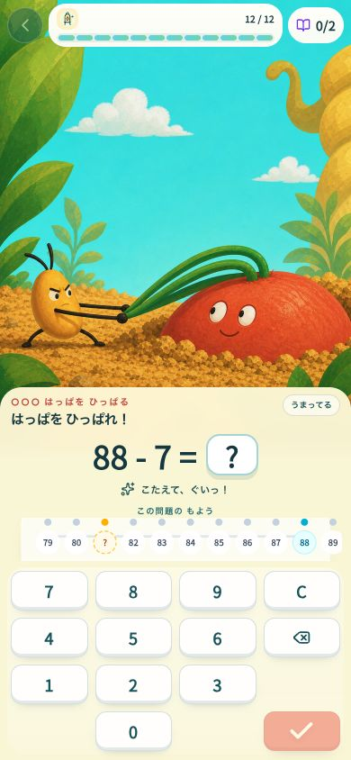
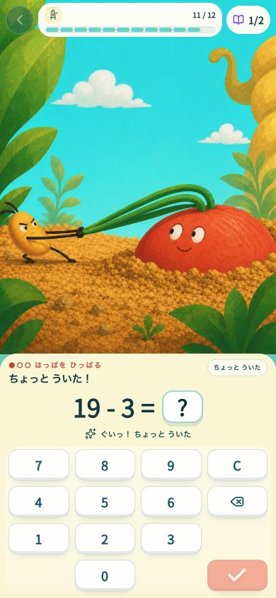
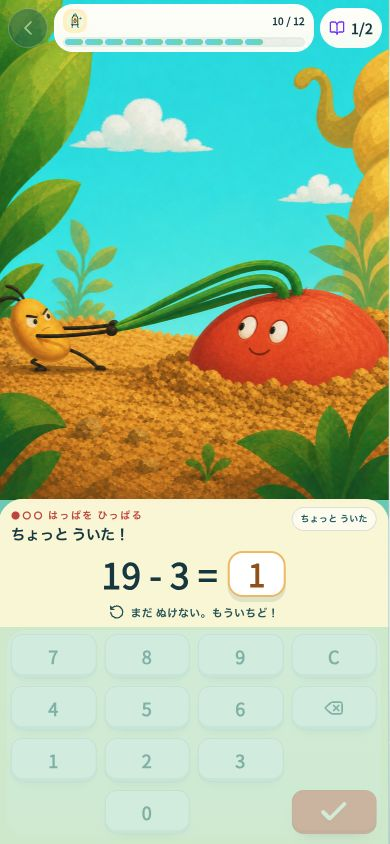
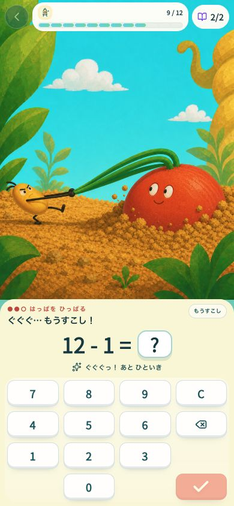
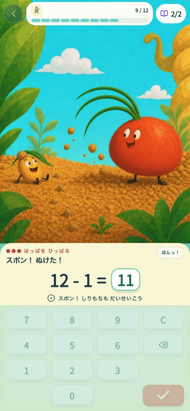
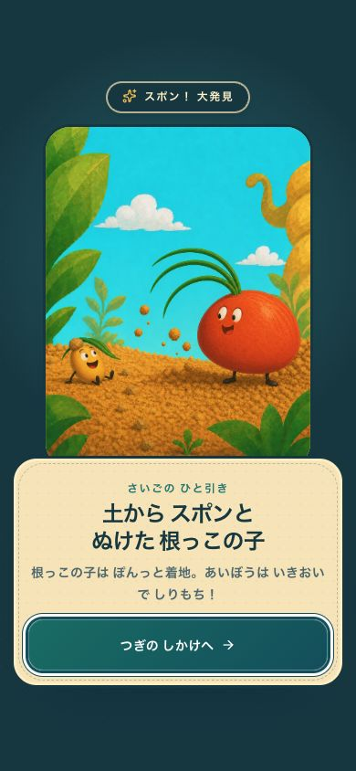
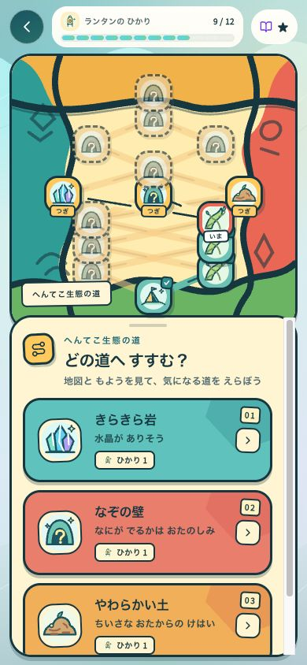
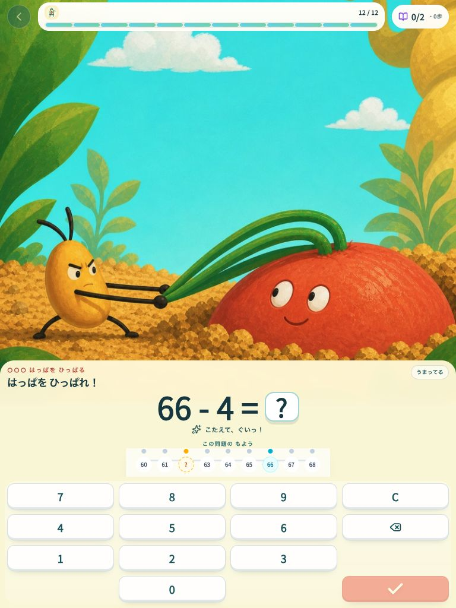

# Root Pull value loop 01

- Date: 2026-07-21
- Candidate: `opening-root-pull-v1`
- Scope: 390×844 three-question opening, incorrect retry, third-answer payoff, discovery handoff, next route, and 768×1024 composition
- Result: **self-review gate PASS / production gate HOLD**
- Runtime: local development defaults to this candidate; production continues to fall back to `classic-v1`

The candidate now expresses one rule without a new interaction: solve a problem, the companion pulls the same leaves, the buried creature rises, and the third answer releases both characters into a safe physical-comedy payoff.

## Current-run evidence

| Step | Evidence | Health | Finding |
|---|---|---|---|
| 1. Ready |  | PASS | Actor left, subject right, shared leaves, and the math shelf are readable in one frame. |
| 2. First pull |  | PASS | Correct input changes the world without a continue tap or a new control. |
| 3. Incorrect retry |  | PASS | The physical stage stays committed; the answer shelf explains retry without blame. |
| 4. Bigger pull |  | PASS | The same camera and action escalate; one lifted foot adds anticipation. |
| 5. Comic release |  | PASS | Tiny feet, the seated companion, dirt hat, and leaf umbrella form a specific safe gag. |
| 6. Discovery |  | PASS after fix | The first run exposed an old Makimodon dialog. It now stays in the Root Pull world and uses the same payoff art. |
| 7. Next loop |  | PASS | The discovery closes directly into the authored map; no legacy creature copy remains. |
| 8. Tablet |  | PASS after fix | The first 768×1024 pass hid both actors behind the answer shelf. A width-specific crop now keeps faces and pull axis visible. |

The rejected tablet capture is preserved as [09-tablet-ready.png](./09-tablet-ready.png). The legacy-mix defect is preserved as [06-after-payoff.png](./06-after-payoff.png).

## Ten-axis score

| Lens | Before wiring | Loop 01 | Reason |
|---|---:|---:|---|
| One-second comprehension | 8 | **9** | One actor, one subject, one shared leaf action, fixed left/right anchors. |
| Answer/input tempo | 5 | **9** | Existing keypad remains fixed; no between-answer action is introduced. |
| Input-to-world causality | 6 | **9** | Every committed correct answer selects the next authored physical state. |
| Physical comedy and surprise | 7 | **9** | The third answer reveals feet and returns the pulling force as a safe seated gag. |
| Pop visual appeal | 8 | **8** | Limited turquoise/ochre/coral palette and large silhouettes work; final authored character cleanup is still needed. |
| Desire to see the next beat | 8 | **8** | Three visible marks and increasing tension promise a payoff without explaining it. |
| Replayability | 5 | **8** | Problems and routes vary while the opening stays fast; the physical gag still has only one authored variant. |
| Content scalability | 8 | **9** | Typed presentation boundary, four-state mapping, and legacy-ID adapter isolate art from learning state. |
| Child safety | 8 | **9** | The subject participates, nobody is hurt, incorrect answers do not reverse or shame the child. |
| Learning integration | 7 | **9** | Real planner, keypad, attempt writer, receipt, energy, and SRS flow remain unchanged. |
| **Total** | **70** | **87 / 100** | First six: **52 / 60**; no lens below 8. |

This passes the internal scoring threshold. It does **not** yet satisfy the production threshold because the silent 4-of-5 child/adult test and multi-trial P95 timing sample have not been run.

## Timing and invariants

- Browser click round-trip samples: correct `284–285 ms`; incorrect `283 ms`.
- Configured holds: ordinary correct `180 ms`; third-answer payoff `840 ms`; incorrect retry `550 ms`.
- The browser samples confirm the intended order and feel but are not a statistically valid P95.
- Answer leak: none in the four raster plates. They contain no text, numbers, equations, progress marks, or quantity encoding.
- Persistence: both presentations reuse the same legacy progress matching only at the adapter boundary. Planner, problem values, assignment, SRS, receipt, and reducer were not replaced.
- Rollback: `VITE_EXPLORE_EXPERIENCE=classic-v1` restores the prior presentation; production remains classic by default.

## Defects found by the loop

1. **Critical — mixed payoff world.** Root Pull ended in a Makimodon research dialog. Fixed with a display-only Root Pull discovery reveal while retaining the persisted discovery IDs.
2. **High — tablet subject crop.** At 768×1024 the 4:5 plate scaled almost full-height and both actors fell behind the answer shelf. Fixed by cropping quiet sky at the wider breakpoint.
3. **Medium — asset delivery.** Four local images were absent from PWA precache. Fixed with a narrow Root Pull production-asset glob; total precache remains under budget.

## Remaining limits and next loop

- Run a silent, textless test with at least five people; four must independently describe “pulling the leaves, the root comes out, the companion falls safely.”
- Collect repeated correct-next-input and incorrect-retry samples and report P50/P95, not a single browser round trip.
- Compare a fixed ten-question set with the prior fast Study loop for answers per minute and interruption count.
- Test 200% text, keyboard-only, sound off, reduced motion, and offline install manually.
- Before production art approval, create a small canonical character model sheet and at least two payoff variations. The current generated texture is cohesive enough for value validation but not a claim of final hand-authored finish.
- Decide whether the entrance Root Pull should occur before route choice or be tied to a root-labelled route; the validation build currently treats it as the shared opening gate after the first route choice.
