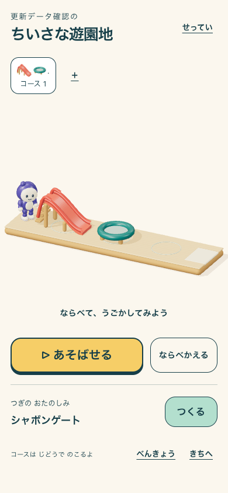
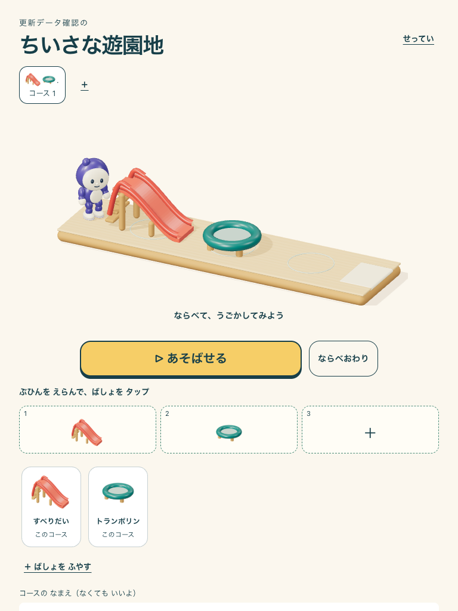

# Three.js遊園地の本番公開とPWA更新

2026-09-06の追加ユーザー依頼により公開した。美術・実機・子ども観察の未確認事項を報告した後の明示的な公開依頼であり、それらのゲートを合格へ変更するものではない。

## 公開実績

- 実アプリ: https://sansu-seven.vercel.app/#/park
- Production immutable URL: https://sansu-qv5end829-yutogasakis-projects.vercel.app
- GitHub main / source revision: `f70d96797f63ff4f8a4ce78c1ea1c9e540529d78`
- PWA version: `f70d96797f63ff4f8a4ce78c1ea1c9e540529d78:9377751a-b5f6-4ebe-acfc-1e92a84a3df0`
- Vercel deployment: `6mt8RQpWLFsGB6QWvpkWUJqQ6Bbq`、Production / READY（GitHub deployment 6289370796、2026-09-06 05:05:33 UTC success）。Framework: Vite / React。
- `VITE_BUILD_PLAY_ENABLED=true` / `VITE_PARK_RENDERER=three`。実stage `park-three-resin-v1`、delivery `build-play-v1`。version manifestの探索メタデータは引き続き `snap-root-v1`、遊園地有効化は `park` フィールドで確認する。
- [GitHub Verify Core](https://github.com/yutogasaki/sansu/actions/runs/34013083723) / [Docs Check](https://github.com/yutogasaki/sansu/actions/runs/34013083621): success。

Vercel CLI認証が無効、connector team一覧も空だったため、既存のGitHub main→Vercel連携を使用。今回の実行で別プロジェクトや別ドメインは作成していない。公開に必要な3D実装、旧表示fallback、静止アイコン、検証ツール、仕様をcommitした。先行作業のBlender原本・元資料・旧監査・完了記録など未コミットのファイルは保持した。

## PWAの変更

既存の60秒以下の定期確認、起動・復帰・focus・online・pageshow・SPA遷移での確認、skipWaiting、no-store headers、安全なcheckpointとcritical persistence保護を再利用。更新versionをGit revisionから分離し、buildごとにUUIDを含む識別子を生成する。同じコミットで設定を変えて再ビルドした場合も旧版として検知できる。manifestと埋め込み版は同じ値。

IndexedDB、localStorage、学習記録や作品を削除して強制更新する実装は追加していない。オンラインで表示している端末は自動更新し、入力中・保存中は安全な区切りまで待つ。OS停止・電源OFF・offline中の端末は、次のオンライン起動・復帰が確認機会となる。

## 検証

- `npm run verify:release`: PASS。docs/lint/typecheck、104ファイル・1,106テスト、build/assets、smoke 31、PWA 4。
- 公開flagを有効にしたbuildと `e2e:park-pwa` 3件、Three.js offline（47素材・chunk・再演・学習）PASS。
- 実際の二つのローカルbuildで同じrevision・異なるversion、manifestとJS埋め込みの一致を確認。[real-build-identity.json](real-build-identity.json)。
- 本番旧版 `4102126` を実SW制御下の独立した2つのChromium contextへ読み込み、offlineで保持してから公開。新版を確認後onlineへ戻した。Service Workerの差し替えやversion応答をmockしていない。
- 安全な設定画面では19,813msで新しいbundleへ自動切替、reload 1回。profile/appData/logs/parks/parkPlans/exploreRunsの値とlocalStorageテスト値を維持し、遷移先 `#/settings` を保持。
- 操作中のonboardingフォームでは旧bundleと入力文字を保持。フォームを完了した安全なcheckpointでreload 1回となり、入力した名前を新しいprofileに保存。
- 更新後の本番 `/#/park` で実Three.js stageとrevisionを確認。初期所有は2部品。再演、無料再演による学習ログ非更新、768幅での配置表示を確認。
- [report.json](report.json) `pass=true`、観測したブラウザpageerror 0件。[headers.json](headers.json): app shell / SW / version / manifestのno-store、3Dアイコンと6位置fallbackの配信を確認。

ブラウザはChromium 145.0.7632.6、Mac / Metal、390×844と768×1024。実機iOS/Androidのインストール済みPWA検証ではない。Vercelアカウント全体のruntime log scanと継続監視は実施していない。

## 実際の本番画面

rollbackは [PWA runbook](../../../runbooks/pwa-release.md) に従い、renderer flagをlegacyへ変更して再配信する。保存データは維持する。
