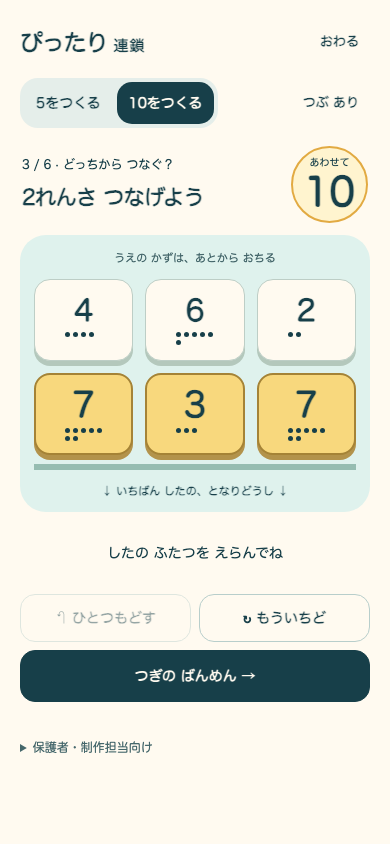
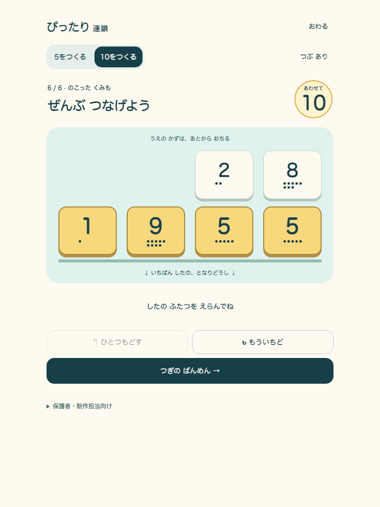

# ぴったり連鎖 — 新規12盤面のローカル受入

日付: 2026-09-06。仕様: [27](../../../product/27_gameplay_first_pittari_spec.md)。元試作の再現ではなく、新作 `pittari-positive-v1`。

## 実行対象

- DEV: `http://127.0.0.1:5197/prototypes/pittari/`（Vite、既存Reactアプリと別エントリ）。DEVのDOM build revisionは `development-local`。
- 配布ファイル: `output/pittari/pittari_chain.html`。ファイルURLで直接起動して操作・再読込を確認。約20KB、外部HTTP通信0件。
- 配布版: `aa36ada-pittari-ecbac36ee395`。先頭はbase commit、後半は試作ソースのSHA-256由来。既存の未コミット変更を含む作業ツリー上で生成したため、HEADだけを完成版と扱わない。
- delivery: `standalone-prototype`。本体の公開flag・起動先は変更なし。本体production bundle・PWAにはこの候補を追加していない。
- [build metadata](build.json)、[全到達状態とブラウザ結果](report.json)、[追加の操作検査](supplementary-checks.json)。通常ブラウザの新規contextを使い、Service Worker未登録・新規保存から確認した。

## 検証結果

- `npm run verify:core`: PASS。docs / lint / typecheck、105ファイル・1,124テスト、本体build / asset budget。
- 試作domain: 18テストPASS。全12面に解があり、全到達状態で競合自動連鎖なし。合法な手動候補が5の2種・10の5種を含み、6面は各目標で手動起点が最低2回必要。
- `npm run build:pittari` / `npm run e2e:pittari`: PASS。全12面の実クリック達成、右1→戻す→左2、反転、誤合計、非隣接、再挑戦、次面、終了／再開、連鎖中の取消、reloadとundo復帰、保存不能・破損保存、JSON出力。
- 320×740 / 390×844 / 768×1024 / 1280×800で横溢れなし・最下段tap領域48px以上。768でreduced motionを使い完走。音なしで状態を読む表示を確認。Enter/Tabによる選択と音ON/OFFのAPI経路も確認した。
- unrelated localStorage sentinel保持、IndexedDB新規作成なし。コードは既存学習DB・writerを参照しない。既存プロフィールとの統合動作の検証とは区別する。
- ローカルHTTPとChromiumのfile URLで実起動。file URLで左右比較とreloadの保存を確認。保存不能時も停止しない。ログはページセッションだけに限定し、reload後は新しい記録として出力する。
- 修正して再検査した項目: ES2020非対応文字列API、lint対象の全角空白、単一HTMLの置換文字列にminify済みの `$&` が混ざる書き出し不具合。最終HTMLのscript構文もbuild時に検査する。

既存の古いdocs棚卸し期限7件、Browserslistの更新案内、Viteの大きなchunk警告は継続。試作の型・lint・テスト・buildのエラーなし。

## 別々の評価

| ゲート | この回の証拠 | 判定の限界 |
|---|---|---|
| 視覚的魅力 | 実HTMLのphone/tablet画面を目視。触れる下段、数字、粒、選択を読み分けられる配置 | 実装者レビュー。子どもの「触りたい」「再挑戦したい」は未確認 |
| 音なしの理解・安全 | 合計の式、消去→落下、短い連鎖も正解、無料undo、終了経路を実操作 | 無説明の子ども観察・実音の聞こえ方・実機は未確認 |
| runtime整合 | 全面・競合・保存・取消・サイズ・直接起動検査PASS、候補IDと配布版を照合 | Chromiumローカル範囲。Safari/Firefox・インストールPWA・公開環境は未確認 |

面白さ、自発的な別日再訪、選択肢なしの補数入力への転移は未検証。技術合格を学習効果へ換算しない。

## 実画面・操作録画

[右1連鎖→戻す→左2連鎖の実操作録画](comparison.webm)。以下の画像と録画は配布用単一HTMLから取得。同一candidate・同一buildで、起動盤面→結果→戻す→別結果→次→終了・復帰を確認。

[Critical-path contact sheet](contact-sheet.html)

## 子ども観察の記録欄

個人名は不要。5または10の数を読める／数えられる／組にできる段階と、粒の支援有無を記録する。

| 場面 | 観察した行動・発言 | 大人の声かけ／支援 |
|---|---|---|
| 最初の一組 |  |  |
| 連鎖後に上の数を見る |  |  |
| 3面の別の手を試す |  |  |
| 4面の反転でも数を見る |  |  |
| 6面で残る組を選ぶ |  |  |
| 自分で再挑戦／次／終了を選ぶ |  |  |
| 別日に数の操作へ戻る |  |  |
| 別表現・選択肢なしで補数を答える |  |  |

「もう一回」と誘導せず観察する。ログの操作数から、総当たり・意図的な試行錯誤・独力回答を断定しない。弱い反応は盤面・操作・対象を見直す材料として残す。
