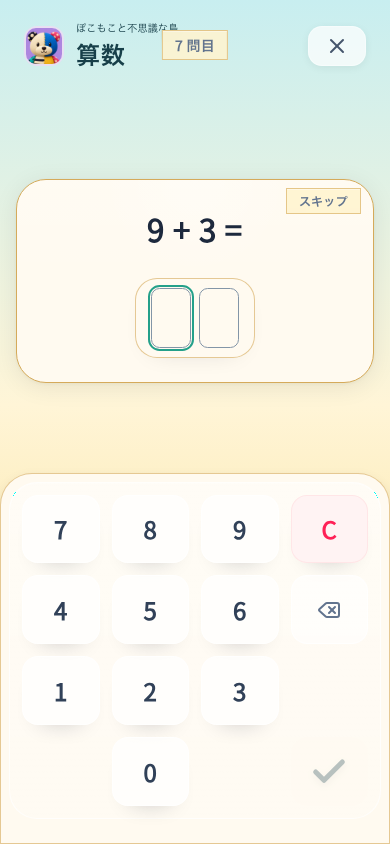
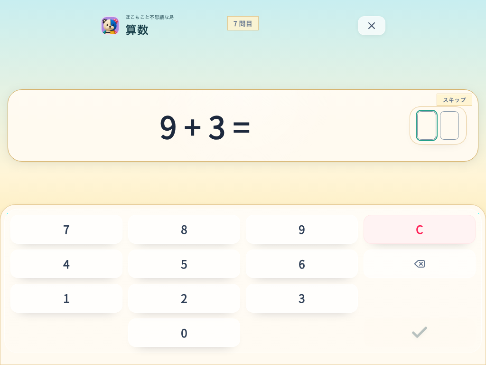
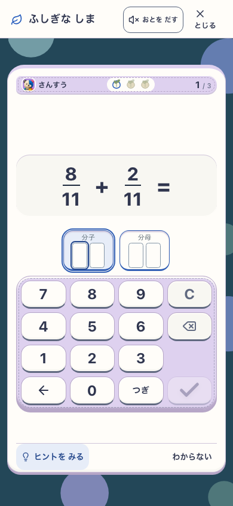
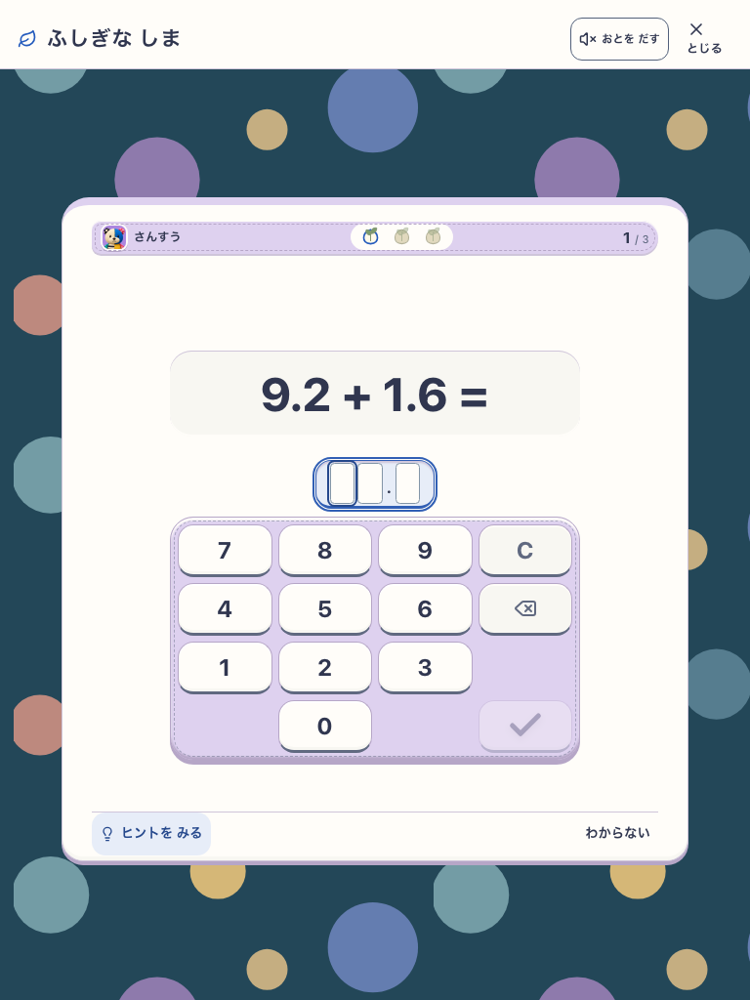

# 桁マスが埋まると即時採点

2026-09-09。採用仕様は [02の自動採点](../../../product/02_math_skills.md#自動採点と確定キー)。

整数・小数・分数・商/余りは同じマス入力とし、最後の数字で正誤にかかわらず採点する。小数点は固定表示。答えの桁数を見せる足場は意図的で、桁数・小数点位置を独力判断した証拠とは扱わない。既存の筆算、支援、SRS、保存の経路を利用する。

## 対象

- 専用worktree、`VITE_ISLAND_ENABLED=true`、DEV `http://127.0.0.1:5632`。
- アプリ `src` tree: `ccf8e7e9d508ce8ae6a32c700d6a182d71b691c3`。文書/ハーネスの更新はアプリソースと区別する。
- Studyは明示fixed-ten、島はnativeプロフィールfixtureから実plannerで予約された問題に回答する。
- スクリーンショットはChromiumの実画面。実機PWA・子どもの無説明理解・意欲は未検証。

## 実画面

| スマホ390×844 | 横タブレット1024×768 |
|---|---|
|  |  |

| スマホの分数 | タブレットの小数 |
|---|---|
|  |  |

## 検証

- `tools/e2e-answer-cells.mjs`。Studyは390/768/1024幅で固定10問をEnterなしで回答、入力途中のEnter、Backspace、保存abort後の部分入力再送拒否と最終桁による再送を確認。
- 島は390/768幅で整数・かけ算・小数・分数・商/余りを確認。入力途中は保存なし、同じ桁数の誤答を1回保存、訂正後に次問へ進み、保存revisionとログ件数を照合する。
- 全体 `verify:core` は316ファイル/3446テスト・lint・typecheck・build・assets・docs合格、smokeは31件合格。Study最終6ケース、島最終10ケース合格。main `1b7d16d` 統合後はdocs/変更ファイルlint/typecheck/関連101テスト/build/assets、Study6ケースを再確認し合格。フルsuiteは前述の統合候補に帰属し、最終版の全体再実行とは扱わない。詳細JSONは `output/playwright/answer-cells-publish-study/report.json` と `output/playwright/answer-cells-island-final-3/report.json`（ローカル成果物）。
- 先行runのスモークでは旧探索の数列を加減式として読むハーネスが失敗。島の統合runでは初回画面のbutton可視待ちと、3Dホームの開始buttonに対する安定frame待ちがタイムアウトした。画面は表示されていたため、初回mount待ち・foreground化・実開始ボタンへのキーボードEnterに変更して再検査し、10ケース完了。開始操作と数値のtouch/keyboard入力は区別する。いずれも自動採点の結果と区別する。

## 判定の境界

- 見た目: 桁マスと選択中マスを静止表示し、キー配置と画面内収容を確認。世界のart parityは今回の判定対象外。
- 理解/安全: タイマーによる途中確定や正解だけの確定はない。マス充足、誤答、訂正は実操作確認。子どもの無説明理解は未評価。
- Runtime: 本文の対象シナリオと完了ログに記載した自動検査の範囲に限定する。
