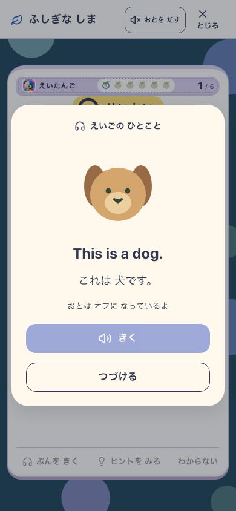
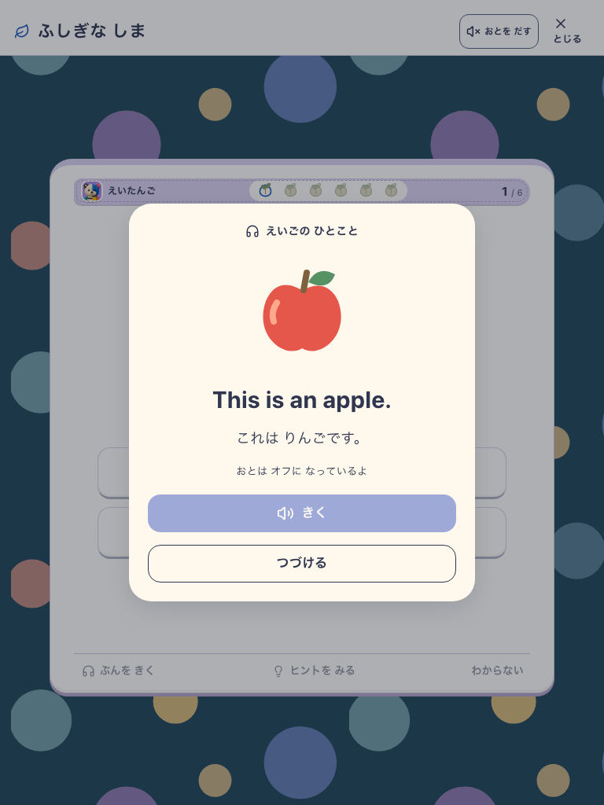
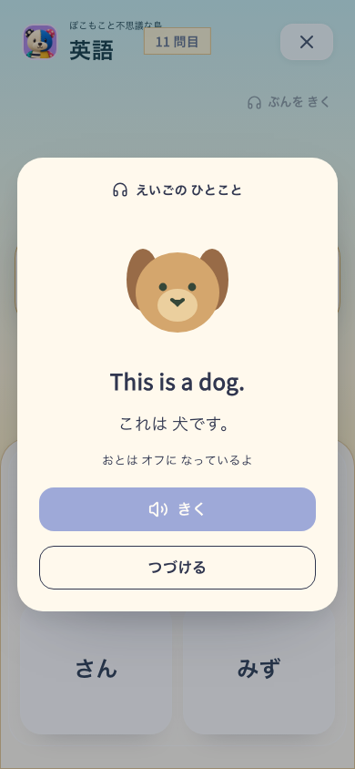
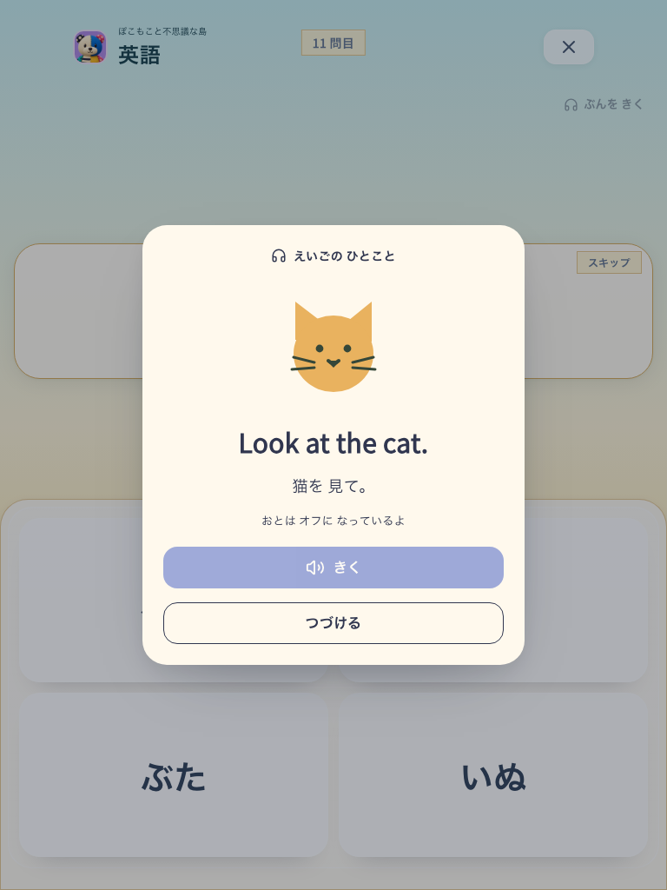

# 英語の任意短文リスニング

正本は[英語仕様03・第7節](../../../product/03_english_skills.md#7-短い文章を聞く)。10文の固定教材、既存の教材図、端末英語TTSを使う。英文・日本語文を常時表示し、再生後の回答を要求しない。

## 実画面

| 対象 | phone 390×844 | tablet 768×1024 |
|---|---|---|
| Island |  |  |
| Study |  |  |

[Studyの入口](study-entry-phone.png)はヘッダーの下へ分け、教科・問題番号・選択肢に重ならない。通常学習は入口を使わず続けられる。

## 実行対象と証拠

- DEV `http://127.0.0.1:5238`、`VITE_ISLAND_ENABLED=true`。ビルドrevisionは `development-local`。正確なDEV version・delivery・既存visual candidateは[島の記録](island-report.json)に保持した。production配布や固定releaseの証拠ではない。
- Islandは明示プロフィールfixtureから通常plannerの予約へ進み、実UIで9問を回答して入口を確認した。Studyは `focus_subject=vocab&focus_ids=apple,banana,cat,dog` の明示範囲で通常回答10問を行った。[Studyの記録](study-report.json)を参照。未設定の全範囲で必ず10問後に対象教材が出るという意味ではない。
- 全IndexedDB storeを比較し、短文閲覧・再生・見送りでプロフィール、学習記録、SRS、予約、島・報酬が変わらないことを確認。同じ未回答問題へ戻り、次の通常回答は保存できる。
- 音offでも日本語・英文を読めて続行可能。再生・停止・再聴・再生失敗からの再試行・途中退出は明示speech mockで制御経路を確認。別にnative TTSを呼び、ブラウザ上の終了状態まで確認した。実スピーカーの音質・発音の専門家評価は未確認。
- 実行コマンドは `node tools/e2e-english-listening.mjs`。対象を `SANSU_LISTENING_URL`、出力を `SANSU_LISTENING_OUTPUT` で指定し、`SANSU_LISTENING_ONLY_ISLAND=1` / `SANSU_LISTENING_ONLY_STUDY=1` で分離できる。生画像と失敗診断は `output/playwright/english-listening-*` に保持。

## 分けて判断する範囲

- 見た目: 作者が両幅の日本語・英文・絵・ボタンの収容と入口の重なりなしを確認。既存教材図を使うutility画面であり、島全体のart parityを更新しない。
- 理解・安全: 回答不要、見送り自由、音offでも続行できる。子どもの無説明理解、自発的な再聴、学習効果はHuman N=0で未確認。
- 動作: 上記の実UI・保存不変は合格。実iOS/Android、短文の実オフライン音声、Island専用の固定throughput/PWA全journeyは今回の対象外。端末に英語音声がない場合は失敗表示から通常学習へ戻れる設計。

## 初回失敗と修正

- Study入口を片方のヘッダーだけに置くと有効な表示レイアウトで見えなかった。両ヘッダーへ置いた後のphone画像ではタイトルとの干渉が見つかり、共有の独立行へ移して実画面を再確認した。
- 並行作業で追加された学習leaseにより通常導線が止まった。native Web Locksが `ifAvailable` と `signal` の併用を拒否することを再現し、abortは取得後の解除へ分離。StrictModeの破棄済みmountが一瞬lockを奪わないようnative request前にキャンセルを確認する。競合拒否と解除の回帰テストを追加確認した。

## 検証結果

- `npm run docs:check`: PASS。既存の棚卸し期限警告あり。
- `npm run lint`: PASS（既存IslandMilestoneのFast Refresh警告1件）。最終レイアウトと今回の追加ファイルの限定lintもPASS。
- `npm run build`: PASS（typecheck・Vite・assetsを含む）。94 precache files、10.51 MiB。配布JSに最終の独立入口行が含まれ、診断ログが残らないことも確認した。
- `npm run e2e:smoke`: 31シナリオPASS。`npm run e2e:pwa-update`: 4シナリオPASS。後者は既存のproduction checkpoint確認で、短文の実端末オフライン発音を証明しない。
- 短文選定・lease解除の5テストPASS。学習保存関連を含む限定4ファイル52テストもPASS。
- 全体 `npm run test:run` は312ファイル・3,366テスト中3,356 PASS、10 FAIL。並行作業と重い3D検査が併走し、8件がタイムアウト、2件が当時変更中の家の表示・geometry期待値の不一致だった。
- 失敗した7ファイルを `npx vitest run --maxWorkers=1 --minWorkers=1` で限定再実行し、74テストすべてPASS。初回全体実行をPASSに書き換えず、再確認を別結果として扱う。
- アプリの保存schemaや通常学習の採点・SRSを短文機能のために変更していない。実装時点ではコミット・デプロイを行っていない。

## コミット候補の分離

上記は共有作業ツリーでの実装検証。mainへの取り込み候補は `c437e49` から英語機能のみを分離した。並行タスクの学習lease修正はこのコミットに含めない。

分離候補でlint・build・index exportのdocsチェックPASS。全315ファイル3,430テストPASS、smoke 31件・PWA更新4件PASS。短文のIsland/Study実導線も両幅PASS。検証ログは `/tmp/listening-push-*`、実導線記録は `/tmp/listening-push-browser/report.json`（ローカル記録）。
