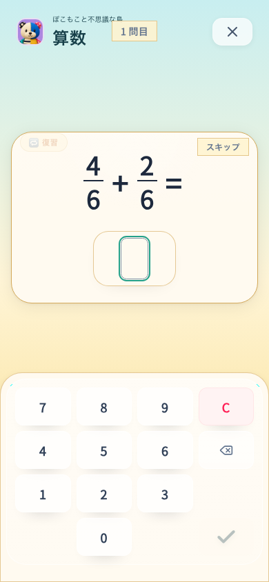
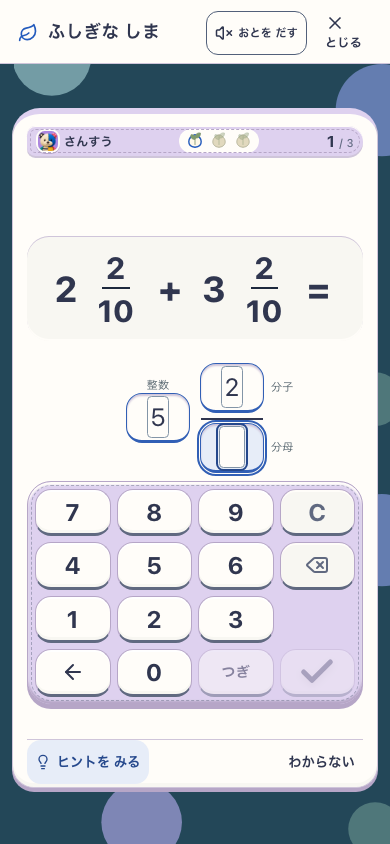
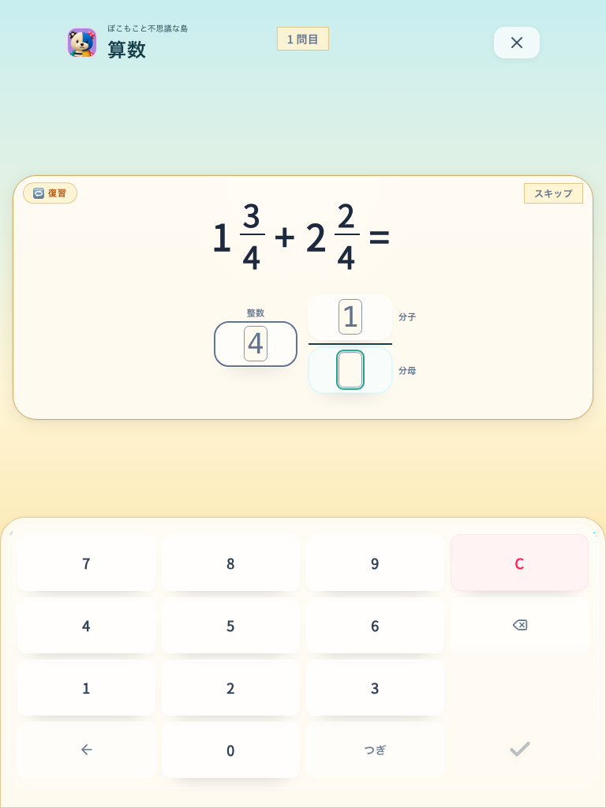

# 整数になる分数と通常回答の訂正

## 変更

- `1/2 + 1/2` など整数になる分数は整数一欄で入力する。表示用のコピーのみを変え、保存された問題・正解配列を変更しない。Islandは入力を元の配列に対応付けて既存の採点へ渡し、Studyは元の問題を記録処理へ渡す。
- Cは通常回答の全欄を消して先頭へ戻す。筆算は既存の現在段の消去を維持する。
- 入力済みの欄をタップすると次の数字でその欄を置換する。選択だけでは値を消さず、他欄を保持する。空欄への自動移動と明示選択を区別し、選択した数字は枠と背景で示す。

## 対象と結果

- [対象ソース](source.json)：`864916f` 基準の未コミット候補。Island有効production preview、SW許可、音off、reduced motion。変更したappファイルのSHA-256を保持する。
- [訂正と整数の実操作8ケース](report.json)：Study / Island × 390×844 / 768×1024 × 帯分数訂正 / 整数結果。すべてPASS、pageerrorなし。
- 明示プロフィールfixtureから通常plannerが生成した問題を使う。整数結果のケースは、整数になる最初の問題が生成されるまで新しいプロフィールを用意する。回数は `sampleAttempts` に記録し、問題本文や答えをブラウザへ上書きしない。
- 入力済みの分子・整数の選び直し、選択だけでは値が消えないこと、不要な小数点キーで値が消えないこと、他欄保持、Cでの全消去と先頭復帰、最後の数字による単一の保存・次問を確認。
- [配置の回帰8ケース](layout-report.json)もPASS。整数結果と混ぜないため、通常分数の配置確認は必ず真分数になる引き算を使用する。上下位置、44px以上のキー、画面内のキー配置、Backspace、最後の「つぎ」の無効化を確認。
- [最初の実操作](first-browser-report.json)はStudyの帯分数2ケースでFAIL。数字処理の直前に置換選択を解除していた実装ミスを発見し、解除を数字処理後へ移した。修正後の8ケースは上記別reportへ保持した。最初の全体テストはこの修正時に中断し、最終ソースで全体検査を再実行した。
- 共有作業場所には他の未コミット変更を保持したまま入力関連ソースを統合し、対象appファイルが検証場所と一致すること、typecheckと関連27件PASSを確認した。

## 実画面

| Studyの整数結果 | Islandの帯分数訂正 | Study tabletの訂正 |
|---|---|---|
|  |  |  |

- 視覚：作者が実画面で一欄の整数回答、分数の位置、既存キー配置を確認。世界アートは変更せず、魅力の新規採点は行わない。
- 理解・安全：選択だけでは消去せず、訂正に他欄の再入力を要求しない。実参加者の無説明理解・学習効果は未検証。
- runtime：上記の実操作と回帰検査の範囲。実iPadやPWA更新・offline全体の再検査ではない。

## 再実行

`SANSU_CORRECTION_URL` と新しい `SANSU_CORRECTION_OUTPUT` を指定して `node tools/e2e-entry-correction.mjs` を実行する。

## 最終品質検査

- 分離した最終ソースで docs / lint / typecheck / Island production build / assets:check はPASS。lintは既存IslandMilestoneのfast-refresh warning 1件。
- 全体テスト324ファイル、3527件すべてPASS。
- 訂正・整数入力8ケースと配置回帰8ケース、計16ケースPASS。

## main統合

`70ad92c` の家の統合変更を取り込んだコミット候補 `eafc10a` で、入力appファイルのSHA-256が実操作・全体3527件を検証した候補と一致することを確認。統合後のtypecheck、関連6ファイル85件、Island有効production buildとassetsチェックはPASS。全体3527件や実操作16ケースを統合後に再実行したという意味ではない。
