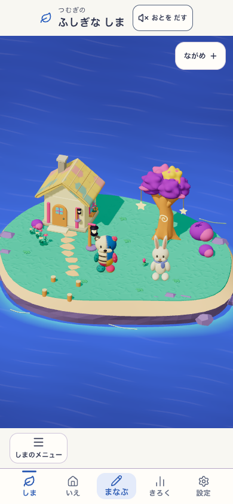
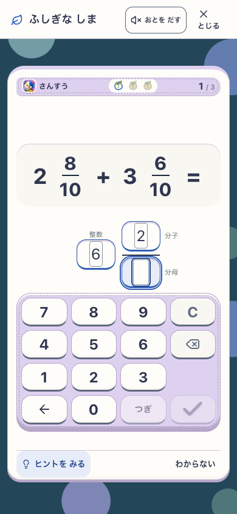
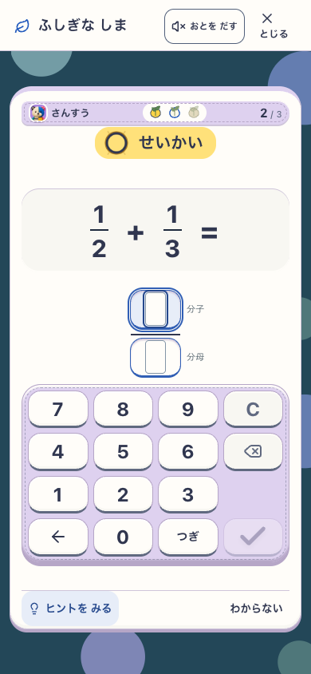
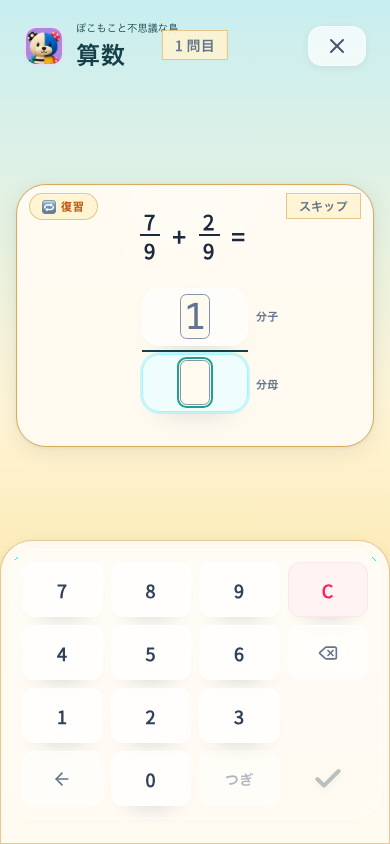
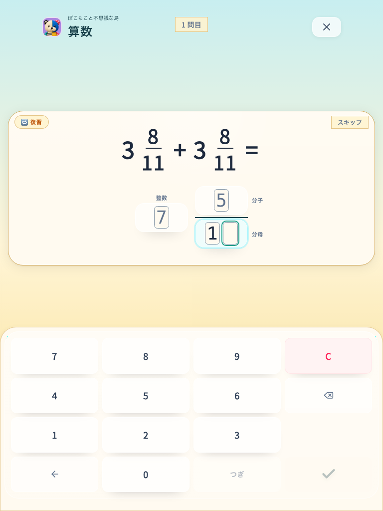
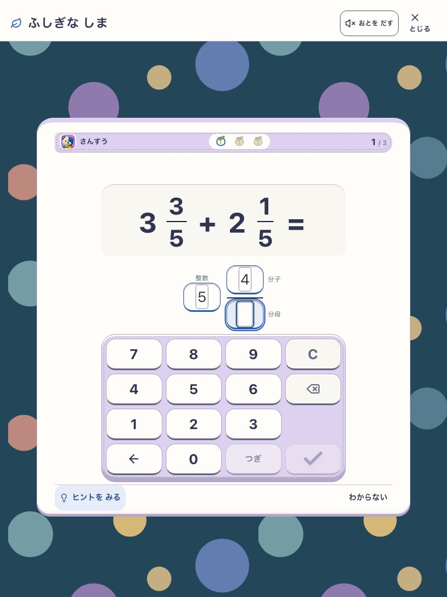

# 分数の縦配置と最後の「つぎ」

## 対象

- StudyとIslandの分数・帯分数回答。分子／分母の保存順は維持し、整数欄は左に配置する。商と余りは横並び。
- 最終欄では「つぎ」を無効にし、前の欄へ戻ると有効にする。mainに同時に入った表示桁数による自動採点（`5fb6d88`）を保持する。
- production preview `http://127.0.0.1:5697`、`VITE_ISLAND_ENABLED=true`。実画面・手動操作候補 `efbe37c`、親 `5fb6d88`。src tree `a1716215128a8bd58e2e29f0368332898287d632`、public tree `c8ac4eebaed8fa9e4b460e938c9afd184632a385`。
- 最終統合で家の表示修正 `38959dd` を取り込んだ。入力ソースは不変。統合app候補 `67dbeec`、src tree `1fa5062aa3338ea7e5b583a29566cf48e9c97b31`。以下の全体テストと追加検査の範囲を区別する。
- UI差分候補 `fraction-layout-v1`。既存の島候補 `mystic-island-shore-garden-v18` / `mystic-island-learning-v2`を維持。新規browser context、SW許可、音off、reduced motion。明示プロフィールfixtureから通常plannerが生成した問題を使用。

## 実操作結果

- [実操作8ケース](report.json)：390×844 / 768×1024 × Study / Island × 分数 / 帯分数、すべてPASS、pageerrorなし。
- 自動欄移動、空欄のBackspace復帰、最後の「つぎ」のdisabled、前欄への復帰時の再有効化、未完成時のEnterによる誤送信防止、最終数字での自動採点と次問を確認。全キー44px以上、横溢れなし、数字キーがviewport内に収まる。
- Playwright CLIでも `2 8/10 + 3 6/10` を `6 2/5` と入力。分子の誤入力をBackspaceで訂正し、分母5の入力だけで次問へ進んだ。
- 統合前 `f44f04f` ベースの8ケースもPASS。ただし手動確定だったため、最新版の証拠には混ぜない。全体テストは最新版統合のため中断し、統合後に改めて実行した。
- [最初の統合ハーネス](first-integrated-report.json) は帯分数のIsland 2ケースでFAIL。Cは先頭欄へ戻る既存契約だったが、ハーネスが分子に残ると仮定した。空欄と分子選択の実画面を確認し、明示的に分子を選び直してから次欄へ進むよう検証側を修正。アプリコードは変更せず、再実行8ケースPASS。

## 実画面

| 起点 | 訂正後・分母入力待ち | 最終数字で次問 |
|---|---|---|
|  |  |  |

| Study phone | Study tablet | Island tablet |
|---|---|---|
|  |  |  |

- 視覚：問題と同じ分数の上下関係、帯分数の整数の位置、分数線、既存の色とキー位置を作者が実画面で確認。世界アートの変更はなく、新しい魅力スコアは付けない。
- 理解／安全：ラベルと配置を併用し、色だけに依存しない。実参加者による無説明理解・学習効果は未検証。
- runtime：上記実操作範囲はPASS。実iPad／Android、PWA更新・offline全体の再検査とは区別する。

## 再実行

`SANSU_FRACTION_URL` に島有効production、`SANSU_FRACTION_OUTPUT` に新しい出力先を指定し、`node tools/e2e-fraction-entry.mjs` を実行する。

## 品質検査

- `efbe37c`：docs、lint、typecheck、島有効production buildとassetsチェックはPASS。lintは既存IslandMilestoneのfast-refresh warning 1件。
- 全体テスト322ファイル／3502件：3501 PASS、家の `learningKeepsakeScenery.test.ts` の部品数上限（181 < 180）が1 FAIL。分数の変更はこの3D実装を変更していない。
- 家の最新修正 `38959dd` を取り込んだ `67dbeec`：typecheck、production buildとassetsチェックはPASS。失敗していた家の検査に加え、家の移動・表示・分数入力の関連6ファイル／74件がPASS。全体3502件を最終統合版で再実行したという意味ではない。

- Final integration browser: [8 cases PASS](push/report.json) on `67dbeec`, using the committed harness and the rebuilt Island production artifact. No page errors. Input/source contracts match the reviewed commit.
- プッシュ時に入力境界修正 `ece72f0` が先行したため追加統合。候補 `a18d3a7`（src tree `bd6e6ae869c1977d0bf5ba775fa3902080d37bb4`）でtypecheck、入力・分数の関連4ファイル74件、production buildを再確認してPASS。前段の家を含む74件とは検査集合が異なる。

- Latest integrated browser: [8 cases PASS](edge/report.json) on `a18d3a7`; fresh production contexts, no page errors.
