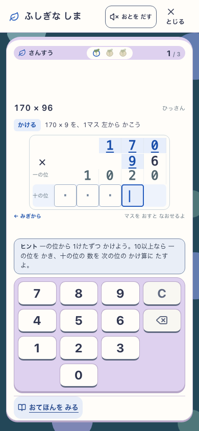
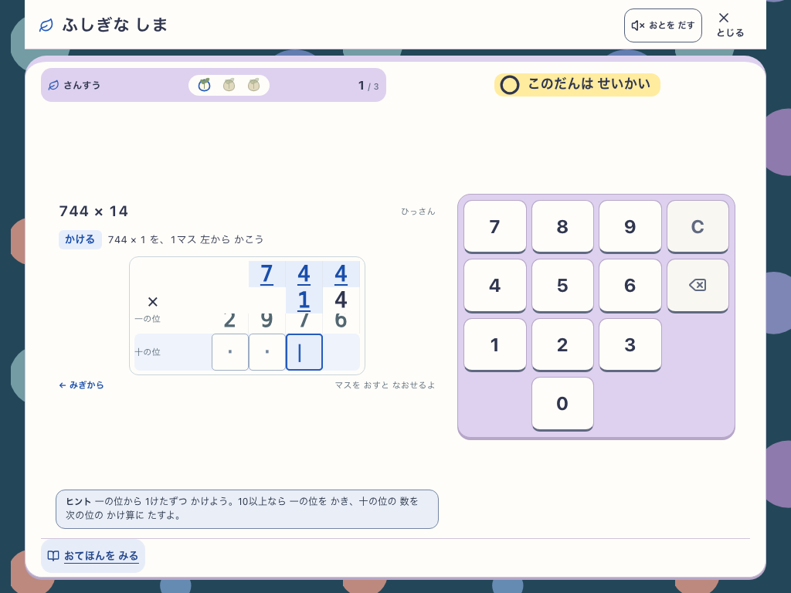
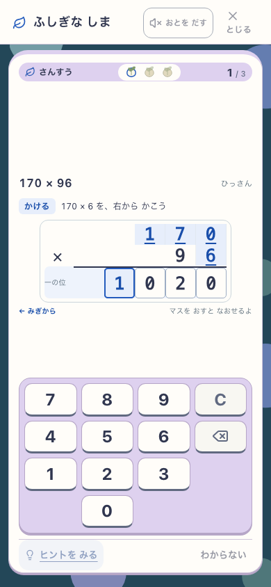
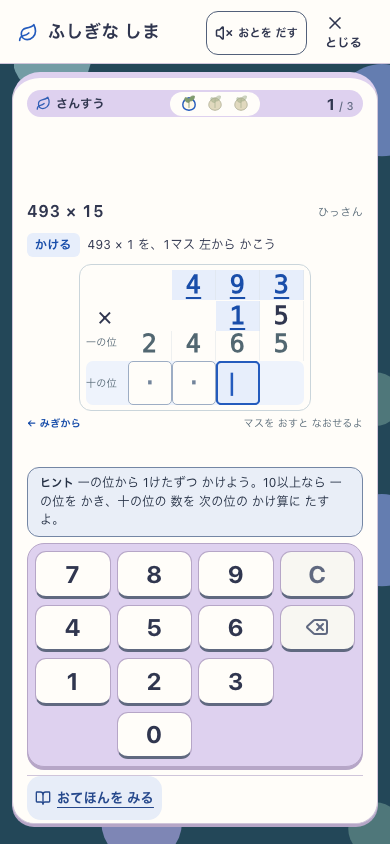
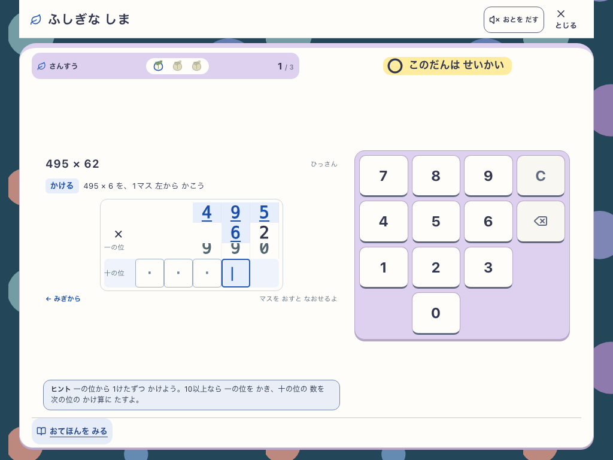

# ヒント直後の筆算入力

## 変更

- ヒントの保存を専用のbusy kindで識別し、筆算の下書きだけは入力・訂正できるようにした。ヒントに課していた180msの最小待機を除去した。
- 段が埋まった場合は、ヒントの保存処理終了後に最新の予約revisionとcallbackで一度だけ採点する。Backspace/Cで保留中の回答を取り消せる。お手本中・回答保存中の入力停止、保存の排他制御とPWA保護は維持した。
- ヒントを操作文の繰り返しから、くり上がり・同じ位の合計・商の見つけ方・ひき算・数字をおろす手順・あまりの確認へ変更。未回答の段や最終答えを表示しない。
- [画面仕様](../../../product/06_screen_specs.md)、[検証matrix](../../../ai/verification_matrix.md)を更新。学習閾値、採点、SRS、保存schemaの変更なし。

## 実画面

## 検証

- 固定sourceの関連37テストPASS。保留中の物理入力、一度だけの最新callback呼び出し、Backspaceによる送信取消、失敗時の部分入力保持、お手本/回答保存の入力停止を含む。
- 全体は295ファイル3,244件中3,243件PASS、学習進行1件が15秒timeout。該当ファイルを関連テストと再実行して49件PASS（元の失敗ケース5.24秒）。初回全体PASSとは扱わない。
- docs/lint/typecheck、classic build/assets、Island buildがPASS。lintには既存IslandMilestoneのFast Refresh警告1件。
- 最終固定production `hint-input-final` で、390×844 / 1024×768 × 即時入力・遅延・失敗の6ケースPASS。35ms間隔の物理入力、タップ・戻す、支援後の一度だけの採点、支援記録、次段の空欄、キー位置を確認。生記録は `output/playwright/hint-input-final/report.json`。
- [固定版の入力記録](input-report.json)、[固定版のsource識別](build-source.json)。全体テスト後のアプリ変更は、ヒントの「のこり」を「十の位の数」と明示した文言のみ。最終文言で上記49件と両build、production実UIを再確認した。
- classic PWA更新4ケース、Island PWAの8保護フローと実service workerのoffline reload・回答・再開がPASS。基本導線smokeも全シナリオPASS。
- 並行変更のコンパクトCSS・学習ナビゲーション保護を含む現在のcheckoutでもtypecheckと同じ6ケースがPASS。[統合画面の入力記録](integration-report.json)。こちらは共有DEV上の補測で、固定production証拠とは区別する。
- 島全体の成長・3D操作E2Eと正式80runの速度比較は今回再実行していない。今回の修正をアプリ全体の公開承認として扱わない。

## 判定と範囲

- 見た目：作者によるphone/tabletの実画像確認。ヒント・現在マス・数字キーが画面内にあり、キー位置を維持する。
- 理解・安全：操作文と計算方法を分け、答えを先に入力しない。子どもによる理解や実iPadの指操作は未検証。
- Runtime：ヒントと回答の順序を保ち、段の確定は1回。nativeプロフィールfixtureを使い、通常plannerの問題をUIから回答した。800ms通知遅延とabortは明示的な診断。
- 共有checkoutの並行変更と混ぜず固定コピーで主要検証を実行した。固定版の後に別担当のコンパクトCSSと学習ナビゲーション保護が加わったため、現在のcheckoutも別途確認した。公開・commit・pushは行っていない。

## 現在の共有画面での補測

初回のfocused testはこのrepoのVitestにないmatcher名で3件失敗したため、呼び出し回数と引数を別々に検査する既存matcherへ修正。初回ブラウザ検査は次段でもヒントが開いたままなのに「ヒントをみる」を待って停止したため、支援の現在状態に合わせた。入力のassertionは維持した。原記録は `/tmp/sansu-hint-focused.log` と `output/playwright/hint-input-fix-01/` に保持。
