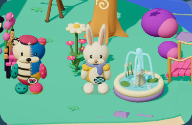
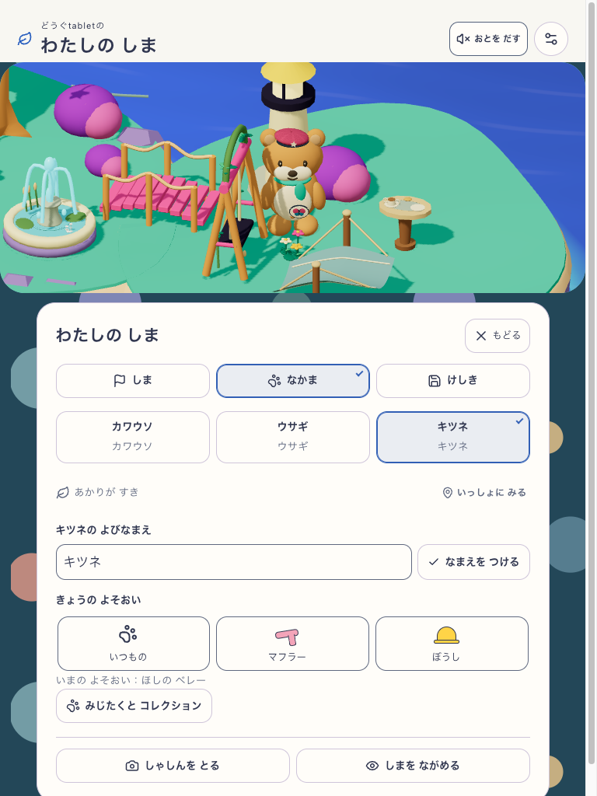
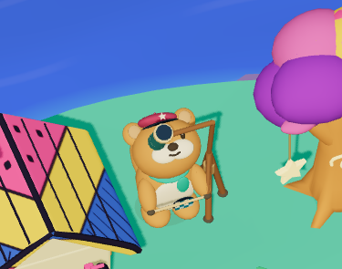
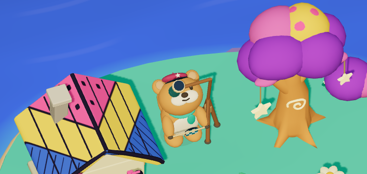
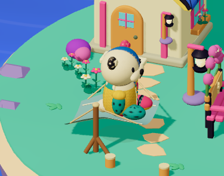
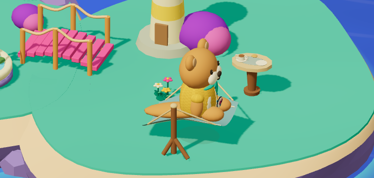
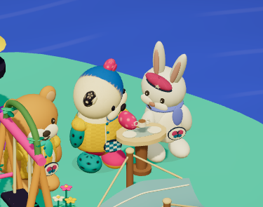
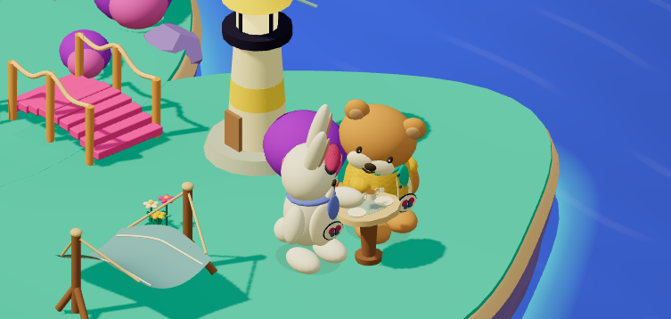

# 固定24・衣装／模様と家具利用の有限確認

固定24の同一アプリに対し、phone / tablet 各25通りの衣装・模様と各9場面の家具利用を、QA03・04・06・07の**項目単位で合成**した記録。選定した計50 portrait・18利用の runtime 検査は通過した。単一の連続実行、実取得、最新版全体の合格を示すものではない。

## 対象と根拠

| 項目 | 固定値・範囲 |
| --- | --- |
| App revision | `workshop-20260909-a285ab860033` |
| Source hash | `a285ab860033212e1cea244548f1eddc00bb973998a1c52fcaeb9b4f761529d0` |
| Visual candidate | `mystic-island-shore-garden-v7` |
| 実対象 | `http://127.0.0.1:5409/` の固定24。served version と照合済み |
| 端末 | phone 390×844・通常motion・touch / tablet 768×1024・reduced motion |
| 入力 | 固定17 `furniture-06` の実保存状態を元に、4資格品の所持、外見初期値、音OFFを明示注入した隔離診断fixture |
| 改変禁止入力 | 固定24の1070入力、元fixture、既存pure oracle・helpers。QA / Node / Playwrightの実runtime closureも前後SHA照合 |
| 終了 | 採用runは全て `sourceStable=true`、`browserClosed=true`。ブラウザの残留なし |

[ledger.json](ledger.json) は元の有限台帳と**同bytes**。SHA256は `3dc4a2ea33ac7e6141f50ab3ffa0efa7a3f1243188b7a3b919340400d3a13290`。各項目にapp、QA、元report、実画像、frame traceのパスとSHAを保持する。元の場所は `output/island-experience/expression-visual-matrix-24-ledger-01/ledger.json`。QA bundleは `output/island-experience/expression-visual-matrix-qa-24-03` / `04` / `06` / `07`、実行結果は `output/island-experience/expression-visual-matrix-24-03` / `04` / `06` / `07`。

| 採用run | phoneで採用した項目 | tabletで採用した項目 | 元runの結果 |
| --- | --- | --- | --- |
| QA03 | 2 portrait | 25 portrait・2利用 | FAILを保持 |
| QA04 | 残23 portrait・4利用 | 2利用 | FAILを保持 |
| QA06 | 2利用 | 2利用 | FAILを保持 |
| QA07 | 残3利用 | 残3利用 | 選定3利用／幅がPASS |

衣装・模様の組合せは、既存の5組を除く有限25組／幅。家具は望遠鏡・ハンモック・茶卓を各3住民で扱う9場面／幅であり、新しい全直積を追加していない。実取得の既存証拠は固定17の別記録で、この注入fixtureによる確認へ置き換えない。

## 元の失敗と本人操作による修復

- QA01は描画済み静止フレームの監視取りこぼし、QA02はexpression画面に別経路のportrait診断を要求するQA前提で停止した。実「なかま」の同住民近景へ導線を合わせた。
- QA03のphoneでは、半分隠れた戻るボタンの中心 `y=295.480` とcanvas下端 `295.390` の境界で、native clickが整数 `y=295` のCANVASへ届いた。実pointerのhit要素・矩形と不成立画像を保持し、通常scrollでボタン全体を表示した後のtrusted再tapを別記録にした。アプリの重なりを解消したとは主張しない。
- 静止後のWebGL `toDataURL` には透明画像があったため、それらを採用画像から除外した。QA03のtablet25枚とphone最初の2枚は実UIのcompositor screenshot、QA04のphone残23枚は実canvasのcompositor screenshotを使う。家具phase画像は実描画直後のPNGで、採用画像に透明・単色破損はない。
- 保存済み配置での `unreachable` と、同住民を指定した明示探索の `no-space` は元FAILのまま残した。ハンモックは実探索の候補 `(-2, 2)`・回転 `PI/2` を本人の「ここに おく」で確定すると、otter / rabbitが利用できた。
- foxが関わる残3場面では、実「まわりの ものを うごかす」から近傍のブランコを本人が一度収納した。その後も同じfoxで望遠鏡・ハンモックが成立し、茶卓は実探索と明示配置を経てrabbitから同foxへの受渡しが成立した。住民を別個体へ替えたり、DBを直接差し替えて復旧したりしていない。
- QA05の新placement期待値は、保存APIのown-property `autoPlacementBlocked: undefined` を欠如と扱ったため停止した。既存repository契約どおりの厳密期待へ修正し、元FAILは保持した。

通常の閲覧・利用・取消は全17storeが不変。外見操作は選択した部位とcanonical receiptだけ、修復操作は選択した1家具の配置／収納と `island-edit-v1` のreceiptだけを全storeで照合した。既存の学習・財布・所有・他の保存枝をbaselineへ無条件に取り込んでいない。実rig UUID、衣装group、各phase、手と道具の接点、茶卓の同一cup UUID・持ち手の移行・台への復帰のpure oracleは変更していない。

## 代表実画像

全8枚を元画像で目視した後、再圧縮・crop・補筆なしの同bytesで `screens/` へ保存した。ファイル名は元画像と同じで、SHAは台帳に対応する。以下は確認できる外見・接触の例であり、効果や学習意欲の証明ではない。

| 場面 | phone | tablet |
| --- | --- | --- |
| 衣装と模様 | QA04。ウサギのあまがっぱ・みずべチェック。実canvas screenshot。 | QA03。キツネのほしのベレー・ちょうのぬいめ。実UI screenshot。 |
| 実画像 |  |  |
| 望遠鏡の接触 | QA07。ブランコ収納後、同foxの接触確認frame。 | QA07。同じ修復境界のtablet実frame。 |
| 実画像 |  |  |
| ハンモックの支持 | QA06。実再配置後のotterと布・支柱。 | QA07。周囲の収納後のfoxと布・支柱。 |
| 実画像 |  |  |
| 茶卓の受渡し | QA04。otter→rabbitの実handoff frame。 | QA07。実配置後のrabbit→foxの実handoff frame。 |
| 実画像 |  |  |

静止PNGだけではcupの同一性や接触の時系列を証明できないため、対応するrequest ID・UUID・phase traceと合わせて扱う。

## 非代替の境界

- **Runtime integrity**: 上記の有限項目に限定してPASS。元の拒否や失敗runを遡及してPASSへ変更しない。
- **Visual appeal**: 代表画像で衣装・模様、道具と利用姿勢は確認したが、画風のbenchmark一致・全場面の洗練度はHOLD。
- **Silent comprehension / safety**: Human N=0。説明なしの理解、楽しさ、再訪意欲、学習効果を断定しない。
- 固定24・candidate v7の結果であり、固定26や後続sourceへ遡及しない。全Goal・全仕様41の完了ではない。
- 新規取得、全写真bytes保持、音、正式速度、自然発生する全利用、全中断境界はこのfixture確認の範囲外。

この耐久化では原台帳・原PNGの同bytes照合のみを行った。並行中の正式検証の排他を守り、新browser・build・testは起動していない。
