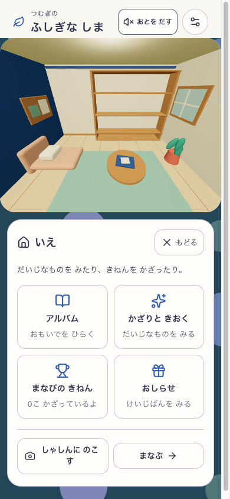
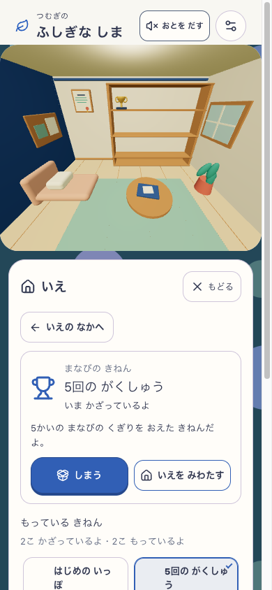
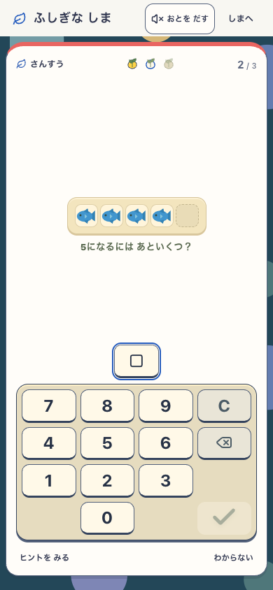
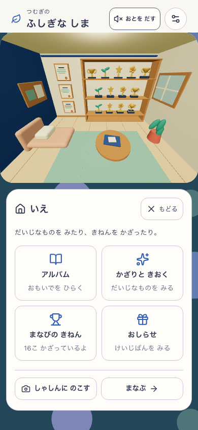
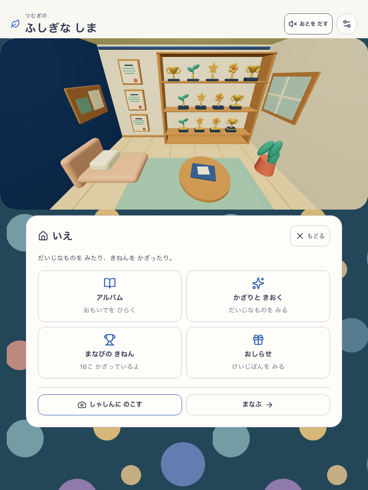
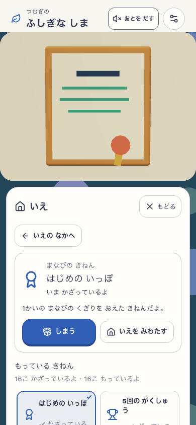

# 島の家・操作導線のチェックポイント — 2026-09-09

Status: **Checkpoint / Full Goal Active**。この文書は途中の保存地点であり、全Goal完了・公開承認を示さない。分析全体の範囲と残差は[親タスク](../../tasks/active/2026-09-08-island-experience.md)と[対応表](../../tasks/active/2026-09-08-island-experience-coverage.md)を正とする。

mainには実装 `fcd1da1`、クリーンcheckoutでの文書参照修正 `7c45f98` をpush済み。後者の [Verify Core](https://github.com/yutogasaki/sansu/actions/runs/34290005123) と [Docs Check](https://github.com/yutogasaki/sansu/actions/runs/34290005161) はPASS。初回CIのローカルoutputリンク失敗は判定を緩めず、元label/pathを残す文書表記修正と追跡ファイルだけの事前検査で解消した。

## 本人の意図と現在の契約

ユーザーの「家がオープンじゃなくて、家に入れるなかで記念室じゃなくて家の中でいろいろ見れるのがいい」「家には大事なものや重要なお知らせとかがある感じ」を[仕様42](../../product/42_island_learning_keepsakes_spec.md)へ反映した。

実際の家の位置を保ち、同じScene/rendererの閉じた家内にPerspective cameraを置く。外壁を開く断面表示は使わない。ソファ・ラグ・机の写真帳・植物・掲示板がある生活空間の一角へ、賞状3点とトロフィー13点を飾る。入口は家の実物と補助ボタン。最初は家のoverviewで、実アルバム／かざりと記憶／実お知らせ／学習の棚を選ぶ。棚の選択・近景・家内全体・島への退出を分け、通常学習へは同じ予約に一操作で戻る。偽の通知や展示必須の関門は追加しない。

島のカメラはpinch/zoom/panと補助操作に対応し、家内カメラと屋外カメラを分離する。閉じた家・物体の実タップ・写真の実描画を単なるDOM状態で代用しない。

## 固定23と検証範囲

- manifest（`../../../output/island-experience/workshop-snapshot-23/build-source.json`）: `workshop-20260909-ecdb5041e7c4`、**1068 inputs**。source SHA256 `ecdb5041e7c437d1977ab334b8ba2c9222355ec444a0689ca9b8d184350caf46`。
- `VITE_ISLAND_ENABLED=true` / `VITE_BUILD_PLAY_ENABLED=true`。実配信guard（`../../../output/playwright/island-renewal/version-23.json`）が `http://127.0.0.1:5407` のversion/revisionとmanifestの一致を確認。Island delivery=`mystic-island-v1`、visual=`mystic-island-shore-garden-v6`、learning=`mystic-island-learning-v2`。家の候補は `island-home-interior-v3`。
- 全体テスト（`../../../output/playwright/island-renewal/integration-tests-23.log`）: **292 suites / 3232 tests PASS**。lint（`../../../output/playwright/island-renewal/integration-lint-23.log`）は0 error・既存Fast Refresh warning 1件（IslandMilestone）。型・build/assets（`../../../output/playwright/island-renewal/integration-build-23.log`） PASS。PWA 10.73/12.00 MiB、art 4.92/8.00 MiB。
- docs:check（`../../../output/playwright/island-renewal/integration-docs-23.log`） PASS。既存の棚卸し・Review By期限超過warning 7件は残っており、警告なしという意味ではない。

| 確認 | 状態と証拠の限界 |
| --- | --- |
| 家の実表示 | interior-03（`../../../output/playwright/island-renewal/room-review-interior-03/report.json`）の両幅を作者が実見。閉じた生活空間・16点の展示・賞状近景を確認。**mutable DEV / 明示した1000区間・全16展示fixture**で、実1000区間獲得や固定23の配信証拠ではない。 |
| 家の実物3箇所 | room-interactions-01（`../../../output/playwright/island-renewal/room-interactions-01/report.json`）: 写真帳・掲示板・トロフィーの実座標タップと家内往復、phone/tablet、全DB不変 PASS。DEVの明示fixture。 |
| 戻り先2経路 | return-routes-01（`../../../output/playwright/island-renewal/room-return-routes-01/report.json`）: 両幅PASS。家→camera→写真一覧→家、家のお知らせ→受取→収納→家→島→島のalbum→島。閲覧は全store不変、受取・収納は対象IslandRecord差分と各receiptだけ。nativeプロフィール＋1区間・未受取1件の**診断fixture**を使用。 |
| 固定23の実獲得 | keepsakes-23-02（`../../../output/island-experience/keepsakes-23-02/report.json`）は**両幅PASS**。同app23＋immutable QA overlay。各25実回答（5区間24問＋同予約の非最終1問）、27全DB比較・6展示writes。初賞状／5区間トロフィーの展示・収納・再表示・reload、実0件掲示板、家の実PNG保存／出力bytes一致、同予約の全islands保持。sourceStable/browserClosed=true。空のnativeプロフィールだけをfixtureにし、進捗は実入力。全16品の資格・有gift・家の3Dタップ・正式timingはこのrun対象外。 |
| 写真QAの旧FAIL | keepsakes-23-01（`../../../output/island-experience/keepsakes-23-01/report.json`）は両幅FAILを保持。各3実回答と賞状展示等の後、canvas aspect変更前後の32camera値完全一致というQA前提で停止。実pose16値・room UUID・選択は不変だった。23-02はPerspectiveの画角変更を扱うQA-only修正で、app23を変更していない。 |
| 固定23のカメラ | camera-23-03（`../../../output/island-experience/camera-23-03/report.json`）は**全4 scenario PASS**、30 capture記録／62 PNG、pageerror 0、sourceStable/browserClosed=true。同app23＋`camera-qa-23-03` overlay（QA SHA `7527b796…`）。両幅の真正新規プロフィールでpan/pinch/wheel/cancel/resize、実家shellの入退出、同予約1回答を確認。隔離した3土地成熟fixtureでは6x・四方境界・地区・全DB保持を検査。正式速度やHuman観察は対象外。 |
| カメラQAの旧FAIL | 23-01（`../../../output/island-experience/camera-23-01/report.json`）は目標zoom 6に対して最後の描画datasetが約5.96で停止。23-02（`../../../output/island-experience/camera-23-02/report.json`）はtabletの広い画角でpan>4を求めた前提で停止。クリック消失の実証とはしない。23-03は期待zoomの実描画と到達対象geometryを照合するQA-only修正で、旧FAILとapp23を保持。 |
| Island core補助QA | core-island-23-04（`../../../output/island-experience/core-island-23-04/report.json`）は **10経路PASS**（実WebGL復旧・onboarding・8入力モード）、ブラウザ終了。23-03は実WebGL復旧とonboardingが通過した後、学習中に隠されたworldの可視待ちで停止。QA-only修正で可視Threeの検査を実「しまへ」の後へ移した。appは不変。DEV optional growthは省略し、旧20の実成長や23の成熟fixtureと混同しない。 |
| 固定23のPWA | pwa-23-01（`../../../output/island-experience/pwa-23-01/pwa-report.json`）は8保護経路と実SW offline回答／reload／同予約復帰 PASS。source照合（`../../../output/island-experience/pwa-23-01/source-verification.json`）で1068入力の前後一致。 |
| 既存classic保護 | smoke31 / classic PWA4（`../../../output/playwright/island-renewal/commit-checks/summary.json`）、実2build更新2経路（`../../../output/playwright/island-renewal/integration-classic-pwa-two-build.log`） PASS。これらは先行するclassic flagsの別target。固定23 Island PWAや家の実獲得へ転用しない。DEV smoke途中のoutput-copyによるreloadも元summaryに保持。 |
| 正式fixed-ten | [固定23の集計](2026-09-09-island-home-checkpoint/throughput-summary.json)は **80 runs PASS / evidence.eligible=true**。固定23の専用DEV5408、交互10反復、phone/tablet。正答operable P95は197.3 / 197.7ms、誤答retryは195.5 / 194.5ms、区間境界は194.3 / 196.5ms。連問追加0操作・fixture/receipt・source不変を確認。自動keyboardのsynthetic固定問題であり、通常plannerや子どもの速度の証拠ではない。初回23-01はDEV用fixtureをproduction previewへ向けて最初のsource importで停止、計測0。元FAILを保持し、正しい固定DEVの23-02で完走した。 |

snapshot21は準備版。22のgenuine QAは実配信が `development-local` でmanifestと異なり起動前に停止した元FAIL（`../../../output/island-experience/keepsakes-22-01/report.json`）を保持する。23の新結果で21/22や23-01の失敗を上書きしない。

## 固定23の実獲得から学習へ戻る3画面

keepsakes-23-02（`../../../output/island-experience/keepsakes-23-02/report.json`）から次の3枚を無加工で複製した。対象は固定23の `http://127.0.0.1:5407`、revision/source/flags/candidateは上記manifestと同一。served versionは `workshop-20260909-ecdb5041e7c4:5309e60a-3715-4a0b-8e06-57c899475a5a`、QAは `keepsakes-qa-23-02` overlay（実report closure `25cea0d233f8cb66ccaee75f41281aaa03369e9866dace360dc5acf3a5101e09`）。phone 390×844、音off・reduced motion。最初の空プロフィールだけをnative seedし、賞状とトロフィーの資格は実回答から得た。写真自体に学習予約の同一性は映らないため、その判定は同reportの全DB照合を根拠とする。

| 家への入口・生活空間 | 5区間後の実獲得2点を展示 | 同じ予約の非最終1回答後 |
| --- | --- | --- |
|  |  |  |

元ファイルは順に `phone-01-house-interior-overview.png` / `phone-08-two-earned-awards.png` / `phone-09-same-reservation-resumed.png`。コピーSHA256は以下。

- `fixed23-phone-house-entry.png`: `c2f8d3419cee357a3ae1fed155cf77f45740624a25e99e1fbaa6fb85c9abe1aa`
- `fixed23-phone-earned-awards.png`: `d8b63ae6bc1658383546d381f77181ea7e7458e09aea61592495e5a5214ea1d7`
- `fixed23-phone-same-reservation.png`: `792e3f6db9195ebe61b4ef75eb5bec7199c727ad75f8df9c550f64b793a73d2f`

## 全16品のDEV診断画像（実獲得と別の証拠）

次の3枚は `room-review-interior-03` のPNGを**無加工で複製**した。撮影対象はDEV5209、revision=`development-local`、version=`development-local:d3ac2a40-929d-4ad1-8102-ed0d5adf9096`、Island delivery/candidateは上記、家候補=`island-home-interior-v3`。phone 390×844／tablet 768×1024、音off・reduced motion、SW block。全16展示と近景は同じ明示fixtureであり、実獲得の画像ではない。

| phone 家のoverview | tablet 家のoverview | phone 賞状近景 |
| --- | --- | --- |
|  |  |  |

コピーSHA256: phone overview `5efbca3e17d76f89214bd5fdfcb3449c932d640a5806fc2c8bd060b08d9d6cd8`、tablet overview `2df432157b433659815a91b5822cf23a5eda81bbd463371718bb33df63b0914e`、phone近景 `01e80ff3c26cef4ab0b430507e4cff1af38070d5f92b0df2536ea02110fe80b8`。

## 独立した判定と次の境界

- **基本の実表示／作者確認:** 家としての囲い、生活道具、展示と近景は上の実画像で確認。source A-v6との強いart parityは **HOLD**。自動テストの成功で視覚の基準を置き換えない。
- **無説明理解・自発的再遊び・子どもの安全:** **Human N=0**。独立した利用者観察の合格を主張しない。
- **runtime／保存:** 上表のtarget別合格のみ。固定23の正式80runも上表に集計した。旧景色互換・音など分析全体の残差は親タスクを保持する。

機能の保存地点を作っても **Full GoalはActive**。この文書だけで全分析の消化・公開・完了へ進めない。
