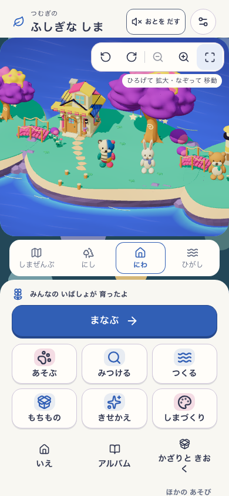
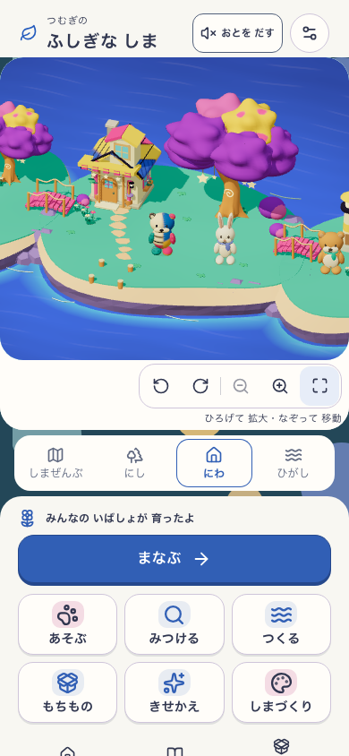
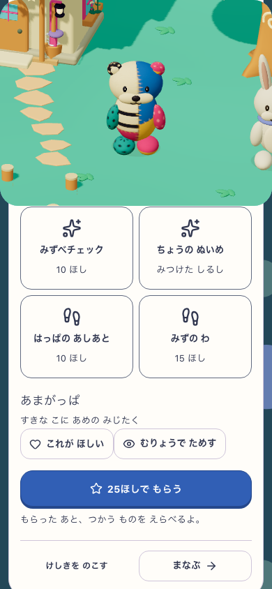
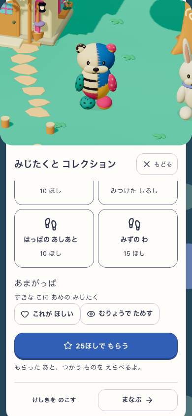
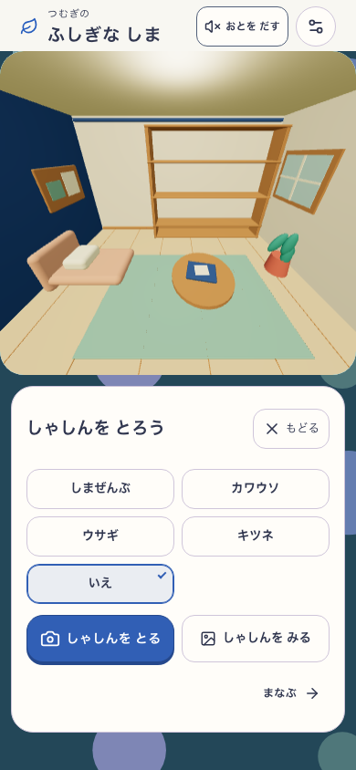
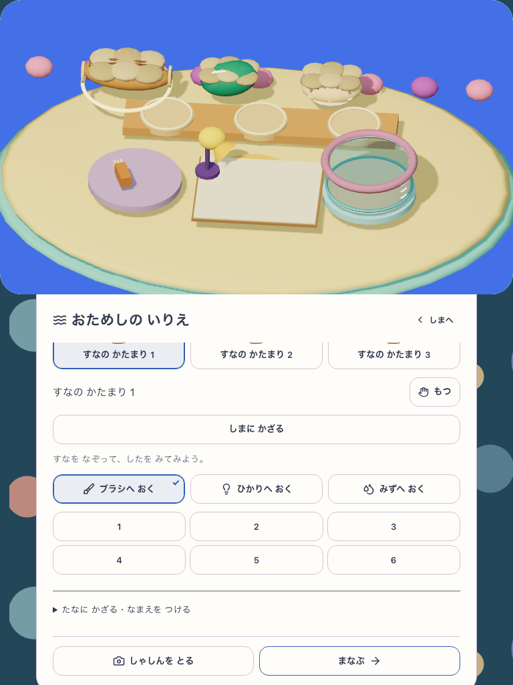
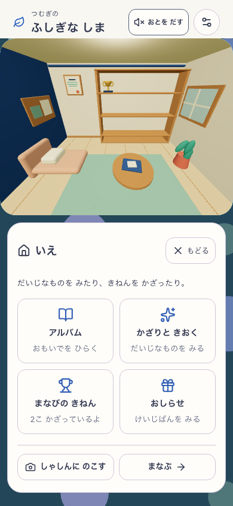

# 島を隠さず、途中から戻れる操作配置

Status: Checkpoint / Full Goal Active。家は閉じた外観から入り、生活空間で賞状・トロフィー・写真・知らせを見る既存の契約を維持する。

固定28 `workshop-20260909-cef819587f14`、candidate `mystic-island-shore-garden-v8`、Island/BuildPlay両flag有効、実対象 `http://127.0.0.1:5414`。[版・実測値・画像SHA](verification.json)に全1072入力と元reportの対応を記録した。

## 変更と実画像

カメラの44px操作と案内をcanvas外へ移し、樹冠を覆わないようにした。島の実描画高は同じ。操作帯はphoneで78px、tabletで58px増えるため、下側の家・記録リンクには通常の縦スクロールが必要になる場合がある。主学習ボタンと6つの遊び入口は390×844の実画面に残る。島の実物の家からも入れる。

| 固定26 | 固定28 |
| --- | --- |
|  |  |
|  |  |

身支度・きせかえ・工房・家・家のカメラ・かざりと記憶の見出しと戻るを、景色の直下に固定した。家のカメラだけfigure側に残っていた高さ指定をレビューで発見し、固定27を保持したまま28でpageの共通値へ移した。従来の42dvhの描画高を保持し、読み込み順に依存する約59pxのずれを解消した。

| 家の撮影画面 | 工房の途中 |
| --- | --- |
|  |  |

6画像は実ブラウザからの無加工・同bytesのコピー。家の棚が空の画像は明示した配置fixtureで、獲得済み展示が消えたことを示さない。写真の撮影そのものはこのレイアウト比較の対象外。

## 範囲と検証

- 375×812・390×844・768×1024、固定26/28の6経路。3土地の明示fixtureに対する6画面×4スクロール位置。変更前は計37/72位置で戻るの整数pointer hitが遮られ、変更後は0/72。閉じる操作は全画面で成立し、閲覧・スクロール・戻りで全store不変。旧版の経路PASSは遮蔽なしを意味しない。
- 全画面横溢れなし、戻る領域44px以上。home canvas高は前後それぞれ324.796875 / 337.59375 / 409.59375pxで一致。app/QA入力の前後hash不変、ブラウザ終了。
- 固定28は294 suites / 3244 tests、型、build、資産予算PASS。通常lintはerror0・既存Fast Refresh warning1。docs:checkもPASS（既存の棚卸し期限warningあり）。
- 固定27の `output/island-experience/camera-27-01/report.json` は、両幅の新規実UIからpan/pinch/wheel/resize/cancel/外側scroll・家の実物入退出・同予約1回答と、別の成熟fixtureによる4方向/6xを確認。4経路・62PNG・全store保持PASS。28の写真画面だけの高さ修正をこの27の結果へ混ぜない。
- 速度の正式80runは固定26、既存PWAは固定23の記録。実学習の取得・故障・offlineの全行列をこの限定確認で置き換えない。

**視覚:** 操作による遮蔽の解消を実画像で確認。source Aの造形・素材全体への到達はHOLD。**意味・学習非干渉:** 元の学習へ戻る実操作は版別の上記範囲、無説明理解・意欲はHuman N=0。**Runtime:** 版と検証範囲に限定してPASS。全Goalは継続する。

## 家で撮影して戻る限定確認

[固定28・実写真の集計](photo-summary.json)は、両幅で家→camera→実PNG1枚→gallery→同じ保存家への復帰がPASS。実frameと原画像・thumbnailの全画素、書き出しbytesが一致し、写真3storeとそのreceipt以外の保存は不変だった。galleryでは既存仕様どおりStageを再mountするためGPU UUIDは新しくなり、保存owner・展示ID/配置/選択・camera pose/投影の同値で復帰を確かめた。撮影中の実rigは同一である。24区間・3土地・2賞の明示fixtureであり、学習して2賞を得た実証は固定23の別記録。

原QA01はprofile seed後にlearningを固定期待し、QA02はgalleryの再mount後もGPU UUIDが続くと期待してFAIL。元結果を保持し、固定app28を変えずQA03で上の実契約を確認した。ブラウザ終了・全source前後一致。原結果は `output/island-experience/house-photo-28-03`。
