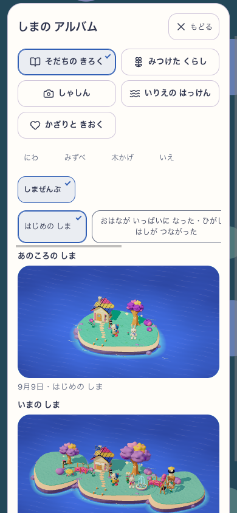
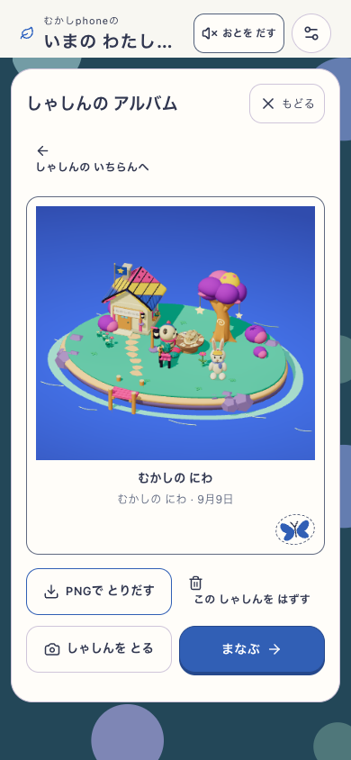
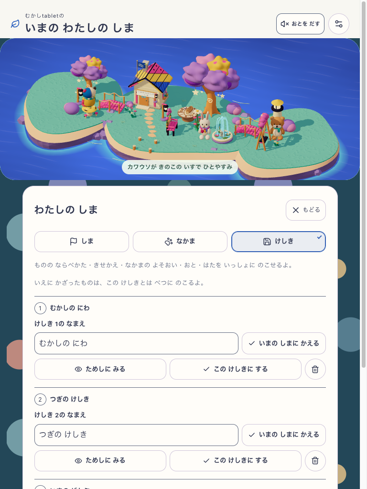
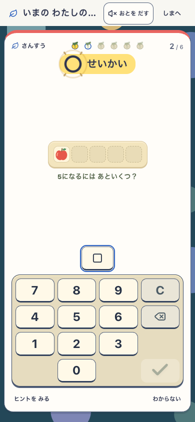

# 旧景色と写真の保存互換 — 現行33の限定確認

2026-09-09。**現行33への診断復元から始めた選定経路は両幅PASS**。全GoalはActive。これは保存形式の互換確認で、全体の公開承認・アート同等性・子どもの理解の判定ではない。[検証値と画像の出所](verification.json)に正確な版、hash、原FAIL、範囲を保存した。

| 実行 | 対象・生成方法 | 確認できた範囲と判定 |
|---|---|---|
| 本走03 | 同一originの実06 `9039d0105c7d` → 12 `3023b69183f8` → 20 `0db80c949ca3`。両幅各150通常回答 | none/v1の実保存・旧写真/初期memory・資格4品・nonnull v2/null復元まで通過。最後に配置画面で存在しない「しまへ」を待つQA前提で**全体FAIL**。元判定を保持 |
| checkpoint02 | 本走03の実17store・原PNG/thumbnailを隔離環境へ明示復元、固定20 | 後発家具/展示の全体拒否→本人の配置修正→同予約1回答/reloadを両幅**限定PASS**。連続した旧UI取得の再実行ではない |
| current01 / QA01 | 同じ実保存を固定32 `b3b75c1e7153` へ復元 | 厳密復元と現行読込後、旧表示用チェックへ後発v2履歴も渡して両幅**FAIL**。tabletの文書切替中のnative応答本文取得2件もFAILとして保存 |
| current02 / QA02 | 同じ実保存を固定33 `37fdc4e0b49b` へ復元 | 旧表示は元06/12のfacts、全データ保持は復元全factsへ分離。schema文書を離れる前にnative応答本文収集を完了。両幅の旧閲覧・3形式の試用/取消/適用・原写真・同予約1回答/reloadが**限定PASS** |

原rawは `output/island-experience/scene-compatibility-03/report.json`、`scene-compatibility-checkpoint-02/report.json`、`scene-compatibility-current-01/report.json`、`scene-compatibility-current-02/report.json`（後ろ3件も同じ `output/island-experience/` 配下）。旧実行を今回のPASSへ書き換えず、新たな資格や通貨を注入しなかった診断復元として区別する。

## 今回の固定対象と結果

- 対象 `http://127.0.0.1:5419`、revision `workshop-20260909-37fdc4e0b49b`、source SHA `37fdc4e0b49b2513f1210dc89315e3cf70afc2a2d4eb59634075fb76524b6877`、1074 inputs。Island/build-play両flags true、delivery `mystic-island-v1`、candidate `mystic-island-shore-garden-v13`。
- immutable QA02 closure `fe702f2cfc1e8e68d64678f4869538ac2418190c0855bf555d2c665ab70b4d9d`。runtime helperは固定33自身の `tools/island-e2e-helpers.mjs`、SHA `a0292a63673289acf5dab3d4d28d3cd992801b11e64c4be7f3a610be01c97169`。app source/dist・QA・元checkpoint入力の前後hash一致。
- phone 390×844 touch / tablet 768×1024 reduced motion。**各26全DB比較、16captures、実img4読取、原PNG2回出力、同予約の非最終1回答**。計40PNG・2trace。両幅pageerror/asset body error 0。
- noneは現在の無料設定/F05を保持。v1は当時の無料looks/ambience/emblemを復元し、追加衣装/収集音だけ解除。v2は既存資格権利・財布を維持して保存選択を復元し、今回明示装備したfoxの合羽も保存値 `null` へ戻す。試用/取消は全DB不変、適用はその正規差分とreceiptだけ。旧保存3枠を再保存していない。
- 元写真のthumbnail/full-imageは実galleryの `img` が読むBlob URLをdecodeし、寸法・mime・bytes・SHAを照合。PNG出力も元bytesと同じ。成長memory3件・共有memory1件の保存行を保持し、旧成長memoryの実表示は初期1件を確認した。
- session34790 terminal0。所有8 PIDすべて終了、一時profile削除、両context/browser閉鎖。親の5419 serverは閉じずversion不変。cleanupの記録は `output/island-experience/scene-compatibility-current-02/cleanup-verification.json`。

## 変更していない実画面

以下の4枚は今回の原PNGを同bytesでコピーした。画像内の写真だけは06の実撮影内容で、画面自体は33の実UI。150回答の再獲得や合成成熟fixtureの画面ではない。

phone：旧初期memoryを現在の身支度や名前で後付けしない。

phone：旧06の元写真を現行galleryで閲覧。蝶印は外側の装飾で、保存PNGへ混ぜない。

tablet：資格品と取得済み衣装を含むv2の適用後。

phone：任意操作後、同じ予約の非最終1問を実入力。

## 境界

3旧版ともDB v8／native80／写真3store。SWをblockした保存形式互換で、schema移行・実2build更新・offline・実音・native故障・今回の後発衝突再試験・正式速度は対象外。旧版の連続取得は本走03の別証拠であり、今回の復元ではnative key-generator内部値や実行中の身体姿勢を復元していない。

元checkpointの `rewardGoal` / `learningKeepsakes` は省略状態で、その非materializeを保持した。**非空の目標や家の展示選択の保持まで証明したものではない**。全履歴の実表示や旧writerが作っていないv1 growth memoryを合成せず、人の観察はN=0。全体の範囲と残差は[親タスク](../../../tasks/active/2026-09-08-island-experience.md)と[残差監査](../../../tasks/active/2026-09-08-island-experience-remaining-audit.md)で維持する。QAを本流toolsへ昇格する作業は今回含めない。
