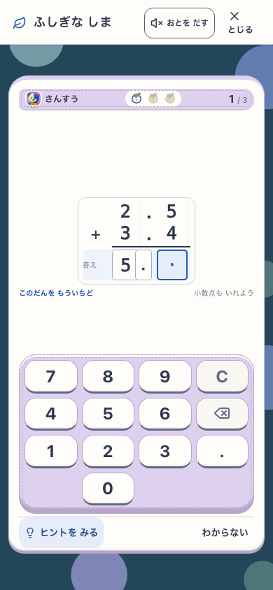
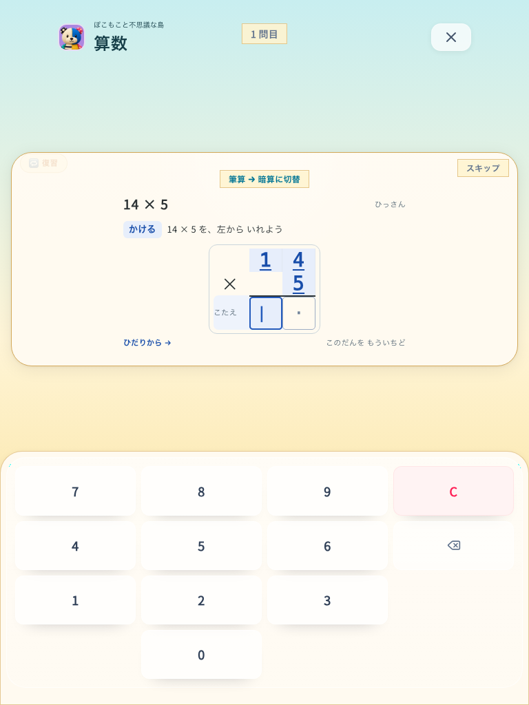

# 小数点の手入力と誤答行の再入力

2026-09-09。candidate: `manual-decimal-whole-row-retry`。Study/Island、`VITE_ISLAND_ENABLED=true` のproduction preview。基点 `a2d2ddd` に対する未コミット変更。実行版の入力とbuild出力は [source.json](source.json) に固定する。

## 変更

- 小数点を空欄から `.` キーで入力し、Backspaceでも1文字として削除する。点の位置を示す教材の足場は維持する。
- 筆算で誤答した現在行は正しかった桁も含めて空欄へ戻す。前の確定済み行と位合わせの補助0は保持する。
- 左から入力し、必要な入力がそろった最後のキーで自動採点する。選択した欄に無効な先頭小数点を押しても下書きを消さない。

## 検証

- 全体回帰: 327 files / 3,540 tests PASS。[記録](full-tests.txt)。先頭小数点の拒否時に選択下書きを保持する最後のguard追加前の結果。
- 最終guard追加後と共有root反映後: typecheck / 関連5 files・57 tests PASS。[記録](final-focused-tests.txt)。全体回帰を最終版全件実行と読み替えない。
- 最終production build / assets PASS。lintはエラー0、既存IslandMilestoneのfast-refresh警告1。[記録](lint.txt)。docs checker PASS。
- 実ブラウザ: phone 390×844 / tablet 768×1024、Study/Island × 通常小数・筆算小数・2桁の片方だけ誤答。nativeプロフィールfixtureから通常plannerで出題し、タッチと物理キー、点の削除/再入力、誤答行全消去、Enterなし再回答と保存を確認する。生徒の理解・学習効果や実機PWAの認定ではない。

## 画面評価

- 視覚: 筆算の位合わせを保ち、小数点を桁の間の入力欄として表示。phone上で問題と数字キー全体を確認。
- 操作理解・安全: 現在の空欄と「小数点も いれよう」「このだんを もういちど」を表示。正しかった桁だけを教える動作を廃止。無文字理解・子どもの実参加は未検証。
- runtime: 学習の採点/SRS経路を保持。ブラウザ結果は下記reportに帰属する。

最終版の実ブラウザは **12/12 PASS、pageerror 0**。[結果](report.json)。

