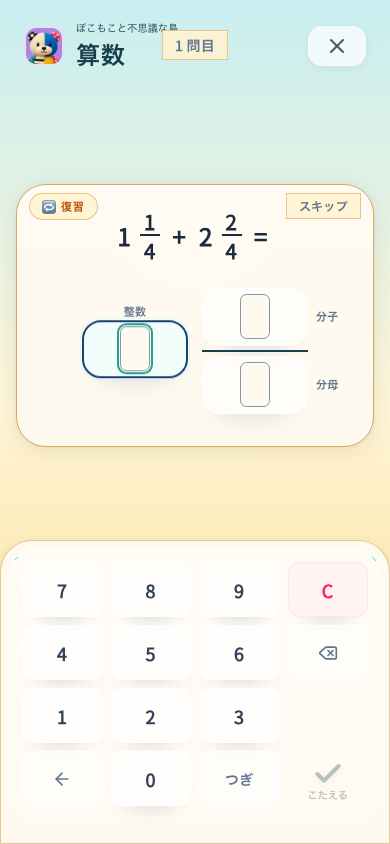

# 学習入力と人の操作意図をそろえる

2026-09-09。Study/Islandの回答入力、訂正、物理キーボードの意味を確認。全画面・全操作の包括的なUX認定ではない。基点 `a2d2ddd` と前回の小数点・行全消去変更に追加した未コミットcandidate `natural-input-selection-keyboard`。[実行版](source.json)。島有効production、phone 390×844 / tablet 768×1024。

## 発見と修正

| 状況 | 以前 | 修正 |
|---|---|---|
| 全体選択した答えで戻す | 末尾1文字だけ消える | 選択した欄全体を消す。隣の欄は保持 |
| 数字・消去・答え欄へフォーカスしてEnter | 回答確定が横取りする | nativeのボタン操作を優先。答え欄は選択 |
| StudyでEscape | スキップ記録を保存する | 解答記録を変更しない。明示スキップ/Sキーを維持 |
| 回答確定キー | 「つぎへ」と表示 | 「こたえる」または具体的な段の操作名 |

対象を広げすぎず、入力する前に結果を予測できる操作へそろえた。通常の1文字削除、左から入力、桁が埋まった時点での自動採点、保存失敗時の再送経路は維持する。

## 検証

- 全体: 327 files / 3,546 tests PASS。[記録](full-tests.txt)。最終のラベル折返し抑制class追加前の動作候補。
- 最終class追加後: 関連2 files / 36 tests PASS。[記録](final-focused-tests.txt)。最終build/assets、typecheck PASS。共有root反映後typecheck PASS。入力ファイルは実行版と同一。
- lint: エラー0、既存IslandMilestoneのfast-refresh警告1。[記録](lint.txt)。docs checker PASS。
- 通常plannerの実問: nativeプロフィールfixture → Study/Islandの小数・帯分数。選択消去と隣欄保持、focused number/C/answer fieldのnative Enter、Escapeでlog/問題が変わらないこと、最終回答で正解logが1件だけ追加されることを確認。Enter検査はハーネスでDOM focusを置き、実KeyboardEventの既定アクションを使用する。Tab巡回全体や実参加者は未検証。
- [初回8ケース](first-report.json)は動作PASS。ただし[phoneの表示](first-label-wrap.png)で「こたえる」が途中改行したため、default labelを1行に修正してproductionを再構築した。

視覚は全キーと分数の上下配置を確認。操作理解は選択表示と結果の対応を確認し、無文字理解・子どもの意欲は未認定。runtimeの合格を全体の使いやすさの保証へ読み替えない。

折り返しの初回修正は既定propが文字列になる点を取り違え、条件が適用されなかった。実DOMのText Rangeが2行であることを確認し、既定ラベルとの比較へ直した。最終ハーネスには実rendered textが1行である検査を追加した。

最終productionは **8/8 PASS、pageerror 0、全8ケースで確定ラベル1行**。[結果](report.json)。

