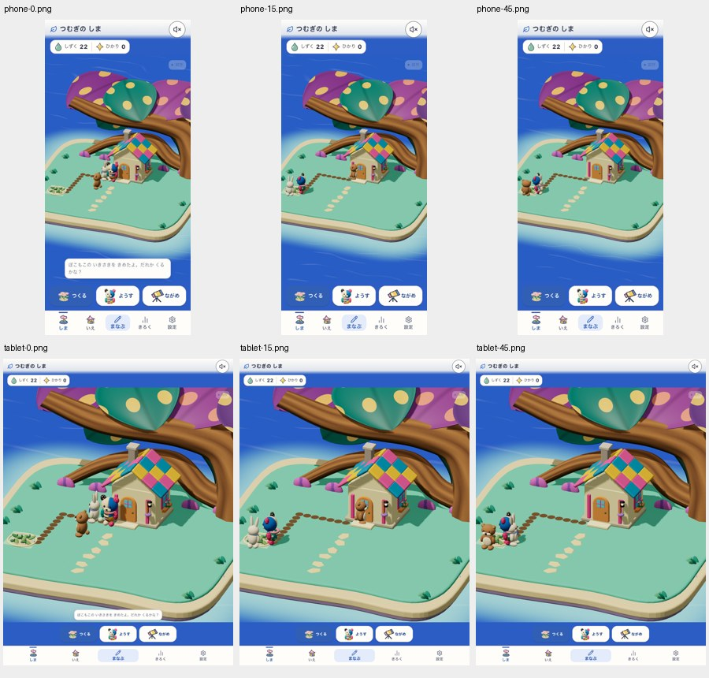
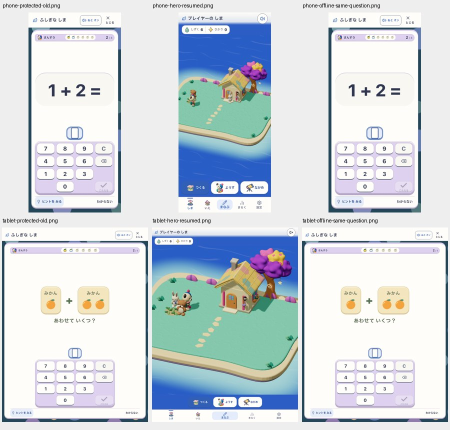

# ぽこもこの呼び出し後の散歩復帰

2026-09-15。呼び出し先 `target` が無期限に残り、短時間滞在の対象からぽこもこだけを除外していた。呼び出しを1回の訪問へ変更し、小物20秒・施設の最終利用24秒後に解除する。利用開始できない呼び出しは30秒で解除する。移動中や運搬途中では解除しない。同じ呼び出しの再試行で期限を延長しない。

保存版17の検証済み切替境界を追加。旧版の行動履歴、位置、所有物、既得報酬と滞在積算を保持し、再読込で呼び出しを復活させない。

## 実行対象と画面

- 検証元: `a4f50ef42f8e57a0b78fda5c14b860d1a292e469` に本修正を適用。アプリ入力SHA256: `13ef3f4808a1b681aeb7c9e8156e8121b7b66a06c332911aad9b738cefbcbd7f`。[入力と配布物](build-source.json)。
- DEV: `http://127.0.0.1:5236`、Island=true、Life preview=true、候補 `canopy-dots-c3-v1`。12しずくと花を用意した診断fixtureで、呼び出しは実UI、90秒は実時計。phone390×844/tablet768×1024（動きを減らす設定）。ぽこもこの異なる位置は13/16箇所、別目的地への歩行と呼び出し解除、reload保持を確認。[結果](dev-summary.json)。画像名0/15/45はサンプル番号で実時間0/30/90秒。
- production: Island=true、Life=true、Discovery=true、Preview=false、BuildPlay=false。既存の庭表示でDEV候補とは別系統。build `pokomoko-single-visit-local:521dcc74-f87e-40b0-a1d8-bea3aaba5488`。新規獲得・購入・呼び出し・途中学習から旧16→新17の実SW更新を両幅で実施し、散歩復帰とoffline同一問題を確認。[更新結果](upgrade-summary.json)。`http://127.0.0.1:5337` の実購入・offline配置/学習・保存失敗注入後のUI再試行も両幅PASS。[保存結果](storage-summary.json)。

## 検証結果と制約

- `npm run verify:core`: PASS、420 files / 4,010 tests。履歴移行、未着手待機、同一呼び出し、運搬後復帰、保存/reload/cacheを含む。
- `npm run e2e:pwa-update`: classic 4件PASS。
- 全classic smoke: 30件PASS、横向きtabletのRoot Tangle再回答ヒント待ち1件で15秒timeout。初回を全PASSとは扱わない。対象だけの5サイズ再確認（390×844、768×1024、1024×768、1024×1366、1080×1920）は全件PASS。
- 初回DEV harnessは成功時に自動で閉じるメニューを再度閉じようとしてdetached locator timeout。アプリの保存失敗ではなく、閉じた状態を待つ形へ直して両幅を完走。初回ログ `output/pokomoko-call-2026-09-15/manifest.json` と最終 `output/pokomoko-call-final/manifest.json` は区別する。
- 実行ログは `/tmp/sansu-hero-core.log`、`/tmp/sansu-hero-smoke.log`、`/tmp/sansu-hero-root-recheck.log`。詳細生データは `output/pokomoko-call-upgrade/report.json` と `output/pokomoko-call-storage/report.json`。コミットした要約と画像が永続証拠。
- Runtime integrity: 上記範囲PASS、全smokeはPARTIAL。Visual appeal: 既存C3のHOLDを維持し、新しいart承認ではない。Silent comprehension/safety: Human N=0、子どもの理解は未検証。実機iOS・旧島throughputの再計測・公開環境の反映確認は今回の証拠に含まない。
