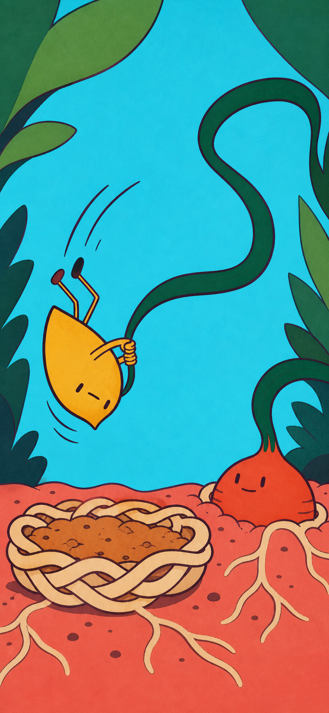

# Candidate A — Snap Root

- Generated: 2026-07-21
- Method: built-in `imagegen`
- Frame: `853 × 1844`（`390 × 844` とほぼ同じ縦横比）
- Decision: **比較候補として採用 / runtime 採用は保留**
- Predicted score: **85 / 100（±4）**
- First-six score: **52 / 60**



## Breakthrough hypothesis

帽子や顔の変化ではなく、`一本の細葉 → 半回転する全身 → 低い根の巣へ着地` を一本の運動線にする。現行 `pull-two` の「片足が上がった立ち姿」を捨て、答えた瞬間に全身シルエットが変わることを主価値に置く。

大きなシアン、コーラル、クリームの色面を背景・地面・受け皿へ割り当て、素材差は細かな描き込みではなく次で作る。

- 細葉: 滑らかな濃緑のリボン
- 根の巣: 太いクリーム色の編み輪
- 土: 数個の大きな粒
- 相棒: 一枚のマスタード色の切り紙

## Three-beat script

1. **ひっぱる** — 小さな相棒が一本だけの細葉を両手で引く。赤い根の友だちは地中から押し返し、葉は一直線に張る。答えが入るまでは静止する。
2. **ぱちん・くるっ** — 正解直後、同じ細葉が巻き尺のように根へ返る。相棒の両手を支点に胴体が約150度回り、両足が同じ側へ飛ぶ。ここが生成したkeyframe。
3. **ぽふん** — 相棒は頭ではなく尻から低い編み根の巣へ落ちる。巣が横へ潰れて戻り、土粒が少しだけ跳ねる。帽子・痛み・説明modalは出さず、次の問題を受け付ける。

## 64px silhouette audit


Actor-only silhouette was cropped from the generated frame, converted to solid black, and reduced to 64px wide. This is a legibility test, not a runtime asset.

| Question | Result | Evidence |
|---|---|---|
| 顔を消しても立位ではないと分かるか | **PASS** | 尖った胴体が下向き、両足が上側へまとまり、逆さの輪郭になる |
| 半回転の方向を読めるか | **PASS** | 脚側と胴体側に分かれた弧線、葉を握る支点、斜めの胴体で回転方向が残る |
| 着地点を別物として指せるか | **PASS** | full-frame 64pxでも、左下の太い編み輪が通常の地面から分離する |
| 同じ葉が根から返ったと読めるか | **CONDITIONAL** | 濃緑の一本線は相棒から根まで連続する。一方、上部の大きなS字が強く、葉そのものが主役に見える余地がある |
| 顔が笑いの主因になっていないか | **PASS** | actor-only silhouetteでも逆さ姿勢が残る。目は小さな点、口は短い一線だけ |

**Audit decision:** black-silhouette gateは通す。full-frameを64px幅まで落とすと相棒は小さいため、実装時は背景を固定し、actor layerを現状より約15%大きくする。葉の上部ループは少し短くし、根の冠から相棒の手までの連続性を優先する。

## Predicted 10-axis score

これは静止画からの予測であり、実測スコアではない。テンポと学習統合は既存契約を維持する実装を前提に採点した。

| Axis | Score | Rationale |
|---|---:|---|
| 1秒理解 | **9** | 根、一本葉、逆さの相棒、受け皿の4要素を大色面と余白で指し分けられる |
| 回答・入力テンポ | **8** | 1回答1動作、説明CTAなしで設計可能。ただし静止画だけではP95を証明できない |
| 入力から世界反応までの因果 | **9** | 根から相棒の手まで一本のS字が連続し、回転の支点になる。上部ループは短縮余地あり |
| 身体ギャグと驚き | **9** | 両足と胴体が完全に立位を離れ、顔なし64pxでも半回転を読める |
| ポップな視覚魅力 | **8** | 7色以下の大色面と太い輪郭は明快。生成由来の微細grainと周縁葉の量はまだ削れる |
| 次のbeatを見たい欲求 | **9** | 相棒の真下に空の受け皿があり、「どう着地するか」が未完の問いになる |
| リプレイ性 | **7** | 帽子オチからは脱却したが、この案単体には別の回転方向・着地結果がまだない |
| コンテンツ拡張性 | **8** | actor / leaf / root-friend / nestを独立layerにすればpose差分で増やせる。現物はまだ一枚絵 |
| 子どもの安全 | **9** | 低い柔らかな受け皿、下から押す協力関係、痛み・敵対・羞恥なし |
| 学習との一体性 | **9** | 既存planner / receipt / TenKeyを変えず、保存済み正解だけをbeat triggerにできる |
| **Total** | **85** | **最初の6軸は52。production 86点にはリプレイ差分と実測が1点以上必要** |

## Strict decision

**採用するもの:** 身体規則、色面構成、編み根の受け皿、半回転keyframe。現行案を突破する比較候補として残す。

**採用しないもの:** この全面PNGをそのままruntimeへ入れること。葉の上部S字が長く、周縁の葉も少し多い。actor / subject / leaf / nestを分離したlayer passと実画面のTenKey合成が必要。

初回生成で主判定の「64pxの全身ギャグ」と「帽子でない安全な着地」がPASSしたため、見栄えだけを変える再生成は行わなかった。次の変更は単なる生成差分ではなく、葉のループ短縮とactor 15%拡大を指定したレイヤー化で行う。

## Generation prompt

```text
Use case: stylized-concept
Asset type: exploratory mobile game keyframe, vertical 9:19.5 portrait composition matching a 390 x 844 phone screen, image only with no interface
Primary request: Show one frozen instant in a safe physical-comedy sequence: the exact same long narrow leaf that a tiny seed companion pulled has sprung back, rotating the companion halfway through the air, just before it lands bottom-first into a low soft nest made of interwoven roots and loose soil. The cause and effect must be instantly readable without words at 64-pixel thumbnail size.
Scene/backdrop: a joyful abstract underground garden made from a few enormous flat color shapes; clear open action space in the middle; bright cyan sky opening, warm coral ground plane, cream root nest, oversized simple green foliage only at outer edges
Subject: on the right, one squat friendly red-orange root creature remains half-buried and calmly pushes upward from below; exactly one extremely long dark-green ribbon-thin leaf remains visibly attached to its crown, stretches in one unbroken S-curve across the scene, and is still gripped by the airborne companion on the left-center. The pulled leaf and the returning leaf must unmistakably be the same single object.
Actor: one small mustard-yellow seed-shaped companion, compact solid body, tiny off-center dot eyes and one short mouth stroke only, no giant eyes and no broad smile. Its whole body is rotated about 150 degrees: bottom aimed downward at the nest, torso diagonal, both stick legs flying together above and to one side, both arms locked around the leaf. Make the body silhouette extremely exaggerated and unmistakably mid-tumble.
Safe landing: directly below the actor, a low wide bowl-shaped cushion built from 5–7 thick cream/tan roots braided into a visible rim, filled with a small mound of loose ochre soil; clearly a soft catching nest, not an ordinary patch of ground, no pain or impact.
Style/medium: deliberately authored flat cut-paper and two-color screen-print children's game art; hard-edged large shapes, thick dark plum contour lines, simple controlled geometry, irregular hand-cut edges only; character and subject read like reusable animation pieces, not a painterly storybook illustration
Composition/framing: strong left-to-right cause line: rooted subject at right, continuous returning leaf sweeping through center, half-rotated actor suspended over root nest at lower-left-center. Each object separated by negative space. Actor large enough to dominate the silhouette. No decorative clutter.
Lighting/mood: bright even daylight, playful suspense one fraction of a second before a safe landing
Color palette: at most seven flat colors: cyan, coral, mustard, red-orange, dark green, cream/tan, dark plum
Materials/textures: material distinction comes from silhouette and sparse cut-paper edge marks: leaf smooth ribbon, nest braided rounded roots, soil only a few chunky dots. Mostly flat untextured fills.
Constraints: exactly one actor, exactly one half-buried root creature, exactly one connected narrow leaf, exactly one root nest; no hat and no object touching the actor's head; no words, letters, numbers, math, UI panels, buttons, icons, score bars, frames, logos, or watermark; original character design, do not imitate any existing franchise
Avoid: AI-generated children's book look, homogeneous painted texture, watercolor, oil paint, 3D render, soft gradients, glow, depth-of-field, atmospheric haze, excessive detail, centered portrait posing, oversized eyes, shiny eyes, open-mouth smile, cute mascot face as the main joke, hat gag, ordinary sitting pose, violence, distress, sharp rocks, impact stars, random leaves, extra limbs, disconnected leaf pieces, visual ambiguity about which leaf returned
```
