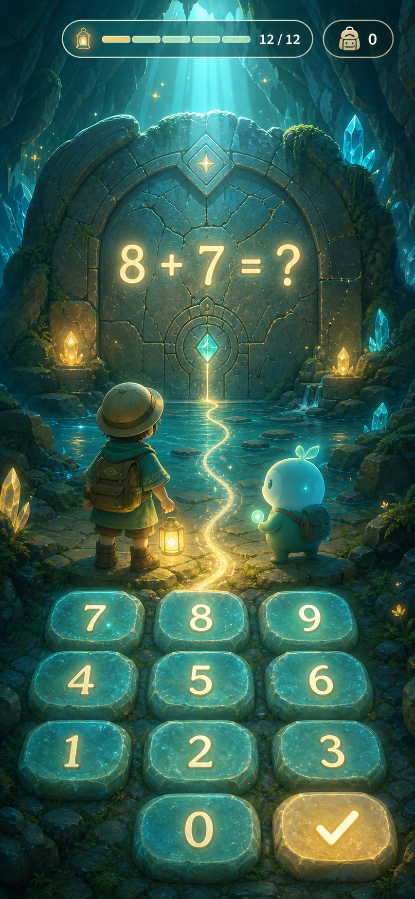
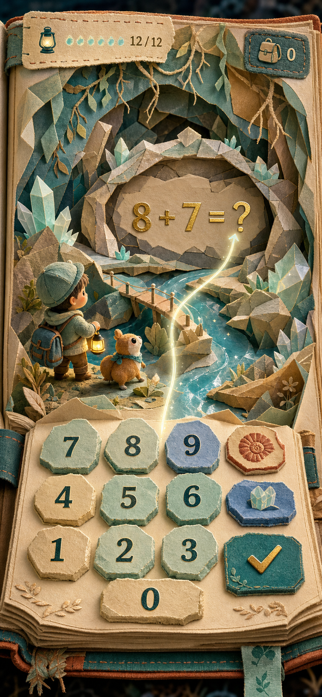
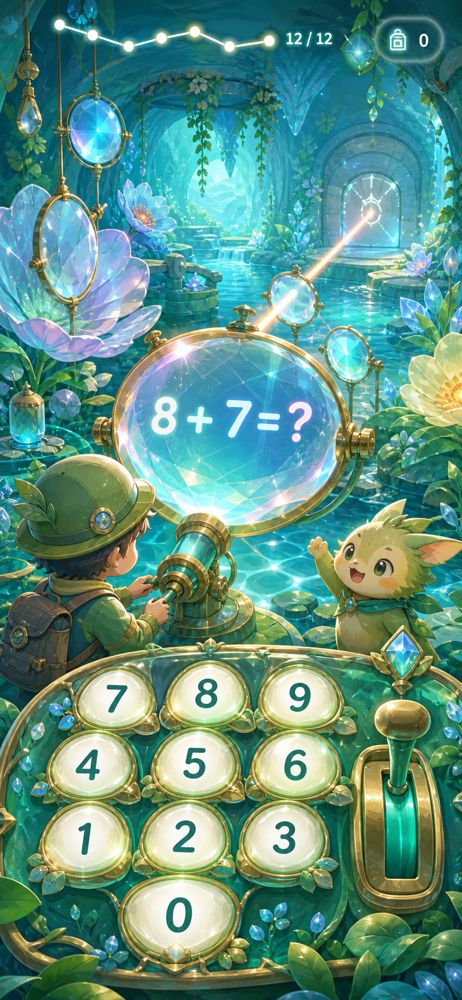
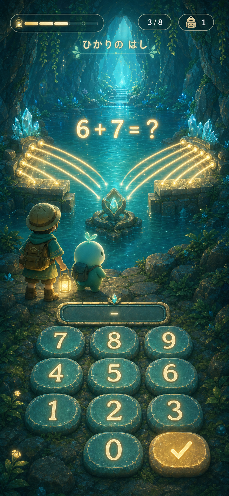

# 探索画面・没入感デザイン方向案

実装前のビジュアル方針比較用モックです。既存の探索ループを保ちつつ、問題を「画面上のフォーム」ではなく「世界を動かすゲームアクション」として見せる方向を比較します。

## 1. 光井戸の探検

## 2. 手ざわりのある飛び出す絵本

## 3. 地底の光学庭園

## 4. ひかりの橋・縦切り

方向案1の明るい地下世界と、方向案3の「算数が世界の物理になる」考え方を統合した実装ターゲットです。

### 実装用シーン

- `public/assets/explore/light-bridge/scene-idle.jpg`: 左右の光が中央の水晶へ届く直前で止まり、橋が未完成の状態
- `public/assets/explore/light-bridge/scene-complete.jpg`: 同じ構図・カメラ・登場人物のまま、光と根と石が一体になった橋が完成した状態
- `public/assets/explore/light-bridge/scene-crossed.jpg`: 完成構図を維持した次フレーム。子どもは手前に残り、丸い相棒だけが対岸へ渡って振り返る状態

3枚とも組み込みの ImageGen で生成。共通指示は「子ども向けの明るい地下湖、青緑の発光水晶、探検する子どもと丸い相棒、縦長モバイル画面、上部と下部にUIを置ける静かな余白、文字・ボタン・HUDは画像へ焼き込まない」。完成版では構図を固定したまま、左右の光が中央で合流して根と石の発光橋へ変わる差分だけを指定。渡り終えた版では完成画像を参照し、橋とカメラを維持したまま相棒だけを対岸へ移しています。

## 5. 根っこのからまり・画風コンセプト

`root-tangle-style-concept-v2.jpg` は制作方向を確認するためのコンセプト画像です。本番配信資産ではなく、`public/assets/explore/root-tangle/scene-*` の3枚だけをランタイムで使用します。
