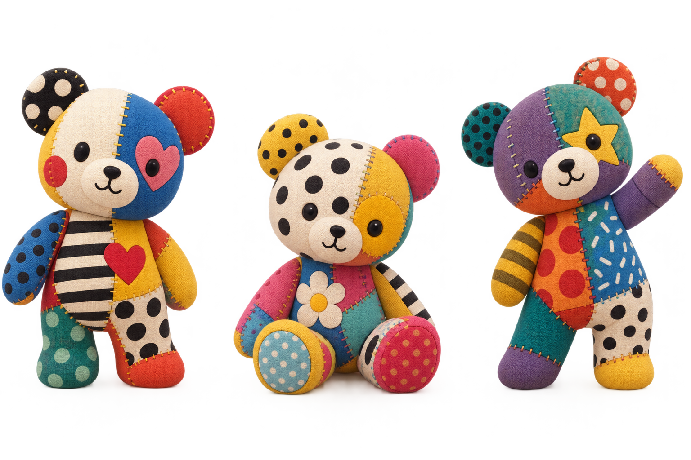

# 島の住民 — パッチワークの参考

- 日付: 2026-09-08
- 出典: ユーザー添付 `ChatGPT Image 2026年9月8日 13_27_55.png`。同じ画像を加工せず保存。
- 参考ID: `patchwork-residents-ref-20260908`
- 状態: 一部の住民の造形方向として採用。生成候補・実装済みアセット・runtime承認の証拠ではない。
- 正本: [島仕様28](../../../product/28_mystic_island_spec.md#patchwork-residents)

## 依頼の意味

「不思議な島でこんな漢字のキャラとかも。全部じゃなくてもでてきていいな」を、この画像のような「感じ」のキャラクターを一部の住民に含めたいという希望として受け取る。漢字そのものを擬人化する指定ではない。全員の造形変更、3体すべての採用、登場時刻・確率の指定は受けていない。

## TRANSFER / DO NOT TRANSFER

| 観点 | TRANSFER — 取り入れる | DO NOT TRANSFER — 島へ移さない |
|---|---|---|
| 素材 | 綿やフェルトを思わせる柔らかな表面、布の境界を読む縫い目 | 島全体を覆う一様な布フィルター、縮小でちらつく細かな繊維 |
| 色と柄 | 左右で違う大きな色面、少数の水玉・しま、クリーム色の休み | 顔の読み取りを妨げる密な柄、問題やキーへの模様の展開 |
| 形 | 大きな頭、丸い耳、短く詰まった手足、安定した接地 | 3体の全採用の義務、全住民の同じクマ化 |
| 表情 | 黒い小さな目・鼻、読める口、座る/手を振る親しみ | 布の切り替えで顔の位置や輪郭が姿勢ごとに変わること |
| 構図と光 | 布の丸みに沿う柔らかな陰影 | 暗いスタジオ背景、強い被写界深度、商品写真の横並び構図 |

## 最初の制作の焦点

まず1体で、通常のどうぶつと隣にいる島の実寸表示を比較する。立つ・座る・手を振る姿で同じ布の切り替えと顔を保ち、全景でも輪郭と大きな色分けが分かり、近景では縫い目と柔らかさが見えることを目指す。布の子と今いる住民が並ぶことで、島の暮らしに素材の違いと愛着が生まれるという仮説。

島側の比較資料は[既存の3D配色監査](../../audits/2026-09-07-island-3d/README.md)と[2026-09-08の成長監査](../../audits/2026-09-08-island-milestones/README.md)。制作時にはその時点の最新runtimeを取り直す。参考画像を貼っただけ、色だけ付け替えた状態を布の質感の完成とは扱わない。

参考を保存した段階では、新規生成・3D制作・アプリ変更を行っていない。その後の「よろしく」「まんまるしっぽで」に対応するカワウソ1体の実装は[専用監査](../../audits/2026-09-08-patchwork-resident/README.md)で確認する。参考画像と実画面の判定を区別し、既存候補のPASSを引き継がない。
